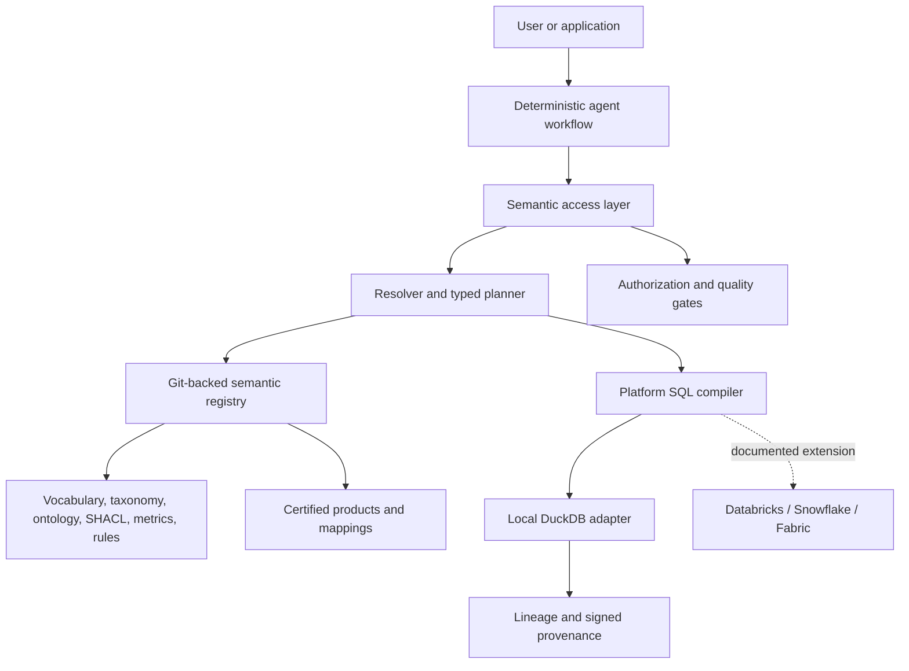
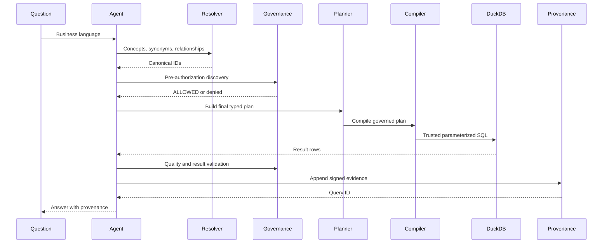
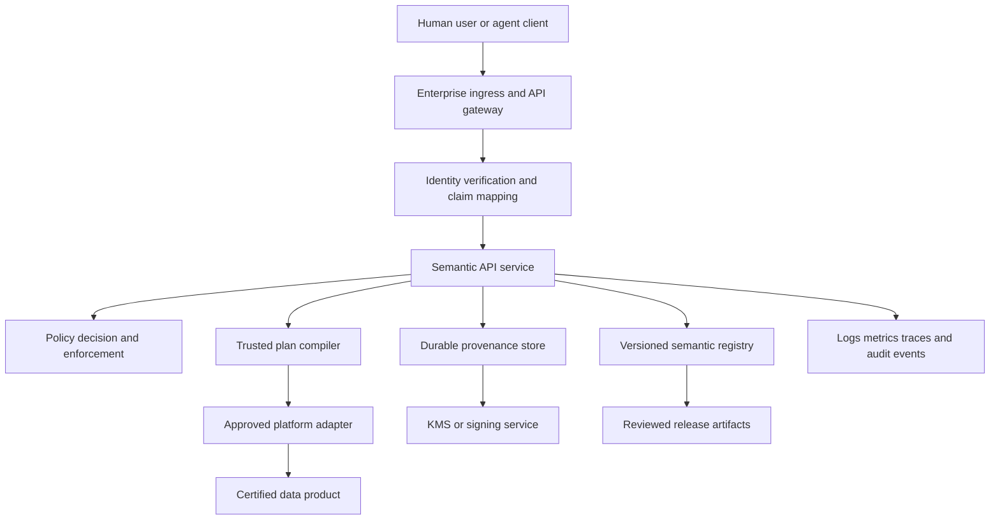

# Federated Semantic Layer for Agentic AI

A locally runnable reference implementation of a governed semantic layer for
GlobalSure Insurance Group. It maps business concepts to certified data
products and deterministic platform adapters without requiring cloud
credentials or an LLM key.

## What this repository proves

The primary local path answers this business question end to end:

> Find French motor-insurance customers with at least three qualifying claims
> in the last 12 months and total incurred loss above EUR 20,000.

The deterministic agent resolves canonical concepts, selects certified data
products, authorizes the caller, builds a typed SQL-free plan, compiles trusted
DuckDB SQL, validates quality, and returns provenance. The data is synthetic.

DuckDB is the only fully implemented execution platform. Databricks,
Snowflake, and Microsoft Fabric mappings and SQL are extension artifacts and
are explicitly not executed or benchmarked here. No AXA data, paid cloud
account, production credential, or LLM key is required.

## Table of contents

- [Reader paths](#reader-paths)
- [How to run](#how-to-run)
- [Local developer and data lifecycle](#local-developer-and-data-lifecycle)
- [Architecture](#architecture)
- [The semantic contract](#the-semantic-contract)
- [Federation: one meaning, different implementations](#federation-one-meaning-different-implementations)
- [Governance and data quality](#governance-and-data-quality)
- [API endpoints](#api-endpoints)
- [Verification evidence](#verification-evidence)
- [Testing and evaluation](#testing-and-evaluation)
- [Repository map](#repository-map)
- [Ownership, contribution, and review workflow](#ownership-contribution-and-review-workflow)
- [Semantic versioning, compatibility, and deprecation](#semantic-versioning-compatibility-and-deprecation)
- [Release process](#release-process)
- [Onboarding a country or domain](#onboarding-a-country-or-domain)
- [Capability-to-example traceability](#capability-to-example-traceability)
- [Pilot implementation plan](#pilot-implementation-plan)
- [Scale-out plan and promotion gates](#scale-out-plan-and-promotion-gates)
- [Production extension matrix](#production-extension-matrix)
- [Production deployment and operating model](#production-deployment-and-operating-model)
- [Support and escalation](#support-and-escalation)

## Reader paths

This repository is designed to be read as an executable reference, not a
slide deck. Start with the path that matches your responsibility; every claim
links to the asset or test that makes it reviewable.

| Reader | Start here | Then inspect | What to establish |
| --- | --- | --- | --- |
| AI lead | [architecture](docs/architecture.md), [agent architecture](docs/agent-architecture.md), and [golden evaluation corpus](tests/golden/questions.yaml) | `src/semantic_layer/agents/`, `src/semantic_layer/query_planner/`, and [evaluation tests](tests/golden/test_evaluation.py) | Agents select governed business intent; they do not invent joins, metrics, or SQL. |
| Enterprise or data architect | [semantic layer](docs/semantic-layer.md), [federated semantics](docs/federated-semantics.md), and [ADRs](docs/decisions/) | [Business vocabulary](semantic/vocabulary/insurance.yaml), [Insurance ontology](semantic/ontology/insurance.ttl), and [Certified data-product contracts](data_products/) | Group meaning is stable while local entities retain their own physical platforms and extensions. |
| Platform engineer | [production deployment and operating model](#production-deployment-and-operating-model) and [mappings](mappings/) | `src/semantic_layer/compiler/`, `src/semantic_layer/adapters/`, and [CI workflow](.github/workflows/ci.yml) | The semantic plan/compiler boundary is where a real platform adapter, identity, and native security controls connect. |
| Governance, security, or privacy reviewer | [governance](docs/governance.md), [data-product contracts](data_products/), and [operational failure matrix](#operational-failure-and-action-matrix) | `src/semantic_layer/governance/`, `src/semantic_layer/quality/`, `src/semantic_layer/provenance/`, and [security/control tests](tests/unit/test_execution_controls_security.py) | Access, quality, certified-product selection, and provenance are enforced before an answer is returned. |
| Future contributor | [ownership and review workflow](#ownership-contribution-and-review-workflow), [semantic versioning](#semantic-versioning-compatibility-and-deprecation), and [onboarding a country or domain](#onboarding-a-country-or-domain) | [semantic tests](tests/semantic/), [golden tests](tests/golden/), and [ADR-002](docs/decisions/ADR-002-semantic-assets-in-git.md) | A semantic change is a versioned, reviewed, tested contract change rather than an untracked configuration edit. |

## How to run

```bash
python3 -m venv .venv
.venv/bin/python -m pip install -e '.[dev]'
make PYTHON=.venv/bin/python test
make PYTHON=.venv/bin/python demo
```

Supported targets are `setup`, `test`, `lint`, `validate-semantic`, `demo`,
`evaluate`, and `run-api`; invoke any target as
`make PYTHON=.venv/bin/python <target>`.
The virtual environment keeps project dependencies isolated from Ubuntu's
PEP 668 externally managed system Python. The `validate-semantic` target reports
the valid graph as conforming and the invalid fixture as an expected failure.

## Local developer and data lifecycle

This section is the operational contract for a clean checkout. It is intended
to be sufficient for a developer, CI runner, or platform team to reproduce the
local reference environment without access to GlobalSure systems.

### Prerequisites and support matrix

| Component | Required for local execution | Supported baseline | Notes |
| --- | --- | --- | --- |
| Operating system | Yes | Linux, macOS, or Windows with a POSIX-compatible shell | CI runs on Ubuntu; Windows users can use WSL or invoke the equivalent commands in PowerShell. |
| Python | Yes | Python 3.12 or newer | Declared by `pyproject.toml`; older interpreters are not supported. |
| Git | Yes | Git 2.x | Required to obtain versioned semantic assets and history. |
| Cloud account | No | None | No cloud credentials are required; local execution uses DuckDB and checked-in synthetic CSVs. |
| LLM API key | No | None | No LLM API key is required; resolution and planning are deterministic and do not call an LLM. |
| Docker | No | Docker Engine 24+ if used | There is no Docker dependency in the core path. |
| Databricks, Snowflake, Fabric | No | Integration extension points only | Mappings and example SQL are documented artifacts; they are not cloud execution claims. |

The local implementation deliberately has a small dependency surface: FastAPI
and Uvicorn provide the HTTP boundary, Pydantic provides typed contracts,
RDFLib/pySHACL handle semantic assets, DuckDB provides local execution, and
PyYAML loads repository metadata. Development dependencies add pytest,
httpx, and Ruff. Dependencies are specified with minimum versions in
`pyproject.toml`; a committed lockfile is not currently provided, so transitive
dependency resolution can vary between installations. For release engineering,
generate and review a platform-specific lockfile (for example with `uv lock`)
and retain the same Python/platform matrix used by CI.

### Clean installation from a new checkout

```bash
git clone https://github.com/Sugumaran-Balasubramaniyan/enterprise-agentic-semantic-layer.git
cd enterprise-agentic-semantic-layer
python3 --version                 # must report 3.12 or newer
python3 -m venv .venv
.venv/bin/python -m pip install --upgrade pip
.venv/bin/python -m pip install -e '.[dev]'
cp .env.example .env              # optional; inspect before changing values
make PYTHON=.venv/bin/python validate-semantic
make PYTHON=.venv/bin/python test
make PYTHON=.venv/bin/python demo
```

The editable install makes `src/semantic_layer` importable while keeping the
repository assets at their checked-out paths. Do not install into the system
interpreter. The explicit sequence above is the canonical clean-install path;
do not run both it and the convenience setup target in the same fresh checkout.
For a fresh checkout, the valid convenience command is `make setup`; the
Makefile selects `python3` to create `.venv`, then installs the editable project
into that environment. Once `.venv` exists, targets can be pinned explicitly
with `make PYTHON=.venv/bin/python <target>`. A failed install should be
treated as an environment issue, not solved by weakening the declared
dependency constraints.

### Configuration matrix

The configuration matrix below is the supported local configuration surface.

Configuration is intentionally small and fail-closed. There are no cloud
credentials in the example configuration and no default network model call.

| Variable | Default | Scope | Purpose and operational guidance |
| --- | --- | --- | --- |
| `SEMANTIC_LAYER_ENV` | `development` | Application | Labels the runtime environment. Use a deployment-specific value in production; it does not authenticate a caller. |
| `SEMANTIC_LAYER_SIGNING_KEY` | unset | Provenance authority | Optional 64-character hexadecimal or 32-byte key for durable HMAC evidence. Configure exactly one signing variable. Store it in a secret manager, never in Git. |
| `SEMANTIC_LAYER_SIGNING_KEY_FILE` | unset | Provenance authority | Path to a file containing the same key format. Useful for local restart-safe verification; protect file permissions. |
| `SEMANTIC_LAYER_ROOT` | test-only | Integrity tests | Absolute repository root used by subprocess integrity checks. Do not use as an authorization boundary. |
| `SEMANTIC_LAYER_DB` | test-only | Integrity tests | SQLite path used by isolated provenance tests. Production deployments should use managed durable storage. |
| `SEMANTIC_LAYER_QUERY_ID` | test-only | Integrity tests | Query identifier supplied to a verification subprocess. |

`SEMANTIC_LAYER_SIGNING_KEY` and `SEMANTIC_LAYER_SIGNING_KEY_FILE` are
mutually exclusive. If neither is set, the process creates an ephemeral key;
signatures can be verified only during that process lifetime. This is suitable
for a disposable local run, not for durable evidence. The `.env` file is
ignored by Git; `.env.example` is the only configuration file intended to be
committed. Production identity, authorization claims, KMS keys, database
endpoints, and cloud credentials must be injected by the deployment platform.

### Registry and cache behavior

The semantic registry has one authoritative source: reviewed YAML, Turtle,
SHACL, and metric/rule assets in this repository. `SemanticRegistry.from_repository`
loads and validates those files, checks cross-references, and builds an
in-memory object model. It also populates an in-memory SQLite cache for indexed
lookup; the cache is disposable and is never treated as the source of truth.

This has important lifecycle implications:

1. A process restart reconstructs the registry from the checked-out assets.
2. Editing a semantic asset requires a new process (or a deliberate registry
   reload) before the process observes the change.
3. A cache cannot be promoted independently of the Git commit that produced
   it; deployments should record the semantic commit and registry digest.
4. Invalid or dangling references fail during registry construction rather than
   becoming partially available runtime metadata.
5. A production registry may materialize the same contracts in a catalog or
   service, but Git review, semantic versioning, validation, and promotion gates
   remain the control plane.

### Data lifecycle and fixture policy

The checked-in data is synthetic and intentionally split into two layers. The
curated fixtures are the trusted local serving contract; raw fixtures are
quality-test inputs only. The following is a conceptual production lifecycle,
showing the kind of landing-to-certified flow that a real platform would own:

```text
data/raw/*.csv       source-like landing fixtures; include known defects
        |
        | quality checks, normalization, duplicate/future/invalid-value handling
        v
data/curated/*.csv   governed local execution fixtures; expected clean inputs
        |
        v
DuckDB adapter       query execution for the local reference path
```

The local generator does not execute the arrow as an ingestion pipeline. It
creates the raw defective fixtures and the curated clean fixtures independently
from the same deterministic record definitions. The quality checks demonstrate
the gate that would sit between those layers in production; they do not claim
that this repository performs raw-to-curated transformation, orchestration, or
deployment.

Raw fixtures contain representative failures such as missing identifiers,
negative amounts, future dates, invalid statuses, and duplicate claims. They
exist to exercise quality gates and should not be used as a trusted query
source. Curated fixtures contain the rows consumed by the normal DuckDB path;
they are a small, reviewable stand-in for certified data products. This policy
mirrors production separation between landing data and a certified serving
contract without pretending that CSV files are a production lakehouse.

Regenerate both layers with:

```bash
.venv/bin/python data/generate_demo_data.py
```

The generator writes to `data/` relative to the repository and uses the fixed
script as-of date `2026-08-28`. Its records are explicit and deterministic (the
current implementation does not use a random-number generator); the documented
seed policy is that any future randomized expansion must use a pinned seed and
must preserve the explicit as-of date. The as-of date anchors all relative
claim, policy, and premium dates, so results do not drift with wall-clock time.
For a different reporting cut, call `generate_demo_data(output_dir, as_of)`
from Python with an explicit `datetime.date`; do not silently replace it with
`date.today()` in a test or production job.

The generated fixtures are a reproducible test asset, not an ingestion process:
they do not model CDC, late-arriving records, schema evolution, retention,
encryption, regional residency, or production PII controls. Those concerns
belong in the owning data product and platform adapter.

### Local schemas, grain, and join keys

The four CSV contracts below are intentionally narrow. Column names in the
curated files are the local DuckDB representation; cloud mappings translate
them to platform-specific physical names while preserving the same semantic
concepts.

| Dataset | Grain | Required key | Important join keys | Core fields |
| --- | --- | --- | --- | --- |
| `customers.csv` | One row per customer | `customer_id` | `customer_id` joins to policies and claims | `customer_name`, `country`, `email` |
| `policies.csv` | One row per policy | `policy_id` | `customer_id` → customer; `policy_id` → claims/premiums | `country`, `product`, `policy_status`, `effective_date`, `expiry_date`, `annual_premium_eur` |
| `claims.csv` | One row per claim | `claim_id` | `policy_id` → policy; `customer_id` → customer | `country`, `product`, `status`, `claim_date`, `incurred_loss_eur` |
| `premiums.csv` | One row per premium posting | `premium_id` | `policy_id` → policy; `customer_id` → customer | `country`, `product`, `premium_date`, `premium_eur` |

The principal relationship path is
`customers.customer_id → policies.customer_id → claims.policy_id`.
`claims.customer_id` is retained as a denormalized consistency check, not a
replacement for validating the policy relationship. Premiums are independently
aggregated for `ClaimsRatio`; joining claims directly to premium postings can
fan out totals and is therefore prohibited by the metric/compiler contract.
The product code is normalized through the checked-in platform mapping before
it is compared with the canonical `insurance:MotorInsurance` concept.

### Running data and semantic checks together

Use the following order after changing fixtures or semantic assets:

```bash
make PYTHON=.venv/bin/python validate-semantic
make PYTHON=.venv/bin/python check-yaml
make PYTHON=.venv/bin/python check-mappings-quality
make PYTHON=.venv/bin/python test
make PYTHON=.venv/bin/python demo
```

If a curated fixture is missing, empty, malformed, or fails its required
quality checks, execution is rejected. A successful local answer therefore
means both that the logical plan compiled and that the selected local product
passed the configured quality gate. It does not certify an external source or
prove a cloud platform integration.

## 5-minute interview demo

Use the full narrative in [the interview demo guide](docs/interview-demo-guide.md).
The short version is:

```bash
python3 -m venv .venv
.venv/bin/python -m pip install -e '.[dev]'
make PYTHON=.venv/bin/python validate-semantic
make PYTHON=.venv/bin/python demo
```

In the `RESULT` section, the deterministic answer is:

```json
[
  {"customer_id": "FR_001", "country": "FR", "claim_count": 3, "total_incurred_loss_eur": 24000.0},
  {"customer_id": "FR_002", "country": "FR", "claim_count": 3, "total_incurred_loss_eur": 25000.0}
]
```

To show the HTTP boundary, run `make PYTHON=.venv/bin/python run-api` in one terminal,
then:

```bash
curl -s http://127.0.0.1:8000/health
curl -s -X POST http://127.0.0.1:8000/execute \
  -H 'content-type: application/json' \
  -d '{"question":"Find French motor-insurance customers with at least three qualifying claims in the last 12 months and total incurred loss above EUR 20,000.","role":"ClaimsAnalystFR"}'
```

The stable health output is `{"status":"ok"}`. The execute response includes
the typed plan, generated SQL, `PASS` quality, the two rows, and a runtime
`provenance.query_id`. Retrieve that evidence with
`curl -s http://127.0.0.1:8000/provenance/{query_id}`; the ID and digests are
deliberately runtime values rather than copied fixtures.

## Architecture

Read [architecture](docs/architecture.md) for the control-plane boundary and
diagrams, [agent architecture](docs/agent-architecture.md) for workflow and
tool contracts, and [federated semantics](docs/federated-semantics.md) for
Group/local ownership. [Governance](docs/governance.md) covers authorization,
quality, security, lineage, and semantic versioning.

The distinction matters: RAG can retrieve explanatory text, but only governed
semantic assets define canonical meaning, joins, metrics, access, and physical
field mappings. The ontology supplies typed relationships and SHACL validates
graphs; certified analytical products and compilers handle aggregation.

## Provenance

Every successful answer carries a provenance envelope containing the question
and plan digests, canonical concepts, metrics, selected products, mappings,
queried physical CSV sources separately from all quality-validated CSV sources,
semantic versions, authorization and quality outcomes, row count, timestamp,
and integrity evidence. The API exposes the envelope at
`/provenance/{query_id}`. A local signing key can be configured for restart
safe demo signatures; production should use an external KMS or signing
service.

## Implemented, simulated, and next

- **Implemented:** local YAML/Turtle asset loading; deterministic resolution;
  typed planning; authorization; quality gates; DuckDB execution; FastAPI;
  agent workflow; provenance; SHACL; golden evaluation; CI checks.
- **Simulated/documented:** cloud dialect SQL and Databricks, Snowflake, and
  Fabric adapters. They require credentials and native platform security and
  are not claimed as executed.
- **Production extension:** connect one adapter at a time behind the compiler
  interface, delegate identity and row-level security to the platform, and
  retain the same semantic contracts and evidence-producing tests.

See [implementation plan](docs/implementation-plan.md) and the
[architecture decision records](docs/decisions/) for the production path.

## Durable provenance signing

Capability and provenance signatures are issued by an internal control-plane
authority and are intentionally absent from the public package API. Internal
Python names are an organization boundary, not a hard security boundary; a
production deployment must replace this local demo authority with an external
KMS or signing service and keep its key outside the application process.

For a local process or demo that needs provenance to survive a restart, set
`SEMANTIC_LAYER_SIGNING_KEY_FILE` to a file containing either 32 raw bytes or
64 hexadecimal characters. `SEMANTIC_LAYER_SIGNING_KEY` accepts the same key
as hexadecimal text. Configure exactly one of these variables before starting
the process. If neither is configured, a fresh process-local key is generated;
that default is suitable only when persisted signatures do not need to be
verified after the process exits.

## Architecture at a glance



The stable contract is the semantic plan. It contains canonical concepts,
relationships, filters, metric predicates, time context, caller context, and
approved products—but no SQL. Only the compiler knows physical field names and
produces parameterized SQL for a selected execution platform.

### Runtime sequence



## The semantic contract

The canonical vocabulary includes `Customer`, `Policy`, `Claim`,
`InsuranceProduct`, `MotorInsurance`, `Risk`, `Coverage`, `Premium`,
`ClaimStatus`, `Country`, `ActivePolicy`, `QualifyingClaim`, and
`IncurredLoss`. The compact ontology models:

```text
Customer ownsPolicy Policy
Customer submitsClaim Claim
Claim relatesToPolicy Policy
Policy hasProduct InsuranceProduct
Policy coversRisk Risk
Policy hasCoverage Coverage
Policy generatesPremium Premium
MotorInsurance subclassOf InsuranceProduct
```

Governed metrics are defined in `semantic/metrics/metrics.yaml`:

| Metric | Meaning |
| --- | --- |
| `ClaimCount` | Count of qualifying claims |
| `TotalIncurredLoss` | Sum of qualifying incurred loss |
| `AverageClaimAmount` | Average qualifying claim amount |
| `ActivePolicyCount` | Policies satisfying the ActivePolicy rule |
| `ClaimsRatio` | Separately aggregated loss divided by earned premium |

`QualifyingClaim` excludes `CANCELLED` and `DUPLICATE`. This is a versioned
semantic rule, not an instruction for an LLM to invent.

## Federation: one meaning, different implementations

GlobalSure’s Group model owns canonical labels, relationships, interoperability
rules, and governance. Country domains own local products, physical schemas,
mappings, extensions, and regulatory rules.

| Country | Platform example | Local motor codes | Canonical value |
| --- | --- | --- | --- |
| France | Databricks | `MOTOR`, `MTR` | `insurance:MotorInsurance` |
| UK | Snowflake | `AUTO`, `CAR` | `insurance:MotorInsurance` |
| Germany | Microsoft Fabric | `MotorInsurance` | `insurance:MotorInsurance` |

The same Group plan can compile against different physical columns and code
systems without making the agent rediscover joins.

## Governance and data quality

The local policy engine demonstrates RBAC and ABAC patterns for
`ClaimsAnalystFR`, `ClaimsManagerGroup`, `FinanceAnalyst`, and the synthetic
`AgentService` context. Country scope, purpose, product classification, and
PII access are checked before final planning and execution. The request-body
role is a simulator, not production identity authentication.

Quality checks reject missing or duplicate identifiers, blank join keys,
invalid countries/products/statuses, future dates, negative or non-finite loss,
and degraded/unsafe products. A failed quality capability cannot be passed to
the DuckDB adapter. Provenance records the plan, query, parameters, semantic
closure, selected products, queried sources, quality-validated sources,
authorization outcome, quality result, and integrity evidence.

## API endpoints

Run `make PYTHON=.venv/bin/python run-api`, then open
`http://127.0.0.1:8000/docs` for generated OpenAPI documentation.

| Endpoint | Purpose |
| --- | --- |
| `GET /health` | Service health |
| `GET /concepts` | Vocabulary discovery |
| `GET /concepts/{concept_id}` | One canonical concept definition |
| `GET /metrics` | Governed metric definitions and ownership |
| `GET /data-products` | Certified data-product contracts |
| `GET /mappings` | All registered platform mappings |
| `POST /resolve` | Deterministic business-term resolution |
| `POST /query-plan` | Authorized typed logical plan |
| `POST /execute` | Governed local execution |
| `POST /validate` | Semantic/data-quality validation |
| `GET /provenance/{query_id}` | Signed runtime evidence |

The table above is the implemented transport contract. There are deliberately
no detail routes for metrics, data products, relationships, or individual
mappings; clients retrieve the registered collections and use the canonical
IDs in their responses. `POST /resolve` accepts a business question only.
`POST /query-plan` and `POST /execute` additionally require the simulated
`role` caller context and optional `country` and `purpose` fields. The role is
not authentication: production identity and authorization attributes must be
derived by the transport from an identity provider.

All request models reject unknown fields and SQL-shaped input. Unsupported
question grammars, residual filters, unknown roles or products, unauthorized
country scopes, degraded products, and failed quality checks fail closed before
execution. A successful `/execute` response contains the canonical plan,
compiled local SQL, result rows, quality and authorization outcomes, and a
runtime provenance ID. The `/validate` endpoint is a read-only check of the
checked-in curated fixture; it does not execute an arbitrary query.

## Verification evidence

The latest checked-in verification evidence is recorded in
[docs/verification-report.md](docs/verification-report.md), dated **2026-08-28 UTC**.
It documents the exact local commands, outputs, limitations, and
security-scan interpretation; it is the source of truth for what was actually
verified rather than a claim of cloud-platform execution.

The latest full local matrix reported `195 passed` with the existing third-party
FastAPI/Starlette `TestClient` deprecation warning. It also reported:

- lint: Ruff passed;
- semantic validation: valid RDF conforms and the invalid fixture fails as expected;
- YAML, mapping, quality, compiler, and golden checks: passed;
- golden evaluation: `31/31` governed cases and `10/10` discovery-only cases;
- the end-to-end demo: deterministic `FR_001` and `FR_002` results;
- `git diff --check`: clean; and
- a scoped credential scan: no credential values found.

These results are local regression evidence over synthetic data. They do not
establish production scale, latency, cloud compatibility, or business-data
quality. Re-run the commands after changing semantic assets, mappings,
compiler logic, authorization, or data fixtures.

SQL-shaped questions, unsupported residual constraints, unauthorized roles, and
degraded products fail closed.

## Testing and evaluation

The golden corpus contains 31 distinct governed questions, including the ten
secondary scenarios in the project brief. It measures concept resolution,
relationship resolution, certified-product selection, metrics, authorization,
deterministic executable answers, and discovery-only constraints.

```bash
make test
make lint
make validate-semantic
make check-yaml
make check-mappings-quality
make check-golden
make check-compiler
make evaluate
make PYTHON=.venv/bin/python demo
```

The verified local run reports 195 passing tests, 31/31 golden cases, and
10/10 discovery-only cases. The single warning is a third-party FastAPI/
Starlette `TestClient` deprecation notice, not a project failure.

## Repository map

```text
semantic/                  Versioned vocabulary, taxonomy, ontology, SHACL, rules and metrics
data_products/             Certified product contracts and SLAs
mappings/                  Databricks, Snowflake and Fabric field/value mappings
data/                      Deterministic synthetic raw and curated CSV generation
src/semantic_layer/
  registry/                Git-backed registry and SQLite cache
  resolver/                Synonym and local-code grounding
  query_planner/           Typed logical plans and closed grammar
  compiler/                Trusted DuckDB compiler and cloud artifacts
  adapters/                Local execution and cloud extension seams
  governance/quality/      Authorization and quality gates
  lineage/provenance/      Source lineage and signed evidence
  agents/                  Workflow and governed tools
  api/                     FastAPI transport
tests/                     Unit, semantic, integration, golden and security tests
docs/                      Architecture, ADRs, governance, interview guide, verification
examples/                  Plans, questions and SQL artifacts
```

## Ownership, contribution, and review workflow

The repository is the semantic control plane. Git is authoritative for
published semantic assets; a registry, catalog, or runtime cache can mirror
them but cannot silently become the system of record. The ownership model is
deliberately federated:

| Decision area | Accountable owner | Required reviewers | Evidence before approval |
| --- | --- | --- | --- |
| Canonical vocabulary, ontology, taxonomy, and cross-domain relationships | Group semantic owner | Domain steward and knowledge engineer | Definition rationale, compatibility classification, vocabulary/ontology/SHACL tests, and affected golden cases |
| Metric and business-rule meaning | Metric owner in the relevant business domain | Finance or claims steward, semantic owner, and data-product owner | Formula, inclusion/exclusion logic, grain analysis, regression expectations, and metric-rule tests |
| Certified data-product contract and quality SLA | data-product owner | Domain steward, platform owner, and governance reviewer | Schema/grain/join-key impact, lineage, classification/PII assessment, quality checks, and product certification decision |
| Country mapping and local extension | Local entity semantic owner | Group semantic owner and platform owner | Canonical target, local-code coverage, source lineage, residency implications, and mapping tests |
| Compiler/adapter behavior | platform owner | Semantic owner, security and privacy, and data-product owner | Plan-to-SQL test evidence, least-privilege design, native platform controls, and staged adapter contract tests |
| Policy, provenance, release controls, and incident response | service owner | security and privacy, operations, and semantic owner | Threat/abuse assessment, policy tests, durability/restore evidence, and rollback plan |

These labels name responsibilities, not individuals. A production deployment
should map each role to an accountable team, named on-call rotation, change
authority, and escalation route. No contributor may self-approve a semantic
change where they are both the semantic owner and the data-product owner unless
the organization’s documented exception process records an independent review.

### Contribution workflow

1. **Frame the change as a business contract.** State the use case, canonical
   concepts, local/entity scope, data-product grain, expected access policy,
   and whether the change is patch, minor, or major.
2. **Locate the authoritative asset.** Use the asset map below; do not copy a
   definition into application code or edit a generated registry cache.
3. **Make the smallest coherent change.** A metric change commonly affects its
   rule, product contract, compiler behavior, evaluation cases, and version.
   A local mapping change must not alter Group meaning without Group approval.
4. **Add or update executable evidence first.** Include a focused semantic,
   compiler, authorization, quality, integration, or golden test that fails
   before the contract change and demonstrates the intended behavior after it.
5. **Open a reviewed pull request.** Include the checklist below, assign the
   accountable owners, let CI run, and resolve review comments before merge.
6. **Promote an immutable artifact.** Tag and retain the reviewed commit,
   registry digest, test reports, and migration/rollback notes. Never repair a
   released semantic asset directly in a deployed directory.

### Pull-request checklist

Use this checklist for every semantic, mapping, product, compiler, or policy
change. It is intentionally more demanding for production than for a local
documentation correction.

- [ ] The business outcome, canonical IDs, owner, affected countries/domains,
  and intended semantic version are described.
- [ ] The semantic owner and data-product owner approved the changed meaning;
  the platform owner approved any adapter or physical-contract impact.
- [ ] Security and privacy reviewed changes to PII, classification, purpose,
  residency, retention, or access behavior.
- [ ] The vocabulary/taxonomy/ontology/rules/metrics/product/mapping assets are
  changed in their authoritative location and cross-references remain valid.
- [ ] Grain, cardinality, join keys, normalization, and metric aggregation are
  explicitly assessed; fan-out risks are tested where applicable.
- [ ] New or changed local codes map to an existing canonical concept, or the
  canonical-model change is separately approved and versioned.
- [ ] Quality SLA, certification status, source lineage, and failure behavior
  are updated if the data-product contract changes.
- [ ] Focused regression tests and relevant [golden cases](tests/golden/questions.yaml)
  cover the changed meaning, access decision, and deterministic answer where
  an executable answer is expected.
- [ ] `make lint`, `make check-yaml`, `make validate-semantic`, mapping/quality,
  compiler, golden, and full test gates were run or will be run by CI; results
  and any accepted limitations are recorded in the pull request.
- [ ] A release, compatibility, migration, deprecation, and rollback note is
  present for every non-patch behavior change.

### Authoritative asset and evidence map

| Contract | Authoritative asset | Primary executable evidence | Change implications |
| --- | --- | --- | --- |
| Canonical terms, owners, classifications, synonyms, and allowed values | [Business vocabulary](semantic/vocabulary/insurance.yaml) | [Vocabulary tests](tests/semantic/test_vocabulary.py) | Version affected concepts; assess resolver, product, mapping, and access impact. |
| Product hierarchy and alternate labels | [Product taxonomy](semantic/taxonomy/insurance-products.ttl) | [Ontology/taxonomy tests](tests/semantic/test_shacl.py) | Preserve SKOS hierarchy and map local labels only to governed concepts. |
| Class and relationship meaning | [Insurance ontology](semantic/ontology/insurance.ttl) | [Ontology/SHACL tests](tests/semantic/test_shacl.py) | Confirm domains, ranges, subclass semantics, graph fixtures, and planner relationship paths. |
| Graph validity constraints | [SHACL shapes](semantic/shapes/insurance-shapes.ttl) | [SHACL validation tests](tests/semantic/test_shacl.py) | Add valid and invalid fixtures whenever a mandatory property or constraint changes. |
| Inclusion/exclusion and lifecycle logic | [Business rules](semantic/rules/claims.yaml) | [Metric/rule tests](tests/semantic/test_metric_rules.py) and [ActivePolicy regression](tests/semantic/test_active_policy_regression.py) | Treat as a metric behavior change where a rule feeds a metric. |
| Metric formulas, dependencies, and aggregation grain | [Metric definitions](semantic/metrics/metrics.yaml) | [Metric/rule tests](tests/semantic/test_metric_rules.py) and [compiler tests](tests/unit/test_compiler.py) | Preserve independent aggregation for ratios; update golden expectations. |
| Certified source contract, quality, lineage, and PII | [Certified data-product contracts](data_products/) | [Registry tests](tests/unit/test_registry.py) and [quality tests](tests/unit/test_quality.py) | Re-certify after schema, SLA, classification, or grain changes. |
| Local physical fields, values, and source lineage | [Federated mappings](mappings/) — [France](mappings/databricks/france.yaml), [UK](mappings/snowflake/united_kingdom.yaml), [Germany](mappings/fabric/germany.yaml) | [Mapping tests](tests/semantic/test_mappings.py) and [resolver tests](tests/unit/test_resolver.py) | Mapping changes require country owner approval and certified-product compatibility evidence. |
| Typed intent, compiler, execution, and evidence behavior | `src/semantic_layer/` | [Planner tests](tests/unit/test_query_planner.py), [execution-control tests](tests/unit/test_execution_controls_security.py), and [integration tests](tests/integration/) | Do not bypass typed plans or mutate a compiled request after authorization. |
| Natural-language-to-governed-answer coverage | [Golden evaluation corpus](tests/golden/questions.yaml) | [Golden evaluation tests](tests/golden/test_evaluation.py) and `make evaluate` | Add both successful and denied/unsupported cases for new supported language. |
| Continuous validation | [CI workflow](.github/workflows/ci.yml) | `.github/workflows/ci.yml` job output and [verification report](docs/verification-report.md) | CI is a minimum gate; production release gates add environment-specific checks. |

## Semantic versioning, compatibility, and deprecation

Every published semantic asset carries a semantic version. The Group release
version represents the compatible set of vocabulary, ontology, shapes, rules,
metrics, data-product contracts, mappings, plan schema, and adapter behavior;
individual asset versions identify the smallest contract that changed. Version
numbers are not cosmetic labels: the registry and provenance should retain
them so an answer can be interpreted using the definition in force when it was
produced.

| Change class | Version action | Examples | Required compatibility action |
| --- | --- | --- | --- |
| Patch | Increment `x.y.Z` | Typo correction, clearer description, non-semantic metadata update | Confirm no runtime meaning, resolver result, physical mapping, policy, or expected answer changes. |
| Minor | Increment `x.Y.0` | New compatible synonym, optional concept property, additive product mapping, new certified product with no changed existing interpretation | Preserve prior plan/result behavior and add tests for the new capability. |
| Major | Increment `X.0.0` | Changed definition, metric formula, inclusion rule, relationship/cardinality, join contract, security scope, product grain, canonical value, or plan-schema meaning | Publish a breaking change notice, migration guide, compatibility window, regression baseline, and rollback path. |

A **breaking change** is any alteration that can change a previously valid
answer, authorization outcome, plan interpretation, source selection, or
provenance meaning. Renaming a local field can be a patch only when the
canonical mapping, normalized values, output semantics, and contract tests are
unchanged. Changing `QualifyingClaim` from excluding to including a status is
major even if no Python signature changes.

### Compatibility and migration policy

1. **Classify before merge.** The pull request records impacted concepts,
   metrics, products, mappings, consumers, and the target release version.
2. **Keep readers compatible before writers change.** For a plan or provenance
   schema change, deploy a reader that understands old and new versions before
   producing only the new form.
3. **Publish a migration record.** It states old meaning, new meaning,
   affected questions/dashboards/agents, mapping or data backfill required,
   test evidence, owner, effective date, and rollback procedure.
4. **Run comparative evidence.** Re-run affected golden cases against old and
   candidate releases. Differences must be expected, approved, and traceable
   to the stated semantic change; unexpected changes block promotion.
5. **Use a time-bounded deprecation window.** Maintain the prior concept,
   metric alias, mapping, or reader for an agreed compatibility period based on
   consumer inventory and regulatory retention needs. The duration is an
   organization decision, not a fixed value in this POC.
6. **Retire deliberately.** After the deprecation window, confirm consumers
   migrated, archive the previous asset/release, preserve the ability to
   interpret historical provenance, and remove only the deprecated interface.

Deprecated does not mean silently remapped. A deprecated term may resolve with
a warning in a controlled migration path, but a removed concept, metric, or
mapping must fail clearly rather than return a plausible answer with changed
meaning. See [ADR-002](docs/decisions/ADR-002-semantic-assets-in-git.md) for
Git as the semantic source of truth and [ADR-004](docs/decisions/ADR-004-typed-query-plans.md)
for plan-schema evolution.

## Release process

The release unit is an immutable, reviewed semantic artifact paired with a
compatible application/compiler build. The local repository proves the source
and test contracts; a production delivery pipeline must add artifact signing,
protected environments, deployment attestations, secret scanning, dependency
scanning, and platform-specific integration evidence.

| Stage | Inputs | Required automated evidence | Human approval and exit criterion |
| --- | --- | --- | --- |
| Design | Use case, owner, scope, risk, and baseline semantics | New failing focused test or acceptance case | Semantic owner confirms canonical intent; product/platform/security owners join where their contract is affected. |
| Pull request | Versioned assets, code, tests, migration/deprecation note | Ruff, YAML parse, SHACL validation, mapping/quality, compiler, golden, API/integration, and complete pytest suite through [CI](.github/workflows/ci.yml) | Required reviewers approve; unresolved behavior or risk is not deferred without a named owner and due date. |
| Candidate | Immutable commit, registry digest, release notes, configuration contract | Re-run affected tests, semantic validation, and adapter/product contract tests in staging | Service owner verifies rollback artifact, observability, signing, identity, and change ticket readiness. |
| Progressive production rollout | Approved candidate and protected environment configuration | Native platform authorization/row-column controls, data-quality, provenance, and smoke evidence | Start with a bounded entity/use-case scope; advance only when the promotion gate is met. |
| General availability | Proven candidate and operational runbooks | Monitoring, restore, incident, and consumer migration evidence | Accountable owners accept support ownership and published service limits. |

Create release notes from the actual diff, not a generic template. At minimum
include semantic release/version, registry digest, impacted canonical IDs,
data products and mappings, change classification, consumer impact, migration
or deprecation status, test/quality results, platform coverage, owner
approvals, and rollback artifact identifier. Provenance emitted after release
must carry the release/digest needed to reproduce the decision.

## Onboarding a country or domain

Federation means adding local autonomy without introducing a second, hidden
meaning for an existing Group concept. A new country, line of business, or
data domain follows the same control path. Use a separate change set if the
proposal adds a new canonical concept *and* a first local mapping so reviewers
can distinguish Group semantic design from local implementation.

| Stage | Deliverable | Accountable owner | Evidence and exit condition |
| --- | --- | --- | --- |
| 0. Scope and discovery | A baseline and target-state assessment: priority use cases, regulations/residency, source inventory, local terms/codes, consumers, data quality, and operating owners | Local entity sponsor with Group semantic owner | Agreed scope, named semantic owner/data-product owner/platform owner, and documented non-goals. |
| 1. Canonical alignment | Concept crosswalk and gap decision against [Business vocabulary](semantic/vocabulary/insurance.yaml), [Product taxonomy](semantic/taxonomy/insurance-products.ttl), and [Insurance ontology](semantic/ontology/insurance.ttl) | Group semantic owner and local entity semantic owner | Every local term is mapped to a canonical ID, proposed for governed extension, or explicitly rejected. |
| 2. Product contract | Versioned product definition in `data_products/` with grain, schema, join keys, owner, certification, SLA, PII/classification, lineage, and quality expectations | data-product owner | Product is certifiable; source-to-product lineage and native policy boundaries are understood. |
| 3. Local mapping | Platform/location mapping under `mappings/<platform>/` with physical fields, local values, normalization, and source lineage | Local entity semantic owner and platform owner | All exposed contract fields map once to governed concepts; unknown values fail closed. |
| 4. Controls and execution | Adapter configuration, workload identity design, policy attributes, quality gate, and platform contract tests | platform owner with security and privacy | Native row/column/residency controls and semantic policy give the same or stricter answer; no arbitrary-table access. |
| 5. Evaluation and rollout | Representative positive, denied, ambiguous, stale-quality, and unsupported cases in [Golden evaluation corpus](tests/golden/questions.yaml) | Semantic owner with service owner | Resolution, product selection, authorization, plan, answer, provenance, and failure behavior meet agreed acceptance criteria. |
| 6. Operate and improve | Release, dashboards, support runbook, owner directory, feedback triage, and periodic contract review | service owner and local entity sponsor | A measurable promotion gate has passed; drift, defects, and semantic-change demand have named handling paths. |

The first three country mapping patterns are direct reference points:
[France/Databricks](mappings/databricks/france.yaml),
[United Kingdom/Snowflake](mappings/snowflake/united_kingdom.yaml), and
[Germany/Microsoft Fabric](mappings/fabric/germany.yaml). They demonstrate
normalization only; they do not demonstrate live connections to those
platforms. A real onboarding must validate the target platform’s actual
catalog, identity, row/column policy, query limits, data residency, and
lineage integration.

## Capability-to-example traceability

The matrix below is an audit-friendly route from business requirement to the
asset, runnable example, and regression evidence that implements it. It makes
clear which capabilities are local implementation and which are production
extension points.

| Capability | Authoritative contract | Runnable local example | Regression evidence | Boundary |
| --- | --- | --- | --- | --- |
| Business-language grounding | [Vocabulary](semantic/vocabulary/insurance.yaml), [taxonomy](semantic/taxonomy/insurance-products.ttl), and mappings | `POST /resolve` with “car insurance” or “loss amount” | [Resolver tests](tests/unit/test_resolver.py) | Deterministic lexical/mapping resolution; no hosted model required. |
| Relationships and graph validity | [Ontology](semantic/ontology/insurance.ttl) and [SHACL shapes](semantic/shapes/insurance-shapes.ttl) | `make validate-semantic` validates valid and invalid RDF fixtures | [SHACL tests](tests/semantic/test_shacl.py) | RDFLib/pySHACL local graph; no graph database is required. |
| Governed metrics and rules | [Metrics](semantic/metrics/metrics.yaml) and [rules](semantic/rules/claims.yaml) | `make PYTHON=.venv/bin/python demo` computes qualifying-claim metrics | [Metric/rule tests](tests/semantic/test_metric_rules.py) | Rules are compiler-owned semantics, not LLM prompt instructions. |
| Certified-product selection | [Data-product contracts](data_products/) | `GET /data-products`; `/query-plan` selects the required contracts | [Registry tests](tests/unit/test_registry.py) | Local CSV fixtures model certified serving products only. |
| Federated physical normalization | [Mappings](mappings/) | France `MOTOR`/`MTR`, UK `AUTO`/`CAR`, Germany `MotorInsurance` resolve to `insurance:MotorInsurance` | [Mapping tests](tests/semantic/test_mappings.py) | Cloud mappings are unexecuted extension artifacts. |
| Typed planning and trusted SQL | [ADR-004](docs/decisions/ADR-004-typed-query-plans.md) and `src/semantic_layer/query_planner/` | `POST /query-plan`, then `/execute` | [Planner tests](tests/unit/test_query_planner.py) and [compiler tests](tests/unit/test_compiler.py) | Only DuckDB is executed locally; cloud dialect fragments are not equivalent executed queries. |
| Authorization and quality gates | [Governance guidance](docs/governance.md), contracts, and mappings | An FR analyst can execute FR scope; unsupported/unauthorized input is denied | [Authorization tests](tests/unit/test_authorization.py), [quality tests](tests/unit/test_quality.py), and [execution-control tests](tests/unit/test_execution_controls_security.py) | Request-body role is demo-only; production derives claims from trusted identity. |
| Lineage and tamper-evident provenance | `src/semantic_layer/lineage/` and `src/semantic_layer/provenance/` | `/execute` returns a `query_id`; `GET /provenance/{query_id}` retrieves evidence | [Provenance/integrity tests](tests/unit/test_capability_integrity.py) and [execution integration test](tests/integration/test_duckdb_execution.py) | Local SQLite/HMAC is not a multi-writer enterprise audit store. |
| Agent end-to-end behavior | `src/semantic_layer/agents/` | Primary French motor-claims question through `make PYTHON=.venv/bin/python demo` | [Agent integration tests](tests/integration/test_agent_e2e.py) and [golden corpus](tests/golden/questions.yaml) | Deterministic workflow; optional LLM enhancement is not required or supplied. |
| Continuous semantic assurance | [CI workflow](.github/workflows/ci.yml) and [verification evidence](docs/verification-report.md) | `make lint`, `make validate-semantic`, `make check-golden`, `make test` | CI job plus 195-test local evidence recorded in the report | CI does not yet execute cloud, performance, supply-chain, or deployment checks. |

## Pilot implementation plan

The POC is a base for a narrow, controlled pilot—not a recommendation to turn
on enterprise-wide autonomous data access. Begin with one country, one
business domain, one or two certified products, and a small set of high-value
questions. The initial pilot should use aggregated or pseudonymous outputs
where possible and maintain a human review path for consequential decisions.

| Workstream | Pilot deliverables | Suggested evidence of readiness |
| --- | --- | --- |
| Business and semantic scope | Prioritized question set, success/failure criteria, named owners, canonical crosswalk, non-goals, and decision rights | Every supported question maps to governed concepts, relationships, metrics/rules, and a certified product; unsupported language has an intentional fail-closed response. |
| Data-product readiness | One certified product per required entity/metric, validated grain/join keys, SLA, quality gates, lineage, classification, and data-residency assessment | Data profiling and quality baseline are accepted by the data-product owner; raw sources are never silently substituted. |
| Semantic contract | Reviewed vocabulary/rule/metric/mapping release, SHACL constraints, deterministic resolver behavior, and golden set | Semantic tests, mapping normalization, and affected golden cases are green; all proposed local terms have a decision. |
| Secure platform path | One real adapter design, workload identity, native row/column policy test, network route, query quota, and secrets/KMS design | Staging execution proves the semantic policy cannot widen platform access; denied and cross-scope cases are tested. |
| Agent and user experience | Tool contract, prompt/intent boundary, explanation/provenance format, feedback channel, and user guidance | Representative users can inspect plan, product, quality, and provenance before relying on an answer. |
| Operations | Immutable releases, environment separation, privacy-safe logging, dashboards, alerting, incident/rollback runbooks, and backup/restore test | Service owner accepts an on-call path; restore and rollback are rehearsed; no production use begins with local ephemeral signing. |

The pilot has three practical phases:

1. **Foundation (weeks 0–4):** complete discovery, baseline and target-state
   assessment, owner assignment, canonical crosswalk, data profiling, threat
   and privacy assessment, and an initial golden set. Do not connect a live
   platform before the semantic and product contracts are reviewable.
2. **Controlled integration (weeks 5–8):** build one adapter against a
   non-production certified endpoint, exercise trusted identity and native
   controls, compare compiler outputs with approved platform queries, and
   produce durable provenance in staging.
3. **Bounded production pilot (weeks 9–12):** release a small supported
   question set to a named user cohort, measure accuracy/denials/quality/latency
   and feedback, run change and incident drills, then decide whether a
   promotion gate is met. The pilot must not use an agent answer as an
   unreviewed claims, underwriting, pricing, or customer-impacting decision.

## Scale-out plan and promotion gates

Scale by adding governed capability in bounded slices: one country/entity,
domain, data-product contract, platform adapter, and question family at a
time. The following plan provides measurable promotion gates that an
organization can tune to risk appetite; it does not claim the POC has achieved
them.

| Horizon | Scope | Promotion gate | Evidence required |
| --- | --- | --- | --- |
| 30 days | Establish the pilot foundation | **Contract gate:** 100% of pilot questions, concepts, metrics, rules, products, mappings, owners, and country/residency constraints are catalogued; 100% have an explicit supported, denied, or deferred disposition. | Baseline/target-state assessment, approved RACI, versioned assets, data profile, threat/privacy review, and passing local semantic/golden tests. |
| 60 days | Integrate one non-production platform/data-product path | **Control gate:** 100% of supported staging questions pass plan validation, product selection, authorization, quality, and provenance checks; all known denied cross-country/PII/SQL-shaped cases fail closed. | Platform contract test results, native-policy comparison, signed evidence/restore rehearsal, mapping coverage report, and rollback exercise. |
| 90 days | Run a bounded production pilot | **Operational gate:** the agreed pilot acceptance sample meets the business-approved answer-correctness threshold, zero unresolved critical access/provenance defects exist, and every production answer has retrievable evidence. | Representative evaluation results, red-team/abuse findings, quality/SLA trend, incident drill, support handoff, and accountable-owner sign-off. |
| 3–6 months | Add a second country or domain and harden the control plane | **Federation gate:** each new entity completes all onboarding stages; no unreviewed local term or physical table is reachable through the agent; semantic release rollback is demonstrated. | Country/domain onboarding record, migration/deprecation evidence, contract tests per adapter, consumer-impact review, and release audit. |
| 6–12 months | Operate a multi-entity semantic platform | **Scale gate:** defined service objectives are met over representative load, capacity/cost limits are observed, drift is detected and triaged, and change lead time remains within agreed targets without relaxing controls. | Production telemetry, load and resilience tests, SLO/error-budget report, lineage/provenance audit, security assessment, and quarterly semantic-governance review. |

“100%” is deliberately used for inventory, authorization, quality, and
provenance control coverage—not as a claim that natural-language understanding
will be perfect. Set statistical answer-quality thresholds with business
owners from a representative, independently reviewed evaluation set. Track
unknown language, ambiguous resolution, rejected plans, data-quality failures,
policy denials, false positives/negatives, latency, cost, and human overrides
separately. A high aggregate score cannot compensate for an access-control or
evidence failure.

## Production extension matrix

The semantic model remains platform independent. A country can use native
semantic/catalog capabilities as a local implementation, as long as the
canonical Group contract, mapping, product certification, policy enforcement,
and provenance expectations remain explicit and testable.

| Concern | Databricks / France extension | Snowflake / United Kingdom extension | Microsoft Fabric / Germany extension | Group control-plane requirement |
| --- | --- | --- | --- | --- |
| Catalog and product governance | Unity Catalog with Delta tables, governed views, ownership, lineage, and service principals | Database/schema ownership, certified views, tags/classification, RBAC, and query history | OneLake/Lakehouse governance, Fabric semantic models, workspace roles, and lineage | Register a certified data product with owner, grain, SLA, lineage, classification, PII, and semantic concepts. |
| Semantic implementation | Metric Views or governed SQL views can materialize local metric logic | Semantic Views or carefully governed analyst constructs can expose local semantic expressions | Fabric semantic model/Power BI measures can implement local consumption semantics | Canonical terms/rules/metrics remain versioned in this repository; no platform-only definition changes Group meaning without review. |
| Query execution | Databricks SQL Warehouse through a least-privilege service principal | Snowflake warehouse through scoped role/service user or workload identity | Fabric SQL endpoint/Lakehouse through managed identity or approved service principal | Adapter accepts only an authorized typed semantic plan and only certified products; never arbitrary SQL/table selection. |
| Security and privacy | Unity Catalog grants, row filters, column masks, secret scopes, and regional controls | RBAC, row access policies, masking policies, tags, network policies, and data sharing controls | Workspace/item permissions, RLS/OLS, sensitivity labels, and tenant/residency controls | Semantic policy narrows access; platform-native enforcement independently prevents widening it. |
| Observability and lineage | Platform query history, job lineage, audit logs, and data quality signals | Access/query history, tagging, governance lineage, and resource monitors | Fabric monitoring hub, lineage views, audit logs, and capacity signals | Correlate platform execution with semantic release, plan digest, policy decision, quality result, and provenance ID. |
| Adapter validation | Test actual dialect, parameter binding, catalog path, query limits, cancellation, errors, and result schemas in staging | Test actual role/warehouse/session semantics, parameter binding, timeouts, and query tags in staging | Test endpoint capabilities, identity propagation, capacity behavior, and result semantics in staging | Do not mark an adapter supported until contract, security, quality, performance, failure, and rollback tests pass. |

The table is a design target, not a claim that this POC is integrated with
Databricks, Snowflake, or Fabric. The checked-in examples are the
[France](mappings/databricks/france.yaml), [UK](mappings/snowflake/united_kingdom.yaml),
and [Germany](mappings/fabric/germany.yaml) mapping contracts plus documented
SQL fragments. Only DuckDB execution against synthetic CSV fixtures is
implemented and verified locally.

## Production deployment and operating model

The repository is a local reference implementation and a semantic-contract
baseline; it is not a production deployment template. This section defines the
minimum operating model required before a team exposes the service to enterprise
users or agents. It separates what the checked-in code does today from controls
that a deployment platform and operating team must supply.

### Local reference versus production service

| Concern | Current local reference behavior | Required production posture |
| --- | --- | --- |
| HTTP serving | `make PYTHON=.venv/bin/python run-api` starts Uvicorn with `--reload`, normally on the local loopback interface. Reload is a development-only convenience. | Run immutable, versioned application images behind a managed ingress; disable reload; use multiple workers/replicas only after concurrency, storage, and load tests. |
| Health | `GET /health` returns `{"status":"ok"}`. It is liveness-only: it does not check registry validity, provenance storage, signing authority, policy service, or data-platform connectivity. | Separate liveness from dependency-aware readiness and startup checks. Remove an instance from traffic when a required dependency is unavailable. |
| Caller context | `role`, `country`, and `purpose` arrive in the request body. The request-body role is spoofable demo context, not identity. | Authenticate at the edge and derive signed, short-lived caller and workload claims server-side from an enterprise identity provider. Never accept authorization attributes from a public request body. |
| Execution | DuckDB reads small synthetic curated CSV fixtures. The API creates a uniquely named local SQLite provenance file in the system temporary directory unless a path is injected. | Use a certified platform adapter, a governed data-product endpoint, and managed durable provenance storage. Enforce network, residency, and platform access policies outside and inside the service. |
| Signing | A process-local signing key is generated when no configured key exists; an optional HMAC key can be supplied through environment/file configuration. | Use an approved KMS, HSM, or dedicated signing service with key ownership, rotation, access logging, and independently retained verification material. |
| Operations | Commands are developer-operated; no service deployment, autoscaling, disaster recovery, telemetry, alerting, or on-call integration is included. | Operate through infrastructure-as-code, a release pipeline, an incident process, capacity controls, backups, and documented service objectives. |

The local service proves that an agent can be grounded in governed semantics
before SQL is compiled. It must not be presented as an authenticated API, a
production data-processing service, or evidence that a cloud platform
integration has been operated.

### Target deployment topology

The production topology keeps the semantic control plane independent of a
single data platform while allowing each country/domain to retain local data
ownership and enforcement.



The API service is a policy-enforcement point, not a data-security bypass. It
accepts business intent, resolves it to canonical semantics, and requests a
platform-specific operation only after authorization, product selection, and
quality gates pass. The adapter must use its own least-privilege workload
identity. The target platform remains responsible for native row-level,
column-level, masking, and residency enforcement; the semantic service should
constrain access further, never widen it.

The registry deployment should use a content-addressed release artifact
containing the reviewed vocabulary, taxonomy, ontology, SHACL shapes, rules,
metrics, data-product contracts, and mappings. Each running instance should
report the semantic release identifier and registry digest with every
provenance record. Do not allow a running production process to edit semantic
assets in place.

### Environment separation and promotion

Use separate development, test, staging, and production environments with
separate identities, secrets, provenance stores, and data-product endpoints.
Development may use the synthetic fixtures in this repository; production must
not point at them. Test and staging should use representative but approved
non-production data, with the same security controls exercised before
promotion.

| Stage | Semantic assets | Data and execution | Release gate |
| --- | --- | --- | --- |
| Development | Working branch and local registry | Synthetic CSV and DuckDB only | Unit, semantic, compiler, and local API tests |
| CI | Checked-out commit in an ephemeral runner | Synthetic fixtures only | Lint, YAML, SHACL, mappings/quality, compiler, golden, and full test suite |
| Staging | Immutable candidate artifact | Approved non-production certified products | Contract tests, access-policy tests, migration rehearsal, load/security review |
| Production | Signed/tagged approved semantic release | Production-certified products through approved adapters | Change approval, rollback readiness, monitoring and backup checks |

Promote the same reviewed semantic artifact between stages; do not rebuild its
assets manually per environment. Bind environment-specific information such as
database endpoints, workload identities, key references, residency controls,
and platform catalog locations outside the artifact. A semantic change that
alters a metric, rule, relationship, mapping, or access meaning requires a
versioned change record, compatibility assessment, updated golden expectations,
and explicit owner approval. Treat an adapter or data-product schema change as
a jointly owned release between the semantic and domain teams.

### Identity, authorization, and privacy controls

The included governance module demonstrates fail-closed authorization logic
for a small synthetic role model. It is not an identity system. In production,
place an authentication layer before FastAPI that validates enterprise-issued
tokens and, for service-to-service calls, workload identity or mTLS where
required. It must validate audience and expiry, then map verified claims to an
internal caller context. The service should receive only server-derived role,
country, purpose, tenant/entity, and data-entitlement attributes.

Apply authorization at several layers:

1. **Gateway:** authenticate users and agents, enforce rate/size limits, TLS,
   approved client registration, and request correlation identifiers.
2. **Semantic service:** authorize requested concepts, metrics, products,
   country/entity scope, purpose, and classification before final planning;
   reject unknown attributes and unsupported constraints.
3. **Platform adapter:** use a least-privilege workload principal scoped to the
   approved certified product, not arbitrary schemas or tables.
4. **Data platform:** enforce native row-level security, column masking,
   object grants, data residency, retention, and query auditing independently
   of the semantic service.

Data minimization is essential for an agent-facing service. Return only fields
required by the governed answer and projection; default to aggregates or
pseudonymous identifiers where a business use case permits. Do not put raw
customer identifiers, full SQL parameters, tokens, or sensitive result rows in
application logs, traces, prompts, or incident tickets. Define classification,
PII handling, cross-border transfer, consent/purpose, retention, and deletion
requirements with legal, privacy, security, and each data-product owner before
onboarding real insurance data. A semantic definition or provenance digest does
not replace records-of-processing, DPIA, or regulatory obligations.

### Provenance retention, signing, and backup

The local `ProvenanceStore` is a single-process SQLite implementation with a
tamper-evident chain and HMAC integrity checks. It provides useful local
evidence but is not a multi-writer, highly available, access-controlled, or
retention-managed audit system. Its default API location is a temporary local
SQLite file, so restart persistence and backup are not guaranteed unless a
path and stable signing key are explicitly provided.

For production, define an evidence policy before launch:

- Store provenance in an access-controlled, durable system with an immutable
  or write-once retention option appropriate to audit obligations.
- Retain the semantic release ID, registry digest, plan/query/parameter
  digests, authorization and quality outcomes, product/mapping versions, and
  source identifiers needed to reproduce the decision without unnecessarily
  retaining personal data.
- Keep signing keys in a KMS/HSM or dedicated signing service. Version every
  key, record its key identifier in evidence, rotate under a tested procedure,
  and retain verification capability for records signed by retired keys.
- Encrypt evidence in transit and at rest, restrict readers and writers by
  role, and forward tamper or verification failures to the incident process.
- Set retention, legal hold, deletion, residency, and export rules with the
  applicable business, privacy, and records-management owners; the repository
  intentionally does not prescribe a universal retention period.
- Back up the provenance store, semantic release artifacts, mapping/product
  contracts, key references, and deployment configuration on a defined
  schedule. Encrypt backups, test restore into an isolated environment, and
  verify the provenance chain and signatures after every restore.

Backups are not sufficient by themselves. A restore rehearsal must prove that
the selected semantic release, signing verification material, and provenance
chain can be recovered together. Record recovery point and recovery time
objectives before selecting storage technology; this POC does not implement or
measure either objective.

### Observability and CI coverage boundary

No telemetry, tracing, metrics export, alerting, or security scanning is implemented
by this repository. The API also does not emit a structured audit-event stream,
and the local `/health` route is not a readiness probe. The checked-in GitHub
Actions workflow runs on push and pull request with Python 3.12 and executes
Ruff, YAML parsing, semantic/SHACL validation, mapping and quality checks,
golden tests, compiler tests, and the full pytest suite. It does not currently
run dependency vulnerability scanning, secret scanning, SAST, container/image
scanning, license review, SBOM generation, signing, deployment, performance
tests, or cloud integration tests.

Before operating the service, add and own the following signals and controls:

- Request rate, latency, errors, timeouts, rejected requests, authorization
  denials, quality failures, compiler failures, adapter failures, and result
  row-count distributions.
- Semantic signals: resolver ambiguity, unsupported grammar, selected product,
  semantic release/digest, mapping version, rule/metric version, and drift
  between expected and observed product quality.
- Security/audit signals: verified subject/workload, policy decision ID,
  privilege failures, key/signature verification failures, access to evidence,
  and administrative changes to semantic assets or deployment configuration.
- Privacy-safe correlation IDs and redaction rules so operational data remains
  useful without storing sensitive business questions or result values by
  default.
- CI/CD supply-chain controls: pinned actions and dependencies, secret and
  dependency scanning, SAST, SBOM/provenance generation, artifact signing,
  protected environments, required reviews, and deployment attestations.

Choose service objectives only after measuring representative production-like
workloads. The synthetic local suite is a correctness regression suite, not a
latency, availability, cost, or capacity benchmark.

### Operational failure and action matrix

The local code fails closed for invalid input, unsupported question grammar,
unknown roles/products, unauthorized scope, quality failure, and provenance
integrity failure. The matrix turns those application behaviors into operating
actions; notification, paging, retries, and remediation workflows are
production responsibilities, not implemented automation in this repository.

| Condition | Current local behavior | Production action | Safe disposition |
| --- | --- | --- | --- |
| SQL-shaped or invalid request | Request validation rejects it; no SQL is executed. | Record a redacted validation event, tune client integration if recurring, and investigate abuse patterns at the gateway. | Return a controlled client error; do not reinterpret it as SQL. |
| Unknown role, country scope, purpose, product, or residual constraint | Authorization/planning rejects the request before execution. | Verify claim mapping and policy configuration; require an approved entitlement or semantic change rather than a bypass. | Deny and retain a privacy-safe policy decision record. |
| Curated product fails quality gate | Execution is blocked before DuckDB access. | Quarantine/de-certify the affected product version, notify its owner, assess downstream answers, and restore only after evidence of remediation. | Return no result; do not fall back to raw or uncertified data. |
| Provenance signature or chain verification fails | The store raises an error and read/append does not proceed. | Preserve evidence, isolate the affected store, investigate integrity/key changes, restore a verified copy if approved, and rotate/revoke keys as required. | Stop serving evidence from that store; do not overwrite the chain. |
| Signing key unavailable or ephemeral | Local execution can use a process-local key when unset. | Production startup/readiness must fail if the approved signing authority is unavailable or unverified; never silently create an audit key. | Do not accept auditable production execution until signing is restored. |
| Adapter or certified data product unavailable | The POC has only local DuckDB; adapter failures surface as failed execution. | Apply bounded retries only where the platform guarantees idempotence, use circuit breaking, notify the product owner, and assess stale-data policy explicitly. | Fail the request; never substitute an unapproved table or platform. |
| Semantic release/mapping defect | Local validation or golden tests should detect known regressions before release. | Halt promotion, revert to the last approved release, invalidate affected answers if necessary, and open a versioned corrective change. | Keep the previous approved semantic release active. |
| Suspected privacy or authorization incident | No incident automation is included. | Revoke affected identities, preserve audit evidence, engage security/privacy response, and follow regulatory and contractual notification procedures. | Disable affected capability until investigation approves restoration. |

### Upgrade and rollback guidance

Use release artifacts, not mutable folders, as the unit of change. Build an
artifact from one reviewed commit; record its application version, semantic
asset versions, registry digest, adapter version, and configuration schema
version. Validate it in staging with the target identity claims, product
contract, policy, signing authority, and a restore rehearsal before a
production rollout.

For a compatible change, deploy a small canary or isolated entity scope first,
compare authorization, quality, plan, result, and provenance signals with the
previous release, then promote progressively. For a semantic breaking change,
publish a new major semantic version, retain the prior definition and
evaluation corpus for the agreed compatibility window, and communicate the
business interpretation change to downstream consumers.

Prepare rollback before deployment: keep the previous immutable application
and semantic artifact available; version migrations so they can be rolled
forward safely or restored from a tested backup; and preserve provenance needed
to explain which release generated each answer. Roll back when policy behavior,
metric meaning, mapping correctness, quality gates, signing verification, or
platform access deviates from the approved baseline. Never repair a production
semantic release by editing assets in place, weakening a policy, bypassing a
quality gate, or replacing evidence records. If provenance schema changes are
not backward-readable, deploy a read-compatible migration first and do not
retire the previous reader until retention obligations are met.

### Production readiness checklist

Before a real pilot, the accountable platform, security, data-product, and
semantic owners should be able to answer yes to each item:

- A named production owner and on-call/escalation path exist for the service,
  each adapter, every certified data product, and the semantic release.
- Enterprise authentication derives caller and workload attributes server-side;
  request bodies cannot grant roles, country scope, or purpose.
- Native platform row/column controls and the semantic policy are tested
  together for every supported product and entity scope.
- The semantic artifact, container/dependency artifact, configuration, and
  approved mapping/product contracts are versioned, reviewed, scanned, and
  promotable through protected environments.
- Provenance storage, signing, key rotation, backup, restore, legal hold, and
  evidence-read access have documented owners and a successful rehearsal.
- Observability, redaction, dashboards, alert thresholds, incident runbooks,
  capacity limits, and service objectives are implemented and exercised.
- Golden evaluation, data-quality, authorization, compiler, migration, and
  production-adapter contract tests pass against the candidate release.
- Privacy, residency, records-management, and regulatory obligations are
  accepted for the exact countries, products, and agent use cases being
  enabled.

## Support and escalation

This repository cannot supply an enterprise support desk, pager, or incident
workflow. Before a pilot, the deploying organization must publish a service
directory with named contacts, support hours, severity definitions, evidence
retention instructions, and the authority to stop a capability. The following
routing model keeps semantic defects from being misclassified as generic
application errors.

| Signal or request | First accountable owner | Escalate to | Required evidence and safe action |
| --- | --- | --- | --- |
| A definition, synonym, metric, or relationship appears incorrect | semantic owner | Domain steward and knowledge engineer | Capture the question, semantic release, canonical IDs, plan/provenance ID, and expected interpretation. Disable or warn on the affected capability if materially misleading; create a versioned semantic change rather than hot-fixing a running registry. |
| A source field, local code, schema, quality SLA, or lineage changes | data-product owner | Local entity semantic owner and platform owner | Record product/mapping version, source evidence, failed quality output, and impacted answers. De-certify or block the product if the contract is no longer true; never fall back to raw data. |
| Access is unexpectedly granted, denied, or crosses country/PII scope | service owner | security and privacy, identity owner, and platform owner | Preserve redacted policy decision/provenance evidence, revoke or narrow affected access when needed, and use the organization’s security incident procedure. Do not troubleshoot by granting broader roles. |
| Platform adapter fails, returns inconsistent semantics, or breaches a quota | platform owner | service owner and data-product owner | Capture request correlation, plan digest, product/mapping release, sanitized platform error, and native audit/query identifier. Fail closed, use bounded retries only when approved, and roll back the adapter release if needed. |
| Provenance, signing, backup, or restore verification fails | service owner | security and privacy, records management, and signing/KMS owner | Preserve the affected evidence store, stop relying on unverifiable records, assess scope, and restore only from a verified backup under the incident procedure. |
| A user reports an answer-quality issue or unsupported question | Product/service owner | Semantic owner and relevant data-product owner | Classify as resolver, plan, metric/rule, mapping, data-quality, authorization, or usability issue. Add a representative golden case when it is in scope; retain the fail-closed response when it is not. |

For any production incident, log privacy-safe identifiers only: semantic
release/digest, canonical concepts, product/mapping versions, policy and
quality outcome, provenance ID, and platform audit reference. Do not paste
customer data, raw SQL parameters, access tokens, signing keys, or unredacted
agent prompts/results into tickets or chat channels. Severity, notification,
regulatory reporting, and external communications must follow the organization’s
approved incident and privacy processes.

## Production evolution

This is a local reference implementation, not a claim of live cloud integration.

1. Replace synthetic caller roles with trusted identity, purpose, and policy
   decision services.
2. Keep Group vocabulary, ontology, metrics, and product contracts in Git with
   semantic versioning and review gates.
3. Connect one platform adapter at a time: Unity Catalog/Delta and Metric Views
   for Databricks; governed semantic views, RBAC, masking and query history for
   Snowflake; OneLake, Fabric semantic models and lineage for Fabric.
4. Delegate row/column security to the underlying platform rather than bypassing
   it through the semantic service.
5. Move signing to an external KMS/HSM or privileged signing service and add
   observability for plan decisions, quality, latency, cost, and provenance.
6. Onboard additional domains through certified products and golden tests,
   preserving local autonomy while maintaining Group interoperability.

## Interview walkthrough

Use [docs/interview-demo-guide.md](docs/interview-demo-guide.md) for the full
script. The concise narrative is:

1. Start with the business question, not ontology technology.
2. Show the resolver grounding “car insurance” and “loss amount”.
3. Show the typed plan and certified products.
4. Show FR/UK/DE mapping normalization.
5. Show authorization, quality, SQL, result, and provenance.
6. Explain why direct LLM-to-SQL, RAG alone, or a graph alone is insufficient.
7. Close with semantic versioning, CI, and federated ownership.

For design rationale, see [architecture](docs/architecture.md),
[semantic layer](docs/semantic-layer.md), [governance](docs/governance.md),
[federated semantics](docs/federated-semantics.md), the
[implementation plan](docs/implementation-plan.md), and the
[architecture decision records](docs/decisions/).

## Implemented versus simulated

**Implemented locally:** semantic assets, SHACL, deterministic resolver and
planner, registry, metrics/rules, authorization, quality, DuckDB execution,
FastAPI, agent workflow, provenance, synthetic data, evaluation, and CI.

**Simulated or documented:** Databricks, Snowflake, and Fabric connections and
execution; production identity authentication; external KMS/HSM signing;
enterprise-scale performance; and benchmark claims.

No confidential data, credentials, paid cloud account, or hosted LLM is required.

## License

MIT. See [LICENSE](LICENSE).
