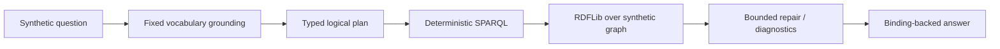
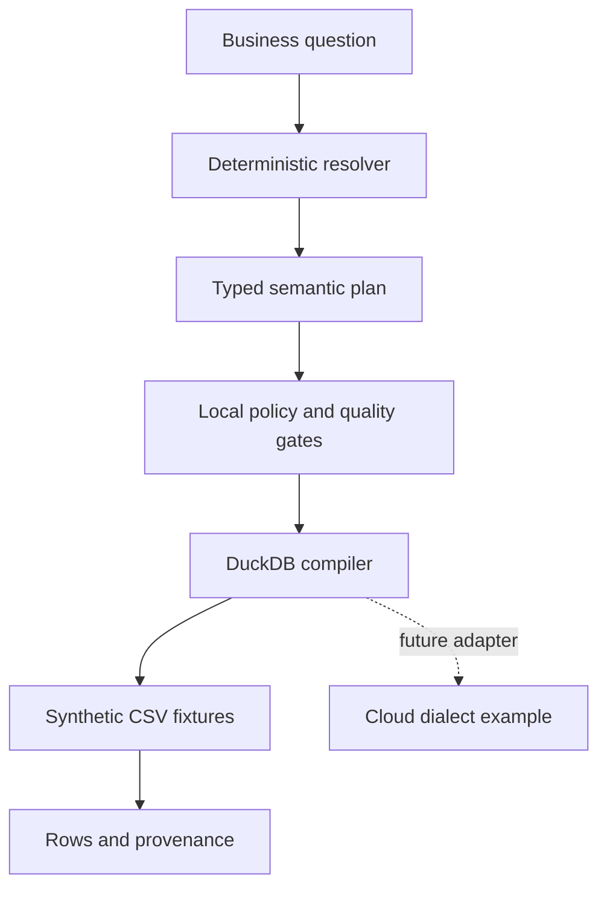
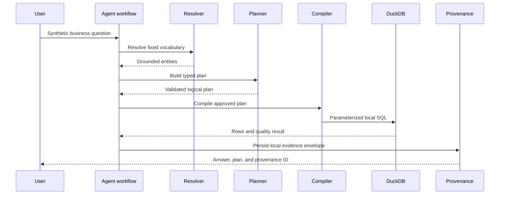
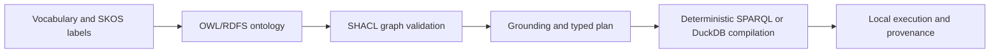

# Enterprise semantic layer and synthetic knowledge-graph prototype

This repository is an executable, local research prototype for semantic
contracts, a synthetic RDF knowledge graph, and deterministic query planning.
It is written for inspection and extension; it is not a product description or
an evaluation of an external system.

> This is an independent, unaffiliated candidate prototype using synthetic support and product-lifecycle fixtures. It is not an SAP product, SAP publication, SAP-endorsed benchmark, or report of access to SAP internal data. The repository demonstrates a deterministic symbolic baseline and proposes future LLM/retrieval experiments; it does not claim completed PhD research or production readiness.

## Status at a glance

The labels below are part of the public contract. They distinguish what a
reviewer can run in this checkout from research that is only proposed.

| Area | Status | Boundary |
| --- | --- | --- |
| Synthetic RDF/OWL/SHACL graph, fixed-vocabulary grounding, typed plans, deterministic SPARQL, RDFLib execution, and bounded repair | **Implemented locally** | Runs against checked-in synthetic support and product-lifecycle fixtures. |
| Local DuckDB/FastAPI semantic-layer demonstration | **Implemented locally** | Uses deterministic CSV fixtures; caller context is simulated and is not authentication. |
| Graph fixtures, cloud dialect snippets, and federated ERP mappings | **Synthetic/simulated** | Illustrative contracts and unexecuted platform examples; no cloud connection is claimed. |
| Learned schema linking, Text-to-SPARQL, learned repair, vector retrieval, and hybrid RAG | **Proposed future work** | Doctoral research directions requiring separately versioned data, methods, runs, and failure analysis. |
| External LLM calls, vector indexes, external certification, and broad generalization claims | **Not implemented** | No such capability or result is supplied by this repository. |

## Table of contents

- [Synthetic KG and AQR research prototype](#synthetic-kg-and-aqr-research-prototype)
- [Preliminary controlled synthetic benchmark](#preliminary-controlled-synthetic-benchmark)
- [Limitations and future research](#limitations-and-future-research)
- [Secondary reference: federated ERP semantic layer](#secondary-reference-federated-erp-semantic-layer)
- [How to run](#how-to-run)
- [Architecture and semantic contract](#architecture-and-semantic-contract)
- [Provenance](#provenance)
- [Testing and evaluation](#testing-and-evaluation)
- [Governance and local review](#governance-and-local-review)
- [Repository map](#repository-map)

## Synthetic KG and AQR research prototype

The primary research path is a synthetic knowledge graph and Autonomous Query
Reasoning (AQR) baseline. It uses neutral `cifsup`, `cifppms`, `cifdata`,
`ciferp`, `cifskos`, and `cifmeta` namespace examples; these are reserved
documentation IRIs, not owned external namespaces.

The current implementation is model-free and deterministic:

```text
fixed-vocabulary text matching
  -> grounded entities
  -> typed logical query plan
  -> deterministic SPARQL 1.1 compilation
  -> RDFLib graph execution
  -> bounded heuristic repair or relaxation
  -> answer synthesized only from returned bindings
```

It contains no external LLM, embedding model, vector index, or retrieval
backend. The supported natural-language grammar is intentionally finite. Repair
is hand-written and bounded: for example, it can remove a support-package
constraint or widen a component after an empty result, subject to the query
contract. An answer is not generated from unsupported text; it is assembled
from graph bindings and provenance identifiers.



### Reproduce the local KG path

From a checkout with the development environment installed:

```bash
make PYTHON=.venv/bin/python kg-validate
make PYTHON=.venv/bin/python research-verify
make PYTHON=.venv/bin/python research-demo
```

`kg-validate` exercises the RDF/OWL/SHACL assets and their fixtures.
`research-verify` is the final reproducibility command specified for the
repository. Task 13 will wire the Make target and generate the canonical
`results/latest_benchmark.json` artifact after all implementation and handoff
files are final; Task 11 has not run or wired that target.
`research-demo` prints a local reasoning trace. W3C RDF, OWL, SPARQL 1.1, and
SHACL are referenced as standards; this README does not invent a citation or
claim conformance beyond the checks that are run.

### Preliminary controlled synthetic benchmark

The v1/v2 protocol is a controlled, preliminary synthetic methodology over a
checked-in graph. It compares the deterministic no-reflection condition with
the deterministic bounded-repair condition, records per-query status and
provenance, and keeps unsupported or strict-empty cases explicit. The corpus
is not proprietary data, an SAP benchmark, a production-support evaluation, or
evidence that the method generalizes to real data.

Final metrics and hashes are intentionally not written here. Task 13 owns the
canonical artifact and final readiness gate. The planned artifact link is kept
for that handoff: [preliminary benchmark artifact](results/latest_benchmark.json).

## Limitations and future research

The following limitations are mandatory reading:

- The data is synthetic; no proprietary or confidential data is included.
- The ontology is simplified and the corpora are small, controlled corpora.
- Natural-language coverage is deterministic and controlled; it is not broad language understanding.
- No LLM, embedding service, or vector retrieval system is implemented.
- There is no production-scale graph or performance validation.
- Security, privacy, authentication, and governance controls are incomplete in this prototype.
- Findings are preliminary and should be reproduced from the source and the eventual artifact.
- No affiliation is claimed; this is an independent candidate prototype.
- Nothing here establishes an affiliation, employment, endorsement, or access to an external organization's systems.

The proposed research programme is deliberately separate from the local
baseline. Future work may test learned schema linking, constrained
Text-to-SPARQL, learned repair policies, and hybrid graph/vector retrieval.
Each experiment would need a versioned dataset, method and dependency lock,
seed/configuration, cost and failure accounting, explicit abstention policy,
and a run artifact before comparison with this deterministic baseline.

## Secondary reference: federated ERP semantic layer

After the KG/AQR reproducibility path, this repository retains a secondary
reference implementation for semantic contracts over synthetic ERP-like
relational fixtures. It demonstrates local DuckDB execution and a FastAPI
boundary; it does not make federated or cloud execution claims.

The local question path is intentionally narrow: resolve canonical concepts,
select a repository-maintained synthetic contract, authorize simulated caller
context, build a typed plan, compile trusted DuckDB SQL, apply quality checks,
and return provenance. Databricks, Snowflake, and Microsoft Fabric mappings and
dialect snippets are **Synthetic/simulated** extension artifacts. They require
independent credentials, native controls, and separate verification before any
future execution.



The internal status `CERTIFIED` in a product YAML is a synthetic contract
status used by local selection and tests. It is not external certification,
publication, or a claim that a platform catalog is connected. See
[data-product contracts](docs/data-products.md),
[federated semantics](docs/federated-semantics.md), and
[ADR-008](docs/decisions/ADR-008-certified-data-products.md).

## How to run

For a clean checkout, use the same local interpreter for setup, validation, and
tests:

```bash
git clone https://github.com/Sugumaran-Balasubramaniyan/enterprise-agentic-semantic-layer.git
cd enterprise-agentic-semantic-layer
python3 -m venv .venv
.venv/bin/python -m pip install -e '.[dev]'
make PYTHON=.venv/bin/python validate-semantic
make PYTHON=.venv/bin/python test
```

No cloud credentials, model API key, or network service is required. A
platform-specific dependency lockfile is future release-engineering work; the
current package declares its dependency floors in `pyproject.toml`.

## Local setup

The runnable path requires Python 3.12 or newer. No cloud credentials and no
LLM API key are needed.

```bash
python3 -m venv .venv
.venv/bin/python -m pip install -e '.[dev]'
make PYTHON=.venv/bin/python validate-semantic
make PYTHON=.venv/bin/python test
make PYTHON=.venv/bin/python demo
```

The supported Make targets are `setup`, `test`, `lint`, `validate-semantic`,
`check-yaml`, `check-mappings-quality`, `check-golden`, `check-compiler`,
`demo`, `evaluate`, `run-api`, `kg-build`, `kg-validate`,
`research-demo`, and the planned `research-verify` gate. The commands use the checked-in
`.venv` interpreter explicitly so Ubuntu's externally managed system Python is
not modified.

### Local data and semantic assets

The graph and relational fixtures are generated or loaded from versioned
repository files. The relational demonstration has a raw quality-test layer
and a curated local serving layer:

```text
data/raw/*.csv       synthetic source-like fixtures, including invalid rows
       |
       | local quality checks
       v
data/curated/*.csv   deterministic clean fixtures for DuckDB
       |
       v
DuckDB views         local execution only
```

Regenerate the deterministic data with:

```bash
.venv/bin/python data/generate_demo_data.py
```

The semantic registry is loaded from reviewed YAML, Turtle, SHACL, mapping,
metric, and rule assets. The in-memory registry/cache is disposable; the files
in Git are the reproducibility source. `make PYTHON=.venv/bin/python
validate-semantic` validates the semantic assets and sample graph fixtures.

The local demo configuration has no default network model call. Optional
`SEMANTIC_LAYER_SIGNING_KEY` or `SEMANTIC_LAYER_SIGNING_KEY_FILE` values are
for local provenance demonstrations only and must never be committed.

### Data grain and join keys

The local relational fixtures retain explicit grain and stable join keys:

| Fixture | Grain | Join keys |
| --- | --- | --- |
| `business_partners.csv` | one row per partner | `partner_id` |
| `sales_orders.csv` | one row per order | `partner_id`, `sales_order_id` |
| `acdoca_financials.csv` | one row per posting | `journal_entry_id`, `sales_order_id`, `partner_id` |
| `billing_documents.csv` | one row per billing document | `billing_doc_id`, `sales_order_id`, `partner_id` |

The metric definitions aggregate posting and billing inputs independently before
joining them. This prevents accidental row multiplication in the local example;
the ratio path remains discovery-only until its execution contract is separately
implemented and tested.

## System walkthrough

The FastAPI application exposes a thin HTTP boundary around the deterministic
workflow. Caller role, country, and purpose in a request body are simulated
context, not authentication. The API rejects SQL-shaped questions and the
compiler emits SQL only from a validated plan.



### API endpoints

Run `make PYTHON=.venv/bin/python run-api`, then inspect the local OpenAPI
document. The implemented routes are:

| Method and path | Purpose |
| --- | --- |
| `GET /health` | Process health check |
| `GET /concepts` and `GET /concepts/{concept_id}` | Canonical concept lookup |
| `GET /metrics` | Metric definitions |
| `GET /data-products` | Synthetic product contracts |
| `GET /mappings` | Illustrative local mappings |
| `POST /resolve` | Deterministic term resolution |
| `POST /query-plan` | Typed plan construction |
| `POST /execute` | Local DuckDB execution |
| `POST /validate` | Curated-fixture quality check |
| `GET /provenance/{query_id}` | Local provenance retrieval |

The API is a local demonstration. Identity, authorization enforcement at a
deployment boundary, privacy controls, durable key management, rate limits,
observability, and incident operations require future environment-specific
work.

## Provenance

The local workflow records a provenance envelope containing the question or
query digest, grounded concepts, typed plan, selected synthetic contracts,
input paths, semantic versions, policy and quality outcomes, row count, and
local integrity identifiers. It is evidence for a reproducible local run; it
is not a durable production retention or audit service.

## Testing and evaluation

Run the focused local checks with `make PYTHON=.venv/bin/python test` or the
individual commands listed in [evaluation](docs/evaluation.md). The semantic
regression suite, SHACL checks, mapping checks, and API tests exercise the
implemented local paths. The preliminary KG/AQR benchmark methodology is
separate from final publication metrics and remains synthetic.

## Architecture and semantic contract

The architecture is split into contracts with different responsibilities:

- YAML vocabulary and metrics describe terms and calculations.
- SKOS assets organize labels and concepts; OWL/RDFS assets describe classes and relationships.
- SHACL validates graph instances.
- Typed query plans carry canonical IDs, relationships, filters, metrics, time context, and target platform.
- The local compiler emits trusted DuckDB SQL after validation and authorization.
- Provenance records the local question, plan, inputs, versions, and outcomes.

The ontology/runtime boundary is intentional: RDF graph assets answer what
entities and relationships mean; relational product contracts and a compiler
answer how an approved local analytical query runs. The ADR set records this
decision and its alternatives.



Read the detailed boundaries in [architecture](docs/architecture.md),
[agent architecture](docs/agent-architecture.md),
[semantic layer](docs/semantic-layer.md), and
[ontology](docs/ontology.md).

## Repository handbook and evidence map

Use these links to move from a public claim to the local implementation or its
verification evidence:

| Concern | Source or asset | Focused evidence |
| --- | --- | --- |
| AQR grounding, planning, repair, and graph execution | [schema linker](src/semantic_layer/reasoning/schema_linker.py), [query planner](src/semantic_layer/reasoning/query_planner.py), [SPARQL boundary](src/semantic_layer/reasoning/text_to_sparql.py), [KG loader](src/semantic_layer/kg/loader.py) | [KG tests](tests/semantic/test_sap_kg.py), [reasoning tests](tests/unit/test_sap_reasoning.py), and [AQR planner tests](tests/unit/test_aqr_query_planner.py) |
| Semantic contracts and validation | [support ontology](semantic/ontology/sap_support.ttl), [PPMS ontology](semantic/ontology/sap_ppms.ttl), [SHACL shapes](semantic/shapes/sap_support_shapes.ttl), [synthetic provenance](semantic/provenance/synthetic_source.yaml) | [SHACL tests](tests/semantic/test_shacl.py), [namespace tests](tests/semantic/test_namespace_contract.py), and [semantic validation](src/semantic_layer/semantic_validation.py) |
| Local relational path | [FastAPI transport](src/semantic_layer/api/app.py), [DuckDB compiler](src/semantic_layer/compiler/duckdb.py), [governance policy](src/semantic_layer/governance/policy.py), [quality checks](src/semantic_layer/quality/checks.py) | [API tests](tests/integration/test_api.py), [compiler tests](tests/unit/test_compiler.py), and [quality tests](tests/unit/test_quality.py) |
| Synthetic research protocol | [benchmark runner](src/semantic_layer/research/benchmark_runner.py), [research contracts](src/semantic_layer/research/contracts.py), and [result schema](tests/research/result_schema.json) | [research contract tests](tests/research/test_contracts.py), [dataset migration tests](tests/research/test_dataset_migration.py), and [evaluation guide](docs/evaluation.md) |
| Runnable examples and extension seams | [example index](examples/README.md), [example questions](examples/example_questions.md), [generated SQL simulations](examples/generated_sql/README.md), and [implementation plan](docs/implementation-plan.md) | [golden evaluation](tests/golden/test_evaluation.py), [Makefile](Makefile), and [local governance guidance](docs/governance.md) |
| Final verification wiring | [CI workflow](.github/workflows/ci.yml), [architecture decisions](docs/decisions/), and [documentation contract](tests/unit/test_documentation_contract.py) | Task 13 owns the final `research-verify` target, canonical artifact generation, and complete publication-link resolution. |

## Governance and local review

Changes to a vocabulary, namespace, graph shape, query pattern, product
contract, mapping, metric, or rule should include a focused test and a clear
status label. Reviewers should distinguish a local deterministic result from a
proposal or an illustrative platform artifact. The repository does not assign
external ownership, certification authority, or affiliation.

The local security boundary is deliberately limited. Synthetic fixtures contain
no proprietary data or credentials; request-body caller fields are spoofable
demo context; and local signing is not a replacement for an external key
service. Fail-closed behavior is tested where it exists, but deployment-grade
security and privacy controls are incomplete.

## Repository map

```text
semantic/                 vocabulary, taxonomy, ontology, SHACL, metrics, rules
data/                     deterministic raw and curated CSV fixtures
data_products/            repository-maintained synthetic contracts
mappings/                 illustrative platform mappings
src/semantic_layer/       registry, resolver, planner, compiler, API, KG, tests
tests/                    unit, semantic, integration, golden, and research tests
docs/                     architecture, governance, ADRs, evaluation, and plans
results/                  canonical benchmark artifact owned by the final task
```

The ADRs preserve the technical decisions behind the local design:

1. [Canonical group model](docs/decisions/ADR-001-canonical-group-model.md)
2. [Semantic assets in Git](docs/decisions/ADR-002-semantic-assets-in-git.md)
3. [Ontology/runtime boundary](docs/decisions/ADR-003-ontology-runtime-boundary.md)
4. [Typed query plans](docs/decisions/ADR-004-typed-query-plans.md)
5. [Platform compilation boundary](docs/decisions/ADR-005-platform-compilation-boundary.md)
6. [Local DuckDB demo](docs/decisions/ADR-006-duckdb-local-demo.md)
7. [Deterministic core](docs/decisions/ADR-007-deterministic-core.md)
8. [Synthetic contract status](docs/decisions/ADR-008-certified-data-products.md)

## What is not a claim

This checkout does not claim an external affiliation, access to proprietary
data, cloud execution, external certification, production-scale validation,
or claims beyond the controlled synthetic corpus. It does not contain an LLM or
vector system. Those
questions belong to future controlled research with new evidence.

MCP transport is not implemented, and LLM integration is not implemented.

## License

MIT. See [LICENSE](LICENSE).
