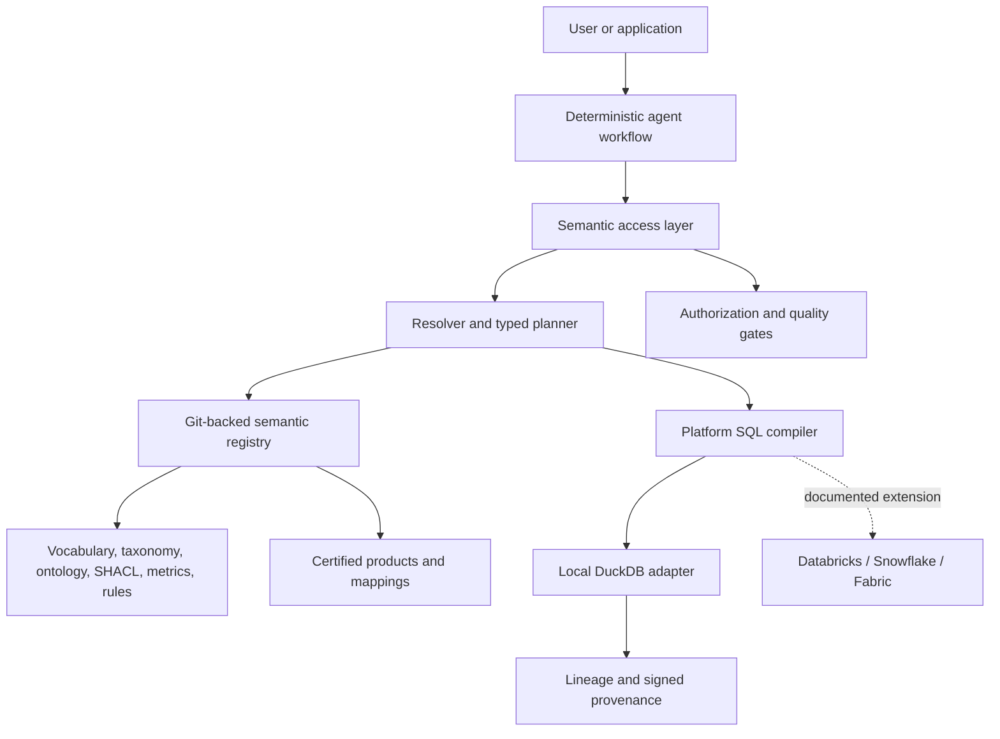
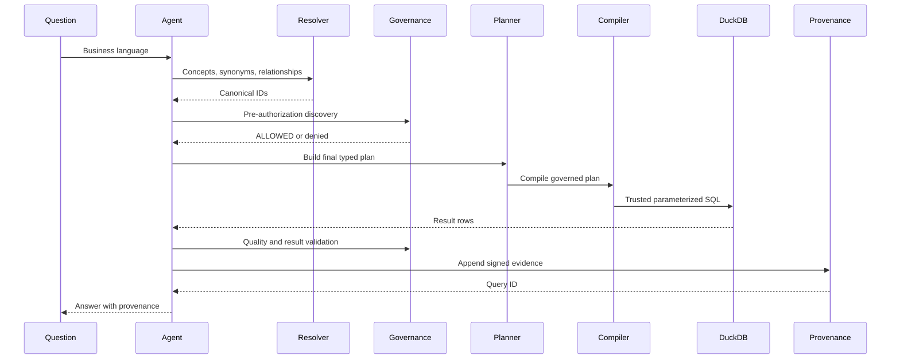

# Federated Semantic Layer for Agentic AI

A locally runnable reference implementation of a governed semantic layer for
GlobalSure Insurance Group. It maps business concepts to certified data
products and deterministic platform adapters without requiring cloud
credentials or an LLM key.

## What this repository proves

The primary local path answers this business question end to end:

> Find French motor-insurance customers with at least three qualifying claims
> in the last 12 months and total incurred loss above EUR 20,000.

The deterministic agent resolves canonical concepts, selects certified data
products, authorizes the caller, builds a typed SQL-free plan, compiles trusted
DuckDB SQL, validates quality, and returns provenance. The data is synthetic.

DuckDB is the only fully implemented execution platform. Databricks,
Snowflake, and Microsoft Fabric mappings and SQL are extension artifacts and
are explicitly not executed or benchmarked here. No AXA data, paid cloud
account, production credential, or LLM key is required.

## How to run

```bash
python3 -m venv .venv
.venv/bin/python -m pip install -e '.[dev]'
make PYTHON=.venv/bin/python test
make PYTHON=.venv/bin/python demo
```

Supported targets are `setup`, `test`, `lint`, `validate-semantic`, `demo`,
`evaluate`, and `run-api`; invoke any target as
`make PYTHON=.venv/bin/python <target>`.
The virtual environment keeps project dependencies isolated from Ubuntu's
PEP 668 externally managed system Python. The `validate-semantic` target reports
the valid graph as conforming and the invalid fixture as an expected failure.

## Local developer and data lifecycle

This section is the operational contract for a clean checkout. It is intended
to be sufficient for a developer, CI runner, or platform team to reproduce the
local reference environment without access to GlobalSure systems.

### Prerequisites and support matrix

| Component | Required for local execution | Supported baseline | Notes |
| --- | --- | --- | --- |
| Operating system | Yes | Linux, macOS, or Windows with a POSIX-compatible shell | CI runs on Ubuntu; Windows users can use WSL or invoke the equivalent commands in PowerShell. |
| Python | Yes | Python 3.12 or newer | Declared by `pyproject.toml`; older interpreters are not supported. |
| Git | Yes | Git 2.x | Required to obtain versioned semantic assets and history. |
| Cloud account | No | None | No cloud credentials are required; local execution uses DuckDB and checked-in synthetic CSVs. |
| LLM API key | No | None | No LLM API key is required; resolution and planning are deterministic and do not call an LLM. |
| Docker | No | Docker Engine 24+ if used | There is no Docker dependency in the core path. |
| Databricks, Snowflake, Fabric | No | Integration extension points only | Mappings and example SQL are documented artifacts; they are not cloud execution claims. |

The local implementation deliberately has a small dependency surface: FastAPI
and Uvicorn provide the HTTP boundary, Pydantic provides typed contracts,
RDFLib/pySHACL handle semantic assets, DuckDB provides local execution, and
PyYAML loads repository metadata. Development dependencies add pytest,
httpx, and Ruff. Dependencies are specified with minimum versions in
`pyproject.toml`; a committed lockfile is not currently provided, so transitive
dependency resolution can vary between installations. For release engineering,
generate and review a platform-specific lockfile (for example with `uv lock`)
and retain the same Python/platform matrix used by CI.

### Clean installation from a new checkout

```bash
git clone https://github.com/Sugumaran-Balasubramaniyan/enterprise-agentic-semantic-layer.git
cd enterprise-agentic-semantic-layer
python3 --version                 # must report 3.12 or newer
python3 -m venv .venv
.venv/bin/python -m pip install --upgrade pip
.venv/bin/python -m pip install -e '.[dev]'
cp .env.example .env              # optional; inspect before changing values
make PYTHON=.venv/bin/python validate-semantic
make PYTHON=.venv/bin/python test
make PYTHON=.venv/bin/python demo
```

The editable install makes `src/semantic_layer` importable while keeping the
repository assets at their checked-out paths. Do not install into the system
interpreter. The explicit sequence above is the canonical clean-install path;
do not run both it and the convenience setup target in the same fresh checkout.
For an existing checkout where `.venv` does not yet exist, the equivalent
convenience command is `make PYTHON=.venv/bin/python setup`; it creates the
managed environment and installs the editable project in one step. A failed
install should be treated as an environment issue, not solved by weakening the
declared dependency constraints.

### Configuration matrix

The configuration matrix below is the supported local configuration surface.

Configuration is intentionally small and fail-closed. There are no cloud
credentials in the example configuration and no default network model call.

| Variable | Default | Scope | Purpose and operational guidance |
| --- | --- | --- | --- |
| `SEMANTIC_LAYER_ENV` | `development` | Application | Labels the runtime environment. Use a deployment-specific value in production; it does not authenticate a caller. |
| `SEMANTIC_LAYER_SIGNING_KEY` | unset | Provenance authority | Optional 64-character hexadecimal or 32-byte key for durable HMAC evidence. Configure exactly one signing variable. Store it in a secret manager, never in Git. |
| `SEMANTIC_LAYER_SIGNING_KEY_FILE` | unset | Provenance authority | Path to a file containing the same key format. Useful for local restart-safe verification; protect file permissions. |
| `SEMANTIC_LAYER_ROOT` | test-only | Integrity tests | Absolute repository root used by subprocess integrity checks. Do not use as an authorization boundary. |
| `SEMANTIC_LAYER_DB` | test-only | Integrity tests | SQLite path used by isolated provenance tests. Production deployments should use managed durable storage. |
| `SEMANTIC_LAYER_QUERY_ID` | test-only | Integrity tests | Query identifier supplied to a verification subprocess. |

`SEMANTIC_LAYER_SIGNING_KEY` and `SEMANTIC_LAYER_SIGNING_KEY_FILE` are
mutually exclusive. If neither is set, the process creates an ephemeral key;
signatures can be verified only during that process lifetime. This is suitable
for a disposable local run, not for durable evidence. The `.env` file is
ignored by Git; `.env.example` is the only configuration file intended to be
committed. Production identity, authorization claims, KMS keys, database
endpoints, and cloud credentials must be injected by the deployment platform.

### Registry and cache behavior

The semantic registry has one authoritative source: reviewed YAML, Turtle,
SHACL, and metric/rule assets in this repository. `SemanticRegistry.from_repository`
loads and validates those files, checks cross-references, and builds an
in-memory object model. It also populates an in-memory SQLite cache for indexed
lookup; the cache is disposable and is never treated as the source of truth.

This has important lifecycle implications:

1. A process restart reconstructs the registry from the checked-out assets.
2. Editing a semantic asset requires a new process (or a deliberate registry
   reload) before the process observes the change.
3. A cache cannot be promoted independently of the Git commit that produced
   it; deployments should record the semantic commit and registry digest.
4. Invalid or dangling references fail during registry construction rather than
   becoming partially available runtime metadata.
5. A production registry may materialize the same contracts in a catalog or
   service, but Git review, semantic versioning, validation, and promotion gates
   remain the control plane.

### Data lifecycle and fixture policy

The checked-in data is synthetic and intentionally split into two layers. The
curated fixtures are the trusted local serving contract; raw fixtures are
quality-test inputs only. The following is a conceptual production lifecycle,
showing the kind of landing-to-certified flow that a real platform would own:

```text
data/raw/*.csv       source-like landing fixtures; include known defects
        |
        | quality checks, normalization, duplicate/future/invalid-value handling
        v
data/curated/*.csv   governed local execution fixtures; expected clean inputs
        |
        v
DuckDB adapter       query execution for the local reference path
```

The local generator does not execute the arrow as an ingestion pipeline. It
creates the raw defective fixtures and the curated clean fixtures independently
from the same deterministic record definitions. The quality checks demonstrate
the gate that would sit between those layers in production; they do not claim
that this repository performs raw-to-curated transformation, orchestration, or
deployment.

Raw fixtures contain representative failures such as missing identifiers,
negative amounts, future dates, invalid statuses, and duplicate claims. They
exist to exercise quality gates and should not be used as a trusted query
source. Curated fixtures contain the rows consumed by the normal DuckDB path;
they are a small, reviewable stand-in for certified data products. This policy
mirrors production separation between landing data and a certified serving
contract without pretending that CSV files are a production lakehouse.

Regenerate both layers with:

```bash
.venv/bin/python data/generate_demo_data.py
```

The generator writes to `data/` relative to the repository and uses the fixed
script as-of date `2026-08-28`. Its records are explicit and deterministic (the
current implementation does not use a random-number generator); the documented
seed policy is that any future randomized expansion must use a pinned seed and
must preserve the explicit as-of date. The as-of date anchors all relative
claim, policy, and premium dates, so results do not drift with wall-clock time.
For a different reporting cut, call `generate_demo_data(output_dir, as_of)`
from Python with an explicit `datetime.date`; do not silently replace it with
`date.today()` in a test or production job.

The generated fixtures are a reproducible test asset, not an ingestion process:
they do not model CDC, late-arriving records, schema evolution, retention,
encryption, regional residency, or production PII controls. Those concerns
belong in the owning data product and platform adapter.

### Local schemas, grain, and join keys

The four CSV contracts below are intentionally narrow. Column names in the
curated files are the local DuckDB representation; cloud mappings translate
them to platform-specific physical names while preserving the same semantic
concepts.

| Dataset | Grain | Required key | Important join keys | Core fields |
| --- | --- | --- | --- | --- |
| `customers.csv` | One row per customer | `customer_id` | `customer_id` joins to policies and claims | `customer_name`, `country`, `email` |
| `policies.csv` | One row per policy | `policy_id` | `customer_id` → customer; `policy_id` → claims/premiums | `country`, `product`, `policy_status`, `effective_date`, `expiry_date`, `annual_premium_eur` |
| `claims.csv` | One row per claim | `claim_id` | `policy_id` → policy; `customer_id` → customer | `country`, `product`, `status`, `claim_date`, `incurred_loss_eur` |
| `premiums.csv` | One row per premium posting | `premium_id` | `policy_id` → policy; `customer_id` → customer | `country`, `product`, `premium_date`, `premium_eur` |

The principal relationship path is
`customers.customer_id → policies.customer_id → claims.policy_id`.
`claims.customer_id` is retained as a denormalized consistency check, not a
replacement for validating the policy relationship. Premiums are independently
aggregated for `ClaimsRatio`; joining claims directly to premium postings can
fan out totals and is therefore prohibited by the metric/compiler contract.
The product code is normalized through the checked-in platform mapping before
it is compared with the canonical `insurance:MotorInsurance` concept.

### Running data and semantic checks together

Use the following order after changing fixtures or semantic assets:

```bash
make PYTHON=.venv/bin/python validate-semantic
make PYTHON=.venv/bin/python check-yaml
make PYTHON=.venv/bin/python check-mappings-quality
make PYTHON=.venv/bin/python test
make PYTHON=.venv/bin/python demo
```

If a curated fixture is missing, empty, malformed, or fails its required
quality checks, execution is rejected. A successful local answer therefore
means both that the logical plan compiled and that the selected local product
passed the configured quality gate. It does not certify an external source or
prove a cloud platform integration.

## 5-minute interview demo

Use the full narrative in [the interview demo guide](docs/interview-demo-guide.md).
The short version is:

```bash
python3 -m venv .venv
.venv/bin/python -m pip install -e '.[dev]'
make PYTHON=.venv/bin/python validate-semantic
make PYTHON=.venv/bin/python demo
```

In the `RESULT` section, the deterministic answer is:

```json
[
  {"customer_id": "FR_001", "country": "FR", "claim_count": 3, "total_incurred_loss_eur": 24000.0},
  {"customer_id": "FR_002", "country": "FR", "claim_count": 3, "total_incurred_loss_eur": 25000.0}
]
```

To show the HTTP boundary, run `make PYTHON=.venv/bin/python run-api` in one terminal,
then:

```bash
curl -s http://127.0.0.1:8000/health
curl -s -X POST http://127.0.0.1:8000/execute \
  -H 'content-type: application/json' \
  -d '{"question":"Find French motor-insurance customers with at least three qualifying claims in the last 12 months and total incurred loss above EUR 20,000.","role":"ClaimsAnalystFR"}'
```

The stable health output is `{"status":"ok"}`. The execute response includes
the typed plan, generated SQL, `PASS` quality, the two rows, and a runtime
`provenance.query_id`. Retrieve that evidence with
`curl -s http://127.0.0.1:8000/provenance/{query_id}`; the ID and digests are
deliberately runtime values rather than copied fixtures.

## Architecture

Read [architecture](docs/architecture.md) for the control-plane boundary and
diagrams, [agent architecture](docs/agent-architecture.md) for workflow and
tool contracts, and [federated semantics](docs/federated-semantics.md) for
Group/local ownership. [Governance](docs/governance.md) covers authorization,
quality, security, lineage, and semantic versioning.

The distinction matters: RAG can retrieve explanatory text, but only governed
semantic assets define canonical meaning, joins, metrics, access, and physical
field mappings. The ontology supplies typed relationships and SHACL validates
graphs; certified analytical products and compilers handle aggregation.

## Provenance

Every successful answer carries a provenance envelope containing the question
and plan digests, canonical concepts, metrics, selected products, mappings,
queried physical CSV sources separately from all quality-validated CSV sources,
semantic versions, authorization and quality outcomes, row count, timestamp,
and integrity evidence. The API exposes the envelope at
`/provenance/{query_id}`. A local signing key can be configured for restart
safe demo signatures; production should use an external KMS or signing
service.

## Implemented, simulated, and next

- **Implemented:** local YAML/Turtle asset loading; deterministic resolution;
  typed planning; authorization; quality gates; DuckDB execution; FastAPI;
  agent workflow; provenance; SHACL; golden evaluation; CI checks.
- **Simulated/documented:** cloud dialect SQL and Databricks, Snowflake, and
  Fabric adapters. They require credentials and native platform security and
  are not claimed as executed.
- **Production extension:** connect one adapter at a time behind the compiler
  interface, delegate identity and row-level security to the platform, and
  retain the same semantic contracts and evidence-producing tests.

See [implementation plan](docs/implementation-plan.md) and the
[architecture decision records](docs/decisions/) for the production path.

## Durable provenance signing

Capability and provenance signatures are issued by an internal control-plane
authority and are intentionally absent from the public package API. Internal
Python names are an organization boundary, not a hard security boundary; a
production deployment must replace this local demo authority with an external
KMS or signing service and keep its key outside the application process.

For a local process or demo that needs provenance to survive a restart, set
`SEMANTIC_LAYER_SIGNING_KEY_FILE` to a file containing either 32 raw bytes or
64 hexadecimal characters. `SEMANTIC_LAYER_SIGNING_KEY` accepts the same key
as hexadecimal text. Configure exactly one of these variables before starting
the process. If neither is configured, a fresh process-local key is generated;
that default is suitable only when persisted signatures do not need to be
verified after the process exits.

## Architecture at a glance



The stable contract is the semantic plan. It contains canonical concepts,
relationships, filters, metric predicates, time context, caller context, and
approved products—but no SQL. Only the compiler knows physical field names and
produces parameterized SQL for a selected execution platform.

### Runtime sequence



## The semantic contract

The canonical vocabulary includes `Customer`, `Policy`, `Claim`,
`InsuranceProduct`, `MotorInsurance`, `Risk`, `Coverage`, `Premium`,
`ClaimStatus`, `Country`, `ActivePolicy`, `QualifyingClaim`, and
`IncurredLoss`. The compact ontology models:

```text
Customer ownsPolicy Policy
Customer submitsClaim Claim
Claim relatesToPolicy Policy
Policy hasProduct InsuranceProduct
Policy coversRisk Risk
Policy hasCoverage Coverage
Policy generatesPremium Premium
MotorInsurance subclassOf InsuranceProduct
```

Governed metrics are defined in `semantic/metrics/metrics.yaml`:

| Metric | Meaning |
| --- | --- |
| `ClaimCount` | Count of qualifying claims |
| `TotalIncurredLoss` | Sum of qualifying incurred loss |
| `AverageClaimAmount` | Average qualifying claim amount |
| `ActivePolicyCount` | Policies satisfying the ActivePolicy rule |
| `ClaimsRatio` | Separately aggregated loss divided by earned premium |

`QualifyingClaim` excludes `CANCELLED` and `DUPLICATE`. This is a versioned
semantic rule, not an instruction for an LLM to invent.

## Federation: one meaning, different implementations

GlobalSure’s Group model owns canonical labels, relationships, interoperability
rules, and governance. Country domains own local products, physical schemas,
mappings, extensions, and regulatory rules.

| Country | Platform example | Local motor codes | Canonical value |
| --- | --- | --- | --- |
| France | Databricks | `MOTOR`, `MTR` | `insurance:MotorInsurance` |
| UK | Snowflake | `AUTO`, `CAR` | `insurance:MotorInsurance` |
| Germany | Microsoft Fabric | `MotorInsurance` | `insurance:MotorInsurance` |

The same Group plan can compile against different physical columns and code
systems without making the agent rediscover joins.

## Governance and data quality

The local policy engine demonstrates RBAC and ABAC patterns for
`ClaimsAnalystFR`, `ClaimsManagerGroup`, `FinanceAnalyst`, and the synthetic
`AgentService` context. Country scope, purpose, product classification, and
PII access are checked before final planning and execution. The request-body
role is a simulator, not production identity authentication.

Quality checks reject missing or duplicate identifiers, blank join keys,
invalid countries/products/statuses, future dates, negative or non-finite loss,
and degraded/unsafe products. A failed quality capability cannot be passed to
the DuckDB adapter. Provenance records the plan, query, parameters, semantic
closure, selected products, queried sources, quality-validated sources,
authorization outcome, quality result, and integrity evidence.

## API endpoints

Run `make PYTHON=.venv/bin/python run-api`, then open
`http://127.0.0.1:8000/docs` for generated OpenAPI documentation.

| Endpoint | Purpose |
| --- | --- |
| `GET /health` | Service health |
| `GET /concepts` | Vocabulary discovery |
| `GET /concepts/{concept_id}` | One canonical concept definition |
| `GET /metrics` | Governed metric definitions and ownership |
| `GET /data-products` | Certified data-product contracts |
| `GET /mappings` | All registered platform mappings |
| `POST /resolve` | Deterministic business-term resolution |
| `POST /query-plan` | Authorized typed logical plan |
| `POST /execute` | Governed local execution |
| `POST /validate` | Semantic/data-quality validation |
| `GET /provenance/{query_id}` | Signed runtime evidence |

The table above is the implemented transport contract. There are deliberately
no detail routes for metrics, data products, relationships, or individual
mappings; clients retrieve the registered collections and use the canonical
IDs in their responses. `POST /resolve` accepts a business question only.
`POST /query-plan` and `POST /execute` additionally require the simulated
`role` caller context and optional `country` and `purpose` fields. The role is
not authentication: production identity and authorization attributes must be
derived by the transport from an identity provider.

All request models reject unknown fields and SQL-shaped input. Unsupported
question grammars, residual filters, unknown roles or products, unauthorized
country scopes, degraded products, and failed quality checks fail closed before
execution. A successful `/execute` response contains the canonical plan,
compiled local SQL, result rows, quality and authorization outcomes, and a
runtime provenance ID. The `/validate` endpoint is a read-only check of the
checked-in curated fixture; it does not execute an arbitrary query.

## Verification evidence

The latest checked-in verification evidence is recorded in
[docs/verification-report.md](docs/verification-report.md), dated **2026-08-28 UTC**.
It documents the exact local commands, outputs, limitations, and
security-scan interpretation; it is the source of truth for what was actually
verified rather than a claim of cloud-platform execution.

The latest full local matrix reported `195 passed` with the existing third-party
FastAPI/Starlette `TestClient` deprecation warning. It also reported:

- lint: Ruff passed;
- semantic validation: valid RDF conforms and the invalid fixture fails as expected;
- YAML, mapping, quality, compiler, and golden checks: passed;
- golden evaluation: `31/31` governed cases and `10/10` discovery-only cases;
- the end-to-end demo: deterministic `FR_001` and `FR_002` results;
- `git diff --check`: clean; and
- a scoped credential scan: no credential values found.

These results are local regression evidence over synthetic data. They do not
establish production scale, latency, cloud compatibility, or business-data
quality. Re-run the commands after changing semantic assets, mappings,
compiler logic, authorization, or data fixtures.

SQL-shaped questions, unsupported residual constraints, unauthorized roles, and
degraded products fail closed.

## Testing and evaluation

The golden corpus contains 31 distinct governed questions, including the ten
secondary scenarios in the project brief. It measures concept resolution,
relationship resolution, certified-product selection, metrics, authorization,
deterministic executable answers, and discovery-only constraints.

```bash
make test
make lint
make validate-semantic
make check-yaml
make check-mappings-quality
make check-golden
make check-compiler
make evaluate
make PYTHON=.venv/bin/python demo
```

The verified local run reports 195 passing tests, 31/31 golden cases, and
10/10 discovery-only cases. The single warning is a third-party FastAPI/
Starlette `TestClient` deprecation notice, not a project failure.

## Repository map

```text
semantic/                  Versioned vocabulary, taxonomy, ontology, SHACL, rules and metrics
data_products/             Certified product contracts and SLAs
mappings/                  Databricks, Snowflake and Fabric field/value mappings
data/                      Deterministic synthetic raw and curated CSV generation
src/semantic_layer/
  registry/                Git-backed registry and SQLite cache
  resolver/                Synonym and local-code grounding
  query_planner/           Typed logical plans and closed grammar
  compiler/                Trusted DuckDB compiler and cloud artifacts
  adapters/                Local execution and cloud extension seams
  governance/quality/      Authorization and quality gates
  lineage/provenance/      Source lineage and signed evidence
  agents/                  Workflow and governed tools
  api/                     FastAPI transport
tests/                     Unit, semantic, integration, golden and security tests
docs/                      Architecture, ADRs, governance, interview guide, verification
examples/                  Plans, questions and SQL artifacts
```

## Semantic assets as software

Semantic assets are version-controlled and tested like code:

- **Patch:** metadata or documentation correction with unchanged meaning.
- **Minor:** compatible synonym, relationship, or concept addition.
- **Major:** changed definition, metric semantics, join contract, or interpretation.

Changing `ActivePolicy`, `QualifyingClaim`, a mapping value, or a metric
definition requires updated regression and golden evidence. CI runs linting,
YAML parsing, ontology/SHACL checks, mapping and quality tests, compiler tests,
API tests, golden evaluation, and the complete suite.

## Production evolution

This is a local reference implementation, not a claim of live cloud integration.

1. Replace synthetic caller roles with trusted identity, purpose, and policy
   decision services.
2. Keep Group vocabulary, ontology, metrics, and product contracts in Git with
   semantic versioning and review gates.
3. Connect one platform adapter at a time: Unity Catalog/Delta and Metric Views
   for Databricks; governed semantic views, RBAC, masking and query history for
   Snowflake; OneLake, Fabric semantic models and lineage for Fabric.
4. Delegate row/column security to the underlying platform rather than bypassing
   it through the semantic service.
5. Move signing to an external KMS/HSM or privileged signing service and add
   observability for plan decisions, quality, latency, cost, and provenance.
6. Onboard additional domains through certified products and golden tests,
   preserving local autonomy while maintaining Group interoperability.

## Interview walkthrough

Use [docs/interview-demo-guide.md](docs/interview-demo-guide.md) for the full
script. The concise narrative is:

1. Start with the business question, not ontology technology.
2. Show the resolver grounding “car insurance” and “loss amount”.
3. Show the typed plan and certified products.
4. Show FR/UK/DE mapping normalization.
5. Show authorization, quality, SQL, result, and provenance.
6. Explain why direct LLM-to-SQL, RAG alone, or a graph alone is insufficient.
7. Close with semantic versioning, CI, and federated ownership.

For design rationale, see [architecture](docs/architecture.md),
[semantic layer](docs/semantic-layer.md), [governance](docs/governance.md),
[federated semantics](docs/federated-semantics.md), the
[implementation plan](docs/implementation-plan.md), and the
[architecture decision records](docs/decisions/).

## Implemented versus simulated

**Implemented locally:** semantic assets, SHACL, deterministic resolver and
planner, registry, metrics/rules, authorization, quality, DuckDB execution,
FastAPI, agent workflow, provenance, synthetic data, evaluation, and CI.

**Simulated or documented:** Databricks, Snowflake, and Fabric connections and
execution; production identity authentication; external KMS/HSM signing;
enterprise-scale performance; and benchmark claims.

No confidential data, credentials, paid cloud account, or hosted LLM is required.

## License

MIT. See [LICENSE](LICENSE).
