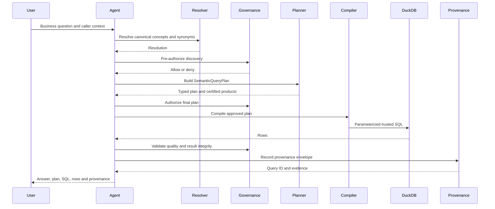

# Agent architecture

`ClaimsInvestigationAgent` is an explicit deterministic workflow, not an
autonomous SQL generator. Its tools expose concept search, definitions,
relationships, certified products, metrics, plan construction, execution, and
provenance. Every stage consumes a typed result from the previous stage.

The ten stages are `intent_parse`, `resolve`,
`relationships_and_products`, `authorize`, `plan`, `compile`, `execute`,
`result_validation`, `provenance`, and `answer_formatting`. A denied caller
stops before final plan creation and execution. The HTTP transport is thin and
delegates to this workflow.

## RAG and semantic responsibilities

Document retrieval may supply a claims-handling explanation or a policy
passage. It cannot establish that “motor insurance” means the canonical
product, that cancelled claims are excluded, or that a caller may see French
PII. Those decisions come from the versioned semantic assets and governance
services. If an LLM is added, it may propose a question interpretation, but
the resolver, Pydantic plan, authorization, compiler, and quality gates can
reject it.

## Tool contract

The agent tools are bounded to semantic operations:

| Tool | Purpose |
| --- | --- |
| `search_concept` / `resolve_business_term` | Find canonical terms and synonyms |
| `get_business_definition` / `get_relationships` | Explain governed meaning and paths |
| `find_certified_data_product` | Select only certified contracts |
| `get_metric_definition` | Return metric expression and rule |
| `build_query_plan` | Emit a validated SQL-free logical plan |
| `execute_semantic_query` | Compile and execute an approved plan |
| `get_provenance` | Retrieve the persisted evidence envelope |

No tool accepts arbitrary SQL. Query plans contain canonical IDs, operators,
and scalar values; physical SQL is produced only by the compiler after
validation and authorization.
