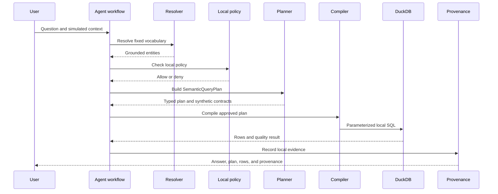

# Agent architecture

This page describes the implemented local semantic workflow. It is a
deterministic control path over synthetic fixtures, not an autonomous SQL
generator and not an LLM agent. Every stage consumes a typed result from the
previous stage.

The workflow stages are `intent_parse`, `resolve`,
`relationships_and_products`, `authorize`, `plan`, `compile`, `execute`,
`result_validation`, `provenance`, and `answer_formatting`. A denied request
stops before final plan creation and execution. The HTTP transport is thin and
delegates to this workflow.

## Current/proposed boundary

The local path uses deterministic vocabulary lookup, typed Pydantic contracts,
reviewed synthetic product metadata, and bounded policy checks. It does not call
an LLM, create embeddings, query a vector index, or accept arbitrary SQL.

Retrieval of an explanatory document could be useful in a future experiment,
but it cannot decide that a label means a canonical product, make a join safe,
or grant access to data. A future LLM may propose an interpretation or
explanation only behind the existing resolver, plan, policy, compiler, quality,
and provenance boundaries. Such an experiment is **Proposed future work**.

## Tool contract

The tools are bounded to semantic operations:

| Tool | Purpose |
| --- | --- |
| `search_concept` / `resolve_business_term` | Find canonical terms and synonyms |
| `get_business_definition` / `get_relationships` | Explain meanings and paths |
| `find_data_product` | Select a repository-maintained synthetic contract |
| `get_metric_definition` | Return a metric expression and rule |
| `build_query_plan` | Emit a validated SQL-free logical plan |
| `execute_semantic_query` | Compile and execute an approved local plan |
| `get_provenance` | Retrieve the local evidence envelope |

Product metadata may contain the internal status `CERTIFIED`. In this
repository it is a synthetic contract status used by selection and tests; it
is not an external certification. Query plans contain canonical IDs,
operators, and scalar values. Physical SQL is produced only by the local
compiler after validation and policy checks.
