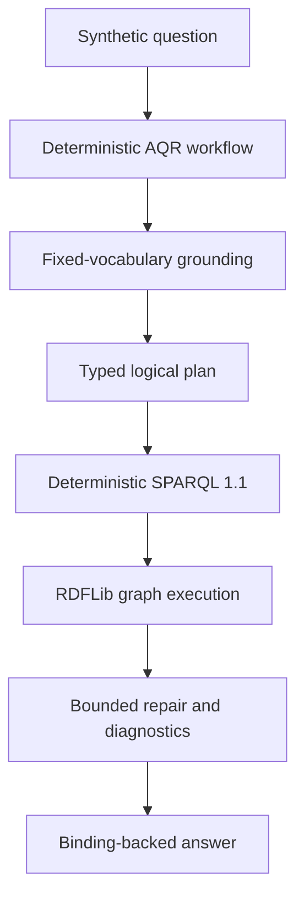
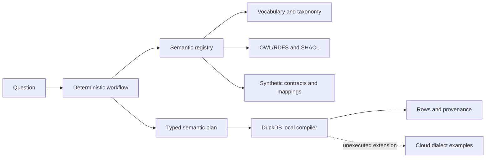
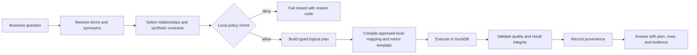

# Architecture

The repository has two deliberately ordered demonstrations. The primary path
is a synthetic RDF knowledge graph and deterministic AQR workflow. A secondary
path demonstrates semantic contracts over synthetic relational fixtures. Both
are local, reviewable examples; neither claims a live external system.

## Synthetic KG/AQR path

The support and product-lifecycle fixtures use neutral documentation
namespaces such as `cifsup`, `cifppms`, `cifdata`, and `cifmeta`. RDF/OWL
describes classes and relationships, SHACL checks instance constraints, and
SPARQL 1.1 expresses deterministic graph queries. The current linker uses
finite vocabularies; the planner emits typed triple patterns; the local loader
executes with RDFLib. Repair is hand-written, bounded, and recorded.

There is no external LLM, vector retriever, embedding model, or broad
generalization test in this path. Learned schema linking, Text-to-SPARQL, and
learned repair are **Proposed future work** rather than current capabilities.

## Secondary relational path

The secondary path loads YAML/Turtle/SHACL/metric/rule assets into a typed local
registry, resolves a business question, selects a repository-maintained
synthetic contract, checks simulated caller context, builds a typed plan,
compiles trusted DuckDB SQL, applies quality checks, and records provenance.

The local API's role and country fields are requester-supplied simulation
fields, not authentication. A future deployment would require an identity-aware
transport, platform-native authorization, privacy controls, and independent
verification. Cloud mappings and SQL snippets remain illustrative.

## Request flow and boundaries

### Semantic responsibilities

Glossary YAML defines human meaning, synonyms, sensitivity, and versions.
SKOS organizes labels and concepts. OWL/RDFS describes typed classes and
relationships. SHACL validates graph instances. Product contracts describe
grain, quality, classification, and lineage. Mappings normalize local fields
and values. Metrics and rules define calculations. The deterministic compiler
turns an approved plan into local DuckDB SQL.

The ontology is not the analytical execution store, and the graph does not
replace relational product contracts. Retrieval and a future LLM may explain
these assets, but validation, policy, compilation, execution, and provenance
remain authoritative.

See [agent architecture](agent-architecture.md),
[semantic layer](semantic-layer.md), [governance](governance.md), and
[federated semantics](federated-semantics.md).
