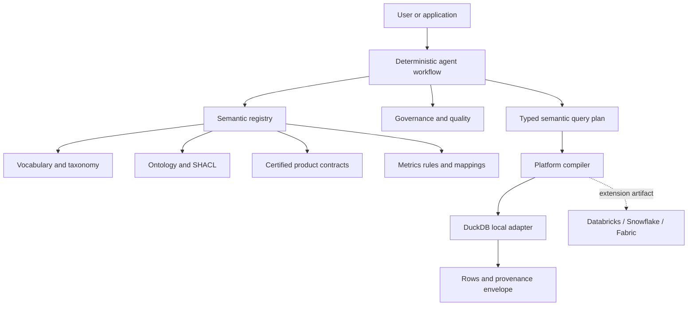
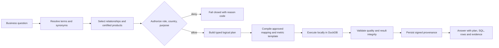
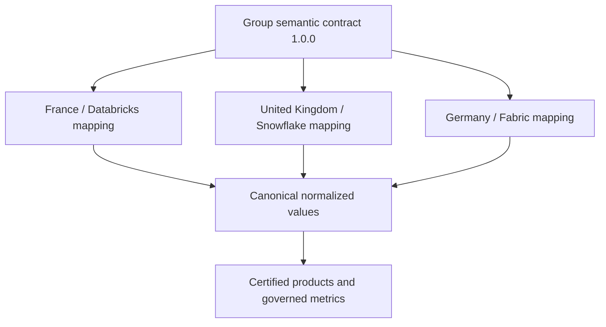
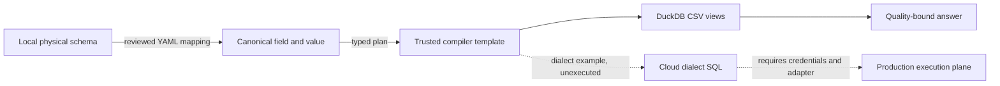

# Architecture

GlobalSure Insurance Group's semantic layer is a small control plane between
business intent and platform execution. Git is the reviewable source of truth
for vocabulary, taxonomy, ontology, SHACL shapes, metric rules, products, and
local mappings. Python services load those assets into a typed registry; a
request is resolved, authorized, planned, compiled, executed, quality-checked,
and recorded with provenance.

## Request flow

The public API accepts business language plus a caller context. It never
accepts a SQL string and the agent has no arbitrary-SQL tool. The planner
emits `SemanticQueryPlan`, a Pydantic contract containing canonical concepts,
relationships, filters, metric predicates, a time context, certified product
IDs, caller context, and a target platform.

## What each semantic asset does

Glossary YAML defines human meaning, ownership, synonyms, sensitivity, and
version. SKOS taxonomy organizes product labels. OWL/RDFS describes typed
classes and relationships, while SHACL validates instance graphs. A knowledge
graph contains compact example facts; it is not the analytical execution
store. Product contracts describe grain, SLA, classification, quality and
lineage. Mappings normalize local fields and values to the Group vocabulary.
Metrics and rules define governed calculations such as `QualifyingClaim` and
`ClaimsRatio`.

RAG can retrieve policy documents or explain a definition, but retrieval does
not make a join, metric, authorization decision, or physical field mapping
safe. The semantic layer supplies those executable contracts. An optional LLM
may improve language understanding or explanation; deterministic resolution,
validation, authorization, compilation, and provenance remain authoritative.

## Federation and ownership

Group owns canonical concepts, the ontology, interoperability rules, semantic
versioning, and CI. France, the UK, and Germany own local products, source
schemas, mappings, extensions, and regulatory policies. Each local product
must map into the canonical vocabulary before a Group metric can use it.

The mapping boundary is explicit and platform-independent. For example,
`MTR`, `CAR`, and `MotorInsurance` normalize to
`insurance:MotorInsurance`; an unknown value fails closed. Cloud identifiers
and SQL examples are documentation/interface artifacts only. The repository
does not claim a live Databricks, Snowflake, or Fabric execution.

## Mapping and execution boundary

DuckDB is the fully implemented adapter and runs against deterministic
synthetic CSVs. A production adapter would delegate authentication,
row-level security, network policy, and audit to the native platform; the
semantic compiler must not bypass those controls.

## Cross-cutting controls

Authorization combines role, country, purpose, and classification. Quality
checks cover IDs, non-negative loss, dates, statuses, countries, and mapped
products. Unsafe or degraded products block detail queries. Static lineage
connects source to product to metric; dynamic provenance records the question,
plan, mappings, physical files, versions, authorization, quality result,
timestamps, and digests for the particular answer.

See [agent architecture](agent-architecture.md),
[governance](governance.md), and [federated semantics](federated-semantics.md)
for operational details.
