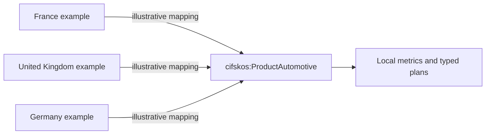

# Secondary federated semantic-layer reference

This page documents the repository's secondary relational reference path. The
mapping files are **Synthetic/simulated** and are illustrative mappings, not
live connections, external ownership statements, or platform certifications.

| Local fixture context | Illustrative platform | Region code | Local automotive values |
| --- | --- | --- | --- |
| France | Databricks example | FR | `MOTOR`, `MTR` |
| United Kingdom | Snowflake example | GB | `AUTO`, `CAR` |
| Germany | Microsoft Fabric example | DE | `Automotive` |

The values map to the neutral `cifskos:ProductAutomotive` concept through the
repository's mapping service. Unknown platforms and values fail closed with a
`ValueError`; an unmapped value cannot silently enter a local metric. Status
mappings preserve the controlled `POSTED`, `CLEARED`, `REVERSED`, and
`DUPLICATE` vocabulary.

Order lifecycle mappings are explicit as well. Local `EN_COURS` (FR),
`OPEN`/`RELEASED` (GB), and `FREIGEGEBEN` (DE) normalize to `RELEASED`; closed
and cancelled values normalize to `CLOSED` and `CANCELLED`.

The mapping files retain platform-shaped source identifiers so the contract is
reviewable, but no network request or cloud query is made. Local execution ends
at the DuckDB/CSV adapter. A future platform adapter would need its own
credentials, native identity and security controls, performance evidence, and
privacy review.

The repository maintains these illustrative mappings and the neutral semantic
contract. The mapping boundary is intentionally separate from any external
organization's ownership model. See [architecture](architecture.md) and
[ADR-001](decisions/ADR-001-canonical-group-model.md).

Live platform execution is **Not implemented**; adapter verification is
**Proposed future work**.
