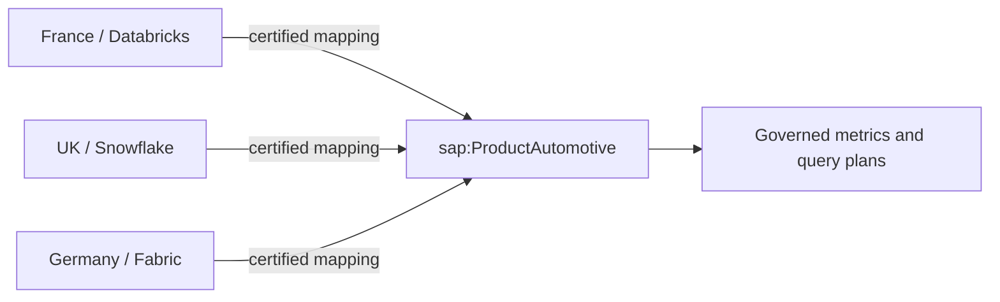

# Federated semantics

The enterprise architecture model owns the canonical vocabulary and semantic version. Regional
entities own their physical schemas and mappings. The three mapping assets
describe the field-level contract and normalize local values before a metric
or query plan can use them.

| Local entity | Platform | Location | Local automotive values |
| --- | --- | --- | --- |
| France | Databricks | FR | `MOTOR`, `MTR` |
| United Kingdom | Snowflake | GB | `AUTO`, `CAR` |
| Germany | Microsoft Fabric | DE | `MotorInsurance` |

All three values resolve to `sap:ProductAutomotive` through
`canonical_product(platform, value)`. Unknown platforms and values fail closed
with a `ValueError`; an unmapped product cannot silently enter a governed
metric. Status mappings work the same way and preserve the canonical
`POSTED`, `CLEARED`, `REVERSED`, and `DUPLICATE` vocabulary.

Order lifecycle mappings are explicit on every platform as well. Local
`EN_COURS` (FR), `IN_FORCE` (GB), and `AKTIV` (DE) all normalize to canonical
`RELEASED`, the only value admitted by `sap:ActiveSalesOrder`; local closed
and cancelled values normalize to `COMPLETED` and `CANCELLED` respectively.

The mapping files intentionally document cloud source identifiers without
claiming a live cloud connection. The local execution boundary is the
DuckDB/CSV adapter in later tasks; platform SQL examples can be compiled from
the same semantic fields but are not executed without credentials.

Enterprise governance owns the canonical vocabulary, ontology, interoperability rules, and
semantic CI. France, the UK, and Germany own their local schemas, products,
mappings, and regulatory policies. This ownership split means local autonomy
does not become semantic divergence: every mapping is reviewed and tested
against the enterprise contract before a metric can consume it.

See [architecture](architecture.md) for the mapping boundary and
[ADR-001](decisions/ADR-001-canonical-group-model.md) for the canonical Group
model decision.
