# Implementation and research plan

The repository is staged so each phase leaves a runnable, reviewable local
boundary. The first four phases below are **Implemented locally**; later work
is **Proposed future work**.

## Implemented locally

1. **Synthetic semantic foundation:** neutral namespace vocabulary, SKOS labels,
   OWL/RDFS ontology, SHACL shapes, and sample RDF graphs.
2. **Secondary relational contracts:** repository-maintained synthetic data
   contracts, illustrative mappings, governed metrics/rules, and deterministic
   local fixtures.
3. **Deterministic control plane:** typed registry, fixed-vocabulary resolver,
   simulated policy, quality checks, logical planner, trusted compiler, DuckDB
   adapter, and local provenance.
4. **Interfaces and regression checks:** deterministic agent workflow, FastAPI
   transport, CLI demos, golden questions, and tests.

## Proposed future work

### Research hardening

- Add learned schema-linking and constrained Text-to-SPARQL experiments behind
  an explicit abstention policy.
- Compare learned repair diagnostics with the bounded deterministic repair
  baseline under a fixed budget.
- Add graph/vector or hybrid retrieval only with a real protocol, held-out
  data, cost accounting, and unsupported-answer review.
- Expand evaluation beyond the small controlled synthetic corpora only after
  data provenance, privacy, and human-review criteria are specified.

### Integration hardening

- Replace simulated caller fields with a trusted identity and policy boundary.
- Implement one platform adapter behind the compiler interface and verify its
  credentials, native security, semantics, and performance independently.
- Add durable provenance, key management, observability, incident response,
  and privacy controls for the chosen deployment environment.

The cloud and platform steps are plans, not deployment claims. No external
endpoint, cloud account, model download, or API key is required by the local
path.

```mermaid
flowchart LR
    PR[Change proposal] --> Y[YAML and schema checks]
    Y --> S[Ontology and SHACL validation]
    S --> M[Mapping and quality tests]
    M --> C[Compiler and API tests]
    C --> G[Golden semantic regression]
    G --> F[Focused pytest and lint]
    F --> R[Review status and evidence]
    R -. future deployment .-> D[Independently verified adapter]
```

A green local suite is evidence about the checked-in implementation only. It
does not imply a cloud adapter has executed or that a deployment is ready.
