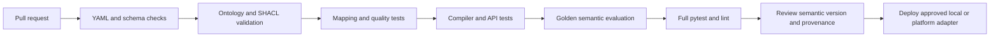

# Implementation plan

The repository is deliberately staged so each phase leaves a runnable,
reviewable boundary.

## Implemented phases

1. **Semantic foundation:** versioned vocabulary, SKOS taxonomy, OWL/RDFS
   ontology, SHACL shapes, and sample RDF graphs.
2. **Federated contracts:** certified data products, local mappings, governed
   metrics/rules, and deterministic synthetic FR/GB/DE data.
3. **Control plane:** typed registry, deterministic resolver, authorization,
   quality checks, logical planner, trusted compiler, DuckDB adapter, and
   provenance.
4. **Interfaces and evaluation:** agent workflow, FastAPI transport, CLI demo,
   golden questions, regression tests, and CI checks.

## 30/60/90-day production evolution

### First 30 days: harden the contract

- Establish Group and local stewardship ownership and review SLAs.
- Replace synthetic fixtures with masked representative samples.
- Add schema-drift checks and contract tests for every local mapping.
- Connect provenance to the enterprise catalog and incident workflow.
- Threat-model identity, PII, prompt injection, and cross-border access.

### By 60 days: connect execution safely

- Implement one platform adapter behind the existing compiler interface.
- Delegate authentication, row-level security, and audit to that platform.
- Add workload limits, query cancellation, cost controls, and observability.
- Run shadow comparisons against approved reports and investigate variance.
- Expand metric certification and add privacy/legal review for new countries.

### By 90 days: operate and scale

- Roll out the remaining platform adapters with independent certification.
- Introduce approval workflows for major semantic-version changes.
- Add SLOs for resolver latency, plan rejection, quality failures, and
  provenance completeness.
- Publish a governed catalog and self-service onboarding playbook for local
  data offices.
- Re-run golden and production-canary suites on every release.

## CI lifecycle

The CI workflow is evidence-producing: it checks the declarative assets and
runtime behavior. A green local suite does not imply that a cloud adapter has
executed; that requires platform credentials and a separate environment.
