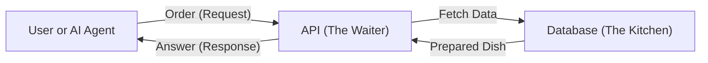

# Chapter 00: Computing & Enterprise 101 for Absolute Beginners

> A zero-prerequisite introduction to how computers, code, databases, and enterprise software actually work in the real world.

If you have never written a single line of code and don't know what a terminal is, this chapter is for you! Before we talk about knowledge graphs or AI reasoning, let's demystify the basic building blocks of modern computer systems.

---

## Track A: The Layperson Intuition Track

### 1. What is Code?
Think of code as a **cooking recipe** written for a very literal, super-fast robot:
- A recipe has ingredients (data) and step-by-step instructions: *"Preheat oven to 350. Whisk 2 eggs. If mixture is dry, add milk."*
- A computer program does the exact same thing: *"Load user input. Check if password matches. If password is correct, unlock account; otherwise, show error."*

Computers are not magic. They do not have intuition. They simply execute millions of tiny recipe steps every second.

### 2. What is a Database?
Imagine a spreadsheet program like Microsoft Excel or Google Sheets, but built to hold **billions of rows** instead of thousands, and accessible by thousands of people at the exact same millisecond:
- In a flat text file, finding a specific transaction requires reading from top to bottom.
- In a database, data is indexed like the index at the back of a textbook: the computer can instantly jump to the exact page without reading all previous pages.

### 3. What is an API (Application Programming Interface)?
Imagine sitting in a restaurant:
- You are the customer sitting at the table.
- The kitchen is the database and computation engine where meals are prepared.
- How do you get food from the kitchen? You don't walk into the kitchen yourself and touch the stove! Instead, you look at a menu and talk to the **waiter**.
- The waiter takes your structured order, carries it to the kitchen, ensures the kitchen prepares it safely, and brings the plate back to your table.

An **API is the waiter**. It is a standardized door through which other programs can safely ask questions without needing direct access to the raw internal database.



### 4. What is the Terminal (Command Line)?
Most people interact with computers using a Graphical User Interface (GUI): clicking icons, dragging windows, and tapping buttons.

The **terminal (or command line)** is interacting with the computer entirely through typed text. Instead of double-clicking a folder called `documents`, you type `cd documents`. Instead of dragging a file to the trash, you type `rm file.txt`.

Why do programmers love the terminal? Because you can **automate** it! You cannot easily program a robot to click on random moving mouse buttons, but you can easily give a computer a script of 100 text commands to run in sequence overnight.

### 5. Frontend vs. Backend vs. Data: Where Does This Repository Live?
Software applications have three main layers:
1. **Frontend (The Face)**: The buttons, mobile app screens, and web pages that humans see and click.
2. **Backend (The Logic)**: The servers in the cloud that calculate totals, verify passwords, and orchestrate business operations.
3. **Data Layer (The Memory)**: The databases, graphs, and files where historical facts are safely stored.

**This repository lives in the Backend and Data layers.** It is the analytical "brain" that figures out the truth before any human or AI makes a decision.

---

## Track B: The Apprentice Engineer Track

### Basic Concepts in Python

In this repository, the primary programming language is **Python 3.12**. Here are the three basic concepts you will see across our code:

#### 1. Variables and Types
A variable is a labelled box that holds a piece of information:
```python
# A string (text)
component_name = "FI-GL"

# An integer (whole number)
support_package = 5

# A boolean (True or False)
is_resolved = True
```

#### 2. Functions
A function is a reusable mini-recipe. It takes inputs, performs logic, and returns an output:
```python
def check_severity(priority: str) -> bool:
    if priority == "Very High":
        return True
    return False
```

#### 3. Dataclasses (Structured Records)
Instead of loose variables, we group related data into structured records called dataclasses:
```python
from dataclasses import dataclass

@dataclass(frozen=True)
class SupportNote:
    note_id: str
    component: str
    is_active: bool
```
The `frozen=True` setting makes the object **immutable**: once created, nobody can accidentally change its values! This prevents hidden bugs.

---

## Student Lab: Try It in Python

Let's test these basic concepts right now in your terminal using the project environment!

### Step 1: Open Python in Your Terminal
Run this command in your shell:
```bash
.venv/bin/python
```
You will see the interactive Python prompt: `>>>`.

### Step 2: Create a Mini Knowledge Triple
Type or paste these lines:
```python
note = {"id": "Note-3109922", "resolves": "TIME_OUT", "component": "BC-DB-HDB"}
print(f"Checking {note['id']} for alert {note['resolves']}")
```
Output:
```text
Checking Note-3109922 for alert TIME_OUT
```

### Step 3: Exit Python
Type `exit()` or press `Ctrl+D` to return to your normal terminal.

---

## Self-Check Quiz

1. **Why do we use an API instead of letting users query the database directly?**
   - *Answer*: Security, stability, and validation. The API acts like a waiter, checking permissions and ensuring requests are safe before touching the raw database.
2. **What does `frozen=True` do to a Python dataclass?**
   - *Answer*: It makes it immutable, meaning its fields cannot be modified after creation, preventing accidental state changes.
3. **Where does this repository live in the software stack?**
   - *Answer*: In the backend and data layers, acting as the semantic translation and reasoning engine.

---

## Next Steps

Now that you have the basic mental model of modern software, proceed to [Chapter 01: The Big Picture](01-the-big-picture.md) to discover why global companies need a Semantic Layer!
