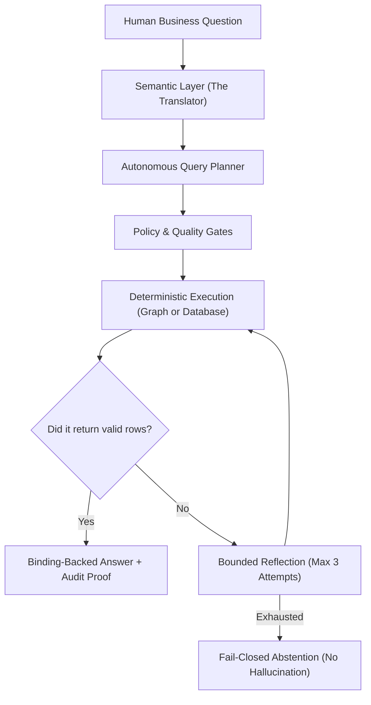

# Chapter 01: The Big Picture

> The enterprise data challenge, the semantic gap, and why naive LLM prompting fails in high-stakes business environments.

Have you ever wondered how giant global companies like Siemens, BMW, or Walmart keep track of millions of orders, inventory parts, and financial transactions? In this chapter, we explore why enterprise data is so notoriously difficult to understand, and how this repository solves that problem with a **Semantic Layer** and **Agentic Reasoning**.

---

## Track A: The Layperson Intuition Track

### The Real-World Problem: The Enterprise Language Barrier
In a small coffee shop, tracking data is simple: you have one cash register and a little notebook.

In a Fortune 500 company operating in 50 countries:
- You have tens of thousands of database tables with millions of columns.
- The software running these operations (called an **ERP system**, such as SAP S/4HANA) was originally built in Germany decades ago.
- Because database storage in the 1980s was tiny, database column names were limited to 5-letter abbreviations derived from German words!
  - `BUKRS` = *Buchungskreis* (Company Code)
  - `KUNNR` = *Kundennummer* (Customer Number)
  - `BELNR` = *Belegnummer* (Accounting Document Number)
  - `ACDOCA` = *Actual Document Accounting* (The universal financial ledger)

Now imagine a Financial Director asks: *"What was our total revenue from automotive customers in France last quarter?"*

Who can answer this?
- A regular business person cannot write database queries against `BUKRS` and `KUNNR`.
- Even experienced developers spend months trying to figure out which cryptic tables need to be joined together.

### The Naive Solution: "Can't We Just Ask ChatGPT?"
In recent years, many companies tried feeding their database schemas into a Large Language Model (LLM) like ChatGPT and asked it: *"Generate a SQL query to answer this business question."*

Here is why that fails disastrously in real business:
1. **The Hallucination Trap**: LLMs are statistical text predictors. If an LLM doesn't know the exact join key between table A and table B, it will confidently invent a fake column name that sounds convincing!
2. **Silent Calculation Errors**: An LLM might join orders to invoices incorrectly, accidentally multiplying rows and double-counting revenue. To an executive, the number looks plausible, but in an audit, it creates a multi-million-dollar discrepancy.
3. **Lack of Auditability**: An enterprise cannot tell a government tax auditor: *"We reported $50M in profits because ChatGPT told us so."* Regulators demand exact, verifiable mathematical proof of where every number came from.

### The Solution: The Semantic Layer & Deterministic AQR
This repository introduces two key innovations:

1. **The Semantic Layer (The Unified Translator)**:
   - A standardized catalog of business terms, calculations, and rules stored as code in Git.
   - It declares once and for all: *"When someone says 'Revenue', here is the exact formula and the exact certified tables to use."*
2. **Autonomous Query Reasoning (AQR - The Careful Detective)**:
   - Instead of asking a model to guess, the system uses a **deterministic symbolic reasoner**.
   - It breaks user questions into grounded slots, builds a strict mathematical query plan, verifies authorization rules, executes queries over knowledge graphs or databases, and inspects the output.
   - If an error occurs, it uses bounded self-reflection to repair it safely. If data does not exist, it **abstains** (says "I don't know") rather than fabricating a fake answer!



---

## Track B: The Apprentice Engineer Track

### Deterministic Symbolic AI vs. Probabilistic Models

This repository represents a **symbolic baseline**. What does that mean?

| Property | Probabilistic Model (e.g., LLM) | Deterministic Symbolic Baseline (This Repo) |
| :--- | :--- | :--- |
| **Mechanism** | Predicts tokens via neural network weights | Evaluates rules, graph triples, and AST query plans |
| **Reproducibility** | May vary across runs or temperature settings | Bit-for-bit identical results on every execution |
| **Hallucination Risk** | High (can generate plausible non-existent data) | Zero (answers assemble strictly from returned database bindings) |
| **Auditability** | Black box (hard to explain why a token was chosen) | Complete provenance trail with SHA-256 digests |
| **Failure Mode** | Confidently gives wrong answers | Fail-closed abstention (`Status.UNSUPPORTED`) |

### How It Is Implemented in This Codebase

In [`src/semantic_layer/reasoning/schema_linker.py`](../../src/semantic_layer/reasoning/schema_linker.py), the `SchemaLinker` class extracts entities using a closed grammar:
```python
# Lines 374-417 of schema_linker.py
def ground(self, query_text: str) -> GroundedEntities:
    # 1. Tokenize text into clean tokens
    tokens = self._tokens(query_text)
    
    # 2. Extract known components, alerts, versions, and notes
    entities = GroundedEntities(raw_query=query_text)
    consumed = self._collect_entities(tokens, entities)
    
    # 3. Match against declared grammar templates
    intent, failure = self._match_declared_template(tokens, entities)
    
    # 4. If unknown cues or unsupported intents occur, fail closed!
    if failure is not None or intent is None:
        entities.intent = "UNSUPPORTED"
        entities.failure_class = failure or ReasonCode.UNSUPPORTED_INTENT
    return entities
```

Notice that if a token is unknown, `entities.failure_class` is set to a specific `ReasonCode`. It **never guesses**!

---

## Student Lab: Try It Yourself

Let's test the `SchemaLinker` right now in your terminal to see how it grounds recognized entities and rejects unknown inputs!

### Step 1: Open the Python REPL
```bash
.venv/bin/python
```

### Step 2: Ground a Valid Query
```python
from semantic_layer.reasoning.schema_linker import SchemaLinker

linker = SchemaLinker()
valid = linker.ground("Which SAP Note resolves alert TIME_OUT in component BC-DB-HDB?")

print("Intent:", valid.intent)
print("Alerts:", valid.alert_codes)
print("Components:", valid.component_codes)
print("Failure:", valid.failure_class.value)
```
Output:
```text
Intent: ALERT_RESOLUTION
Alerts: ['TIME_OUT']
Components: ['BC-DB-HDB']
Failure: NONE
```

### Step 3: Ground an Unsupported / Gibberish Query
```python
invalid = linker.ground("Can you write a poem about artificial intelligence?")

print("Intent:", invalid.intent)
print("Failure Reason:", invalid.failure_class.value)
```
Output:
```text
Intent: UNSUPPORTED
Failure Reason: UNSUPPORTED_INTENT
```
The reasoner safely abstains without crashing or hallucinating!

---

## Self-Check Quiz

1. **Why do enterprise database columns have names like `BUKRS` and `ACDOCA`?**
   - *Answer*: Historical German abbreviations from early ERP development (e.g. *Buchungskreis* for Company Code).
2. **What is the "Hallucination Trap" when prompting LLMs for database SQL?**
   - *Answer*: The model confidently invents non-existent table or column names, or generates incorrect join keys that silently distort calculations.
3. **What does "Fail-Closed Abstention" mean?**
   - *Answer*: If a question cannot be safely grounded or answered with certified evidence, the system explicitly reports an unsupported status instead of making up a guess.

---

## Next Steps

Now that you know what the system does and why it exists, let's get your hands dirty! In [Chapter 02: Setup & Your First Run](02-setup-and-your-first-run.md), we will set up the environment and run both live demonstrations.
