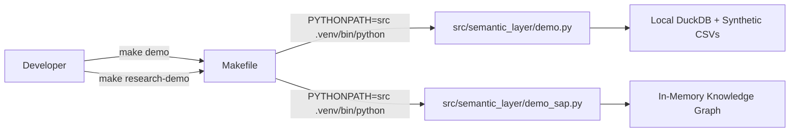

# Chapter 02: Setup & Your First Run

> Learn how to set up an isolated development environment, understand hash-locked dependencies, and run both live demonstrations in under 2 minutes.

Nothing builds confidence in computer science faster than running the code on your own machine. In this chapter, we will walk through setting up the repository, understanding why professional software teams lock dependency hashes, and running both live demos!

---

## Track A: The Layperson Intuition Track

### Why Can't We Just Double-Click an App?
In consumer software, you download an `.exe` or an `.app` file and double-click it.

In professional backend engineering:
- The software runs on servers, not just your personal laptop.
- It relies on dozens of external helper libraries (for math, networking, database connections).
- If your laptop has version 1.0 of a library, and the server has version 2.0, the code might work on your laptop but crash in production. This is the infamous **"Works on my machine!"** bug.

### The Virtual Environment: An Isolated Cleanroom
Imagine a commercial chemistry lab:
- You don't mix chemicals for medicine in the same sink where someone washes lunch dishes!
- You set up a sterile, isolated cleanroom where only the exact measured chemicals for that specific experiment are brought inside.

A **Python Virtual Environment (`.venv`)** is that cleanroom. It is an isolated folder on your computer where the exact versions of Python libraries needed for this project are kept, completely isolated from your computer's general operating system.

### Hash-Pinned Dependencies: The Certified Parts Manifest
When building a passenger airplane, Boeing doesn't just order "some 1/2-inch titanium bolts from whoever is cheapest today." They require every batch of bolts to have a certified serial number and material inspection certificate.

In software, downloading a library by just typing `pip install duckdb` downloads whatever code happens to be on the internet today. If a hacker tampers with the download server, you could download malicious code!

To prevent this, this repository uses **hash-pinned constraints** (`constraints/py312.txt`). For every single library, we record its exact **cryptographic SHA-256 fingerprint**. When downloading, Python checks that the downloaded file matches the fingerprint down to the exact bit!

---

## Track B: The Apprentice Engineer Track

### Setting Up the Environment

Here are the 4 standard commands to set up this repository from scratch:

```bash
# 1. Create the isolated virtual environment (cleanroom)
python3.12 -m venv .venv

# 2. Upgrade the package installer
.venv/bin/python -m pip install --upgrade pip==25.2

# 3. Install exactly pinned dependencies with cryptographic verification
.venv/bin/python -m pip install --require-hashes -r constraints/py312.txt

# 4. Validate the semantic assets and run tests
make PYTHON=.venv/bin/python validate-semantic
make PYTHON=.venv/bin/python test
```

### The Role of the Makefile

Instead of memorizing long terminal commands with flags, software engineers use a tool called `make` and a file called [`Makefile`](../../Makefile).

Think of `Makefile` as a shortcut menu for your project:
- Typing `make test` runs the entire automated test suite.
- Typing `make demo` runs the relational audit demo.
- Typing `make research-demo` runs the knowledge graph AQR reasoning demo.



---

## Student Lab: Run Both Demonstrations

Let's execute both demos right now and see the two hemispheres of the repository in action!

### Experiment 1: Run the Relational Semantic Layer Demo
Run this command in your terminal:
```bash
make PYTHON=.venv/bin/python demo
```

#### What You Will See:
1. **BUSINESS QUESTION**:
   ```text
   Find French automotive business partners with at least three qualifying
   financial postings in the last 12 months and total debit loss above EUR 20,000.
   ```
2. **SEMANTIC RESOLUTION**: The system identifies the concepts: `BusinessPartner`, `FinancialPosting`, `CompanyCode`, and `Product`.
3. **GENERATED SQL**: The compiler compiles the question into parameterized DuckDB SQL.
4. **RESULT**: Returns the exact matching business partner (`BP-FR-001`) with debit loss of `24500.00 EUR`.
5. **PROVENANCE**: Displays the cryptographic hash confirming the execution is certified.

---

### Experiment 2: Run the Knowledge Graph AQR Reasoning Demo
Run this command in your terminal:
```bash
make PYTHON=.venv/bin/python research-demo
```

#### What You Will See:
1. **Indexing Triples**:
   ```text
   Ingesting W3C Ontologies and Multi-Source Knowledge Graph...
   Successfully indexed 730 RDF triples in triplestore.
   ```
2. **Scenario A (Multi-Hop Root-Cause Search)**:
   - Finds which support note resolves alert `TSV_TNEW_PAGE_ALLOC_FAILED` on `S/4HANA 2023` in component `FI-GL`.
   - Result: Discovers Note `3109922`!
3. **Scenario B (Prerequisite Chain Traversal)**:
   - Traverses the graph to find all prerequisite notes required before installing Note `3109922`.
4. **Scenario C (Reflective Self-Correction)**:
   - An over-constrained query yields no results.
   - The agent reflects, relaxes the support package constraint, re-runs the query, and discovers candidate note `3109919`!

---

## Self-Check Quiz

1. **Why do we use `.venv` rather than installing packages globally on our computer?**
   - *Answer*: To prevent dependency conflicts between different projects and ensure identical, reproducible library versions.
2. **What does `--require-hashes` do during `pip install`?**
   - *Answer*: It verifies that every downloaded package matches a pre-recorded cryptographic SHA-256 fingerprint, protecting against supply-chain attacks and altered downloads.
3. **What are the two different Make commands to run the demos?**
   - *Answer*: `make demo` runs the relational DuckDB audit demo, and `make research-demo` runs the knowledge graph AQR demo.

---

## Next Steps

Now that you have seen both demos running, let's look under the hood! In [Chapter 03: The Two Tracks & Repo Anatomy](03-the-two-tracks-and-repo-anatomy.md), we will explore the directory layout and explain the two distinct hemispheres of this codebase.
