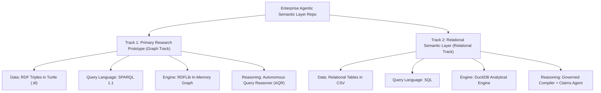

# Chapter 03: The Two Tracks & Repo Anatomy

> Explore the two distinct hemispheres of this codebase and understand why enterprise software separates data models, business rules, and execution code.

When you first open a large professional codebase, it is easy to feel overwhelmed by the dozens of folders and hundreds of files. In this chapter, we give you the **mental map** of the repository so you can navigate it with total confidence.

---

## Track A: The Layperson Intuition Track

### The Two Hemispheres: Graph vs. Relational
One of the most important things to understand early is that this repository contains **two distinct execution tracks (hemispheres)**:



### The Hospital Wing Analogy
Imagine a modern medical center:
1. **The Diagnostic Research Wing (Track 1 - Graph)**: Doctors research how complex diseases, genetic markers, and medications are interconnected. The relationships form a dense web of medical knowledge.
2. **The Patient Records & Billing Clinic (Track 2 - Relational)**: Administrators track patients, invoices, appointment dates, and payment amounts in structured accounting tables.

Both wings are vital. In this repository:
- **The Graph Track** answers relational questions about interconnected support systems (*"Which support notes resolve this alert across software component versions?"*).
- **The Relational Track** answers analytical business questions (*"What was the total debit loss across French automotive partners?"*).

---

## Track B: The Apprentice Engineer Track

### Side-by-Side Track Comparison

| Feature | Track 1: Graph AQR Research Prototype | Track 2: Federated ERP Semantic Layer |
| :--- | :--- | :--- |
| **Primary Domain** | Technical Support, Bug Fixes & Product Lifecycle | Financial Postings, Sales Orders & Partners |
| **Data Format** | RDF Triples in Turtle (`.ttl`) files | Rectangular CSV tables |
| **Data Location** | [`semantic/data/`](../../semantic/data/) & [`semantic/ontology/`](../../semantic/ontology/) | [`data/curated/`](../../data/curated/) |
| **Query Language** | SPARQL 1.1 | Analytical SQL |
| **Engine** | RDFLib in-memory graph triplestore | DuckDB embedded columnar OLAP engine |
| **Key Code** | [`src/semantic_layer/reasoning/`](../../src/semantic_layer/reasoning/) | [`src/semantic_layer/compiler/duckdb.py`](../../src/semantic_layer/compiler/duckdb.py) |
| **Demo Command** | `make PYTHON=.venv/bin/python research-demo` | `make PYTHON=.venv/bin/python demo` |

---

### Folder Tour: Why Things Are Organized This Way

In amateur software, people often put HTML, SQL queries, business logic, and test data all in one giant messy file. In enterprise software, we enforce **Separation of Concerns**:

```text
enterprise-agentic-semantic-layer/
├── semantic/                 # THE KNOWLEDGE ASSETS (Git-controlled truth)
│   ├── ontology/             # OWL/RDFS formal class schemas (.ttl)
│   ├── shapes/               # SHACL validation rules (.ttl)
│   ├── taxonomy/             # SKOS concept categories (.ttl)
│   ├── vocabulary/           # Business term definitions (.yaml)
│   └── data/                 # Synthetic support knowledge graph (.ttl)
│
├── data/                     # THE RELATIONAL DATA FIXTURES
│   ├── raw/                  # Source-like CSVs (contains intentional errors for testing)
│   └── curated/              # Cleaned, validated CSVs for analytical queries
│
├── data_products/            # DATA MESH CONTRACTS
│   └── *.yaml                # Certified definitions of analytical datasets
│
├── mappings/                 # PHYSICAL CLOUD MAPPINGS
│   ├── snowflake/            # Schema mapping for Snowflake data warehouse
│   ├── databricks/           # Schema mapping for Databricks Lakehouse
│   └── fabric/               # Schema mapping for Microsoft Fabric
│
├── src/semantic_layer/       # THE PYTHON SOURCE CODE
│   ├── reasoning/            # AQR brain (SchemaLinker, QueryPlanner, ReflectiveAgent)
│   ├── compiler/             # Compiles plans into DuckDB SQL
│   ├── kg/                   # Graph loader and dataset generator
│   ├── api/                  # FastAPI web server and endpoints
│   ├── governance/           # Role-based access control (RBAC) policies
│   ├── quality/              # Automated data quality checks
│   ├── lineage/              # Column-level data lineage service
│   └── provenance/           # Audit trail and evidence recording
│
├── tests/                    # THE 5-TIER TEST PYRAMID
│   ├── unit/                 # Fast, isolated function tests
│   ├── semantic/             # SHACL and vocabulary validation tests
│   ├── integration/          # End-to-end API and database tests
│   ├── golden/               # Verified benchmark evaluation queries
│   └── research/             # SOTA benchmark datasets and reproducibility tests
│
├── docs/                     # ARCHITECTURE DECISIONS & DOCS
│   ├── decisions/            # Architecture Decision Records (ADR-001 to ADR-008)
│   └── learn/                # THIS EDUCATIONAL FOLDER!
│
└── results/                  # BENCHMARK RUN ARTIFACTS
    └── latest_benchmark.json # Verified reproducibility results
```

---

## Student Lab: Explore the Files in Shell

Let's use our terminal to inspect the two different types of data right now!

### 1. View a Relational CSV Table
Run this command to see the first 3 rows of the curated sales order table:
```bash
head -n 4 data/curated/sales_orders.csv
```
Output:
```text
sales_order_id,partner_id,country,product,order_date,net_amount_eur,currency,order_status
SO-1001,BP-FR-001,FR,Automotive,2026-01-15,12500.00,EUR,Delivered
SO-1002,BP-FR-001,FR,Automotive,2026-02-20,8200.00,EUR,Delivered
SO-1003,BP-DE-002,DE,Industrial,2026-01-10,34000.00,EUR,Delivered
```
Notice: standard rectangular rows and columns!

### 2. View a Graph Turtle File
Now run this command to see how graph triples are written:
```bash
head -n 25 semantic/data/sap_support_graph.ttl
```
Notice: `@prefix` declarations at the top, followed by statements connecting entities:
```turtle
cifdata:Note-3109922 a cifsup:SAPNote ;
    cifsup:hasComponent cifdata:Comp-FI-GL ;
    cifsup:resolvesAlert cifdata:Alert-TSV_TNEW_PAGE_ALLOC_FAILED .
```
This is not a flat table; it is a web of relationships!

---

## Self-Check Quiz

1. **What is the difference between Track 1 and Track 2 in this repository?**
   - *Answer*: Track 1 is the Graph AQR prototype using RDF/SPARQL to reason about support notes and alerts. Track 2 is the Relational Semantic Layer using CSVs/DuckDB/SQL to answer financial audit questions.
2. **Why are data models stored in Git (`semantic/`) rather than hidden in a proprietary database?**
   - *Answer*: To enable version control, peer review, automated testing, and full reproducibility (GitOps).
3. **What is the difference between `data/raw/` and `data/curated/`?**
   - *Answer*: `data/raw/` contains messy source data with intentional dirty rows to test data quality filters, while `data/curated/` contains verified clean data for analytics.

---

## Next Steps

Now that you know the repository map, let's explore the programming tools that bring it to life! Proceed to [Chapter 04: The Developer Toolbox](04-the-developer-toolbox.md).
