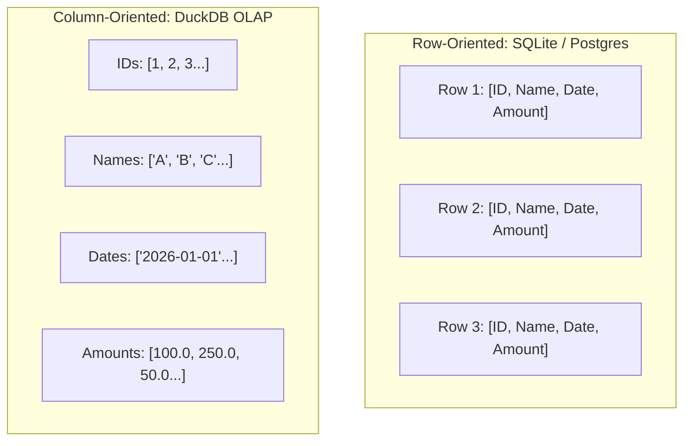

# Chapter 04: The Developer Toolbox

> An engineer's guide to the libraries, frameworks, and programming choices powering this repository.

Why did we choose Python 3.12, DuckDB, RDFLib, and FastAPI rather than Java, PostgreSQL, or Pandas? In this chapter, we look into the **developer's toolbox** and discover the engineering principles behind each technology choice.

---

## Track A: The Layperson Intuition Track

### The Master Carpenter's Toolchest
If you ask a carpenter why they own 5 different saws, they will tell you:
- A handsaw is great for a quick cut on a 2x4 board.
- A bandsaw cuts intricate curved wooden shapes.
- A table saw makes long, perfectly straight cuts through large plywood sheets.

Using the wrong saw ruins the wood. In software engineering, choosing the wrong database or library ruins performance and introduces bugs.

Here is the quick breakdown of our toolchest:
1. **Python 3.12**: The workshop language—clean, readable, and standard for modern data and AI engineering.
2. **DuckDB**: A pocket-sized, turbocharged table saw. It can analyze millions of spreadsheet rows in a fraction of a second right on your laptop.
3. **RDFLib**: The detective's corkboard tool—built specifically to connect entities with red yarn (graph relationships) and query them.
4. **PySHACL**: The strict building inspector—checking that graph data complies with legal requirements before we use it.
5. **FastAPI & Pydantic**: The polite, vigilant waiter—taking orders from the outside world, checking that requests don't contain SQL injection attacks, and delivering clean answers.

---

## Track B: The Apprentice Engineer Track

### 1. Python 3.12 Core Features

#### A. Static Type Annotations
Python was historically dynamically typed. Modern Python 3.12 supports static type hints that catch bugs before code runs:
```python
# In src/semantic_layer/models.py
def contains_sql_shape(text: str, natural_language: bool = False) -> bool:
    ...
```

#### B. `@dataclass(frozen=True)` (Immutability)
In multithreaded and enterprise systems, data changing unexpectedly behind your back causes nightmare bugs. By freezing our dataclasses, once an object is created, it is read-only:
```python
from dataclasses import dataclass

@dataclass(frozen=True)
class RepairOperation:
    attempt_index: int
    operation_kind: str
    binding_count: int
```

#### C. `decimal.Decimal` vs. `float` (The Financial Accuracy Rule)
In computer science, floating-point numbers (`float`) are stored in binary (base-2), which cannot represent certain decimal fractions exactly!
Let's see what happens in standard Python:
```python
0.1 + 0.2  # Returns 0.30000000000000004!
```
In a video game, an extra `0.00000000000000004` doesn't matter. In an enterprise bank calculating tax across $100,000,000, floating-point rounding errors are illegal!
This repository uses `decimal.Decimal` for exact 6-decimal-place financial precision (`benchmark_runner.py:161-167`).

---

### 2. DuckDB: The Embedded Columnar OLAP Database

Most students learn row-oriented databases like SQLite or PostgreSQL. Why does this repo use **DuckDB**?



- When you run `SUM(Amount)`, a row-oriented database must read every ID, Name, Date, and Amount off the hard drive.
- DuckDB only reads the `Amounts` column from disk! It is 10x to 100x faster for analytical aggregations, runs in-memory without a separate server daemon, and queries raw CSV files directly!

---

### 3. FastAPI & Pydantic: The Secure API Gateway

In [`src/semantic_layer/api/app.py`](../../src/semantic_layer/api/app.py), we expose our semantic layer as a REST API. Pydantic models automatically validate incoming requests:

```python
class QuestionRequest(BaseModel):
    model_config = ConfigDict(extra="forbid")
    question: str = Field(min_length=1)

    @field_validator("question")
    @classmethod
    def reject_sql_shaped_question(cls, value: str) -> str:
        if contains_sql_shape(value, natural_language=True):
            raise ValueError("business question cannot contain SQL-shaped values")
        return value
```
If an attacker tries to pass raw SQL statements (`DROP TABLE ...`) into our API, Pydantic rejects it before our backend logic even wakes up!

---

## Student Lab: Try It in Python

Let's test `float` vs `Decimal` and frozen dataclass immutability right now!

### Step 1: Open the Python REPL
```bash
.venv/bin/python
```

### Step 2: See the Float Rounding Bug
```python
# Standard float math:
total_float = 0.1 + 0.2
print("Float result:", total_float)
print("Is it exactly 0.3?", total_float == 0.3)
```
Output:
```text
Float result: 0.30000000000000004
Is it exactly 0.3? False
```

### Step 3: See Exact Decimal Math
```python
from decimal import Decimal

total_decimal = Decimal("0.1") + Decimal("0.2")
print("Decimal result:", total_decimal)
print("Is it exactly 0.3?", total_decimal == Decimal("0.3"))
```
Output:
```text
Decimal result: 0.3
Is it exactly 0.3? True
```

### Step 4: Test Immutability
```python
from dataclasses import dataclass

@dataclass(frozen=True)
class ImmutableConfig:
    api_port: int

config = ImmutableConfig(api_port=8000)
print("Port:", config.api_port)

# Now try to modify it:
try:
    config.api_port = 9000
except Exception as error:
    print("Caught error:", type(error).__name__, "-", error)
```
Output:
```text
Caught error: FrozenInstanceError - cannot assign to field 'api_port'
```
The object refuses to be mutated, protecting system state!

---

## Self-Check Quiz

1. **Why is `decimal.Decimal` required for enterprise financial software instead of `float`?**
   - *Answer*: Floating-point numbers use binary representations that cause fractional rounding errors (e.g. `0.1 + 0.2 != 0.3`), which is unacceptable in accounting.
2. **What makes DuckDB faster than row-oriented databases for analytical queries?**
   - *Answer*: It stores data by columns rather than rows, so queries like `SUM(amount)` only read the relevant column into memory instead of scanning entire rows.
3. **What is the benefit of setting `frozen=True` on a Python dataclass?**
   - *Answer*: It prevents accidental modification of the object's attributes after instantiation, guaranteeing immutability.

---

## Next Steps

Now that we understand our developer tools, let's explore the foundations of the Knowledge Graph hemisphere! Proceed to [Chapter 05: Knowledge Graphs & Triples](05-knowledge-graphs-and-triples.md).
