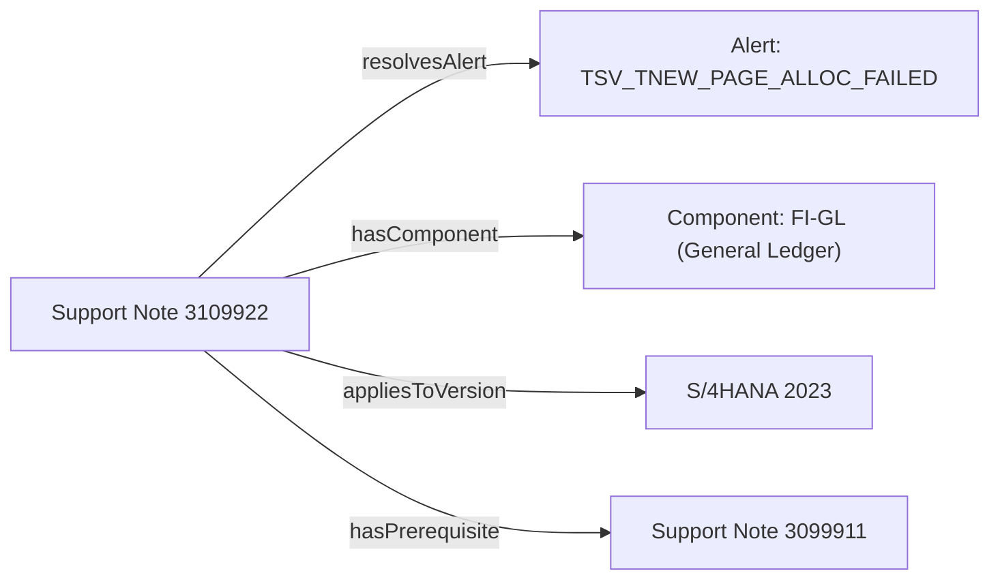

# Chapter 05: Knowledge Graphs & Triples

> Understand graph data models, RDF triples, Turtle syntax, formal OWL ontologies, and automated SHACL validation.

In traditional databases, data lives in rigid tables with fixed rows and columns. But in the real world, knowledge is a **web of interconnected facts**. In this chapter, we explore how Knowledge Graphs represent real-world relationships and how we validate them with mathematical precision.

---

## Track A: The Layperson Intuition Track

### The Wikipedia Infobox Analogy
Have you ever looked at the sidebar on a Wikipedia page?
- On the page for **Albert Einstein**, there is an infobox:
  - *Born in*: Ulm, Germany
  - *Field*: Physics
  - *Award*: Nobel Prize in Physics (1921)
- If you click on **Nobel Prize in Physics**, it has its own infobox:
  - *First awarded*: 1901
  - *Awarded by*: Royal Swedish Academy of Sciences

If you imagine drawing lines between all these Wikipedia pages based on those facts, you get a **Knowledge Graph**!



### The 3-Word Sentence: RDF Triples
How do we store this web of facts so a computer can understand it?

We break all knowledge down into simple 3-word sentences called **RDF Triples**:
$$\text{Subject} \xrightarrow{\text{Predicate}} \text{Object}$$

- `[Note 3109922]` (Subject) $\rightarrow$ `resolvesAlert` (Predicate) $\rightarrow$ `[TIME_OUT]` (Object)
- `[Note 3109922]` (Subject) $\rightarrow$ `hasComponent` (Predicate) $\rightarrow$ `[BC-DB-HDB]` (Object)
- `[Note 3109922]` (Subject) $\rightarrow$ `hasPrerequisite` (Predicate) $\rightarrow$ `[Note 2901100]` (Object)

### Ontologies & SHACL: The Building Code & The Inspector
If anyone can write any 3-word sentence they want, chaos ensues:
- Someone might write: `Note 3109922 resolvesAlert Pizza`. That makes no sense!
- How do we enforce sanity?
  1. **The Ontology (The Building Code)**: A blueprint written in OWL (Web Ontology Language) specifying: *"A Support Note may only resolve a System Alert or a Runtime Error; it cannot resolve food."*
  2. **SHACL (The Building Inspector)**: An automated checklist that scans the graph and rejects any data that violates the rules (e.g. flagging any note that is missing a component or title).

---

## Track B: The Apprentice Engineer Track

### 1. The Turtle (`.ttl`) Syntax

In this repository, graph data is written in **Turtle** format. Here is how it reads:

```turtle
# 1. Namespaces: Shortcuts so we don't have to write full URLs
@prefix cifsup: <https://example.org/cifre-kg/support#> .
@prefix cifdata: <https://example.org/cifre-kg/data/> .
@prefix rdf: <http://www.w3.org/1999/02/22-rdf-syntax-ns#> .

# 2. Triples: Subject -> Predicates and Objects
cifdata:Note-3109922 a cifsup:SAPNote ;
    cifsup:noteNumber "3109922" ;
    cifsup:hasComponent cifdata:Comp-FI-GL ;
    cifsup:resolvesAlert cifdata:Alert-TSV_TNEW_PAGE_ALLOC_FAILED .
```

#### Syntax Rules:
- The letter `a` is shorthand for `rdf:type` (means "is an instance of").
- A semicolon `;` means: "Keep the same Subject, but list another predicate and object."
- A comma `,` means: "Keep the same Subject and Predicate, but list another object."
- A period `.` ends the statement!

---

### 2. Formal Ontologies in OWL & RDFS

In [`semantic/ontology/sap_support.ttl`](../../semantic/ontology/sap_support.ttl), we define the classes and properties:
```turtle
cifsup:SAPNote a owl:Class ;
    rdfs:label "Synthetic Support Note"@en ;
    rdfs:comment "A support note fixture with symptoms and fixes."@en .

cifsup:resolvesAlert a owl:ObjectProperty ;
    rdfs:domain cifsup:SAPNote ;
    rdfs:range cifsup:SystemAlert ;
    rdfs:label "resolves alert"@en .
```
- `rdfs:domain cifsup:SAPNote`: Only a `SAPNote` can have this property.
- `rdfs:range cifsup:SystemAlert`: The target of this relationship must be a `SystemAlert`.

---

### 3. Graph Validation with SHACL

In [`semantic/shapes/sap_support_shapes.ttl`](../../semantic/shapes/sap_support_shapes.ttl), we define shape constraints:
```turtle
cifsup:SAPNoteShape a sh:NodeShape ;
    sh:targetClass cifsup:SAPNote ;
    sh:property [
        sh:path cifsup:noteNumber ;
        sh:datatype xsd:string ;
        sh:minCount 1 ;
        sh:maxCount 1 ;
        sh:message "Every SAP Note must have exactly one note number." ;
    ] .
```
When we run `make PYTHON=.venv/bin/python validate-semantic`, PySHACL evaluates these shapes against all `.ttl` files. If any note has 0 or 2 note numbers, validation immediately fails!

---

## Student Lab: Inspect the Graph with Python

Let's write a small Python script to load the knowledge graph into memory using RDFLib and count the triples!

### Step 1: Open the Python REPL
```bash
.venv/bin/python
```

### Step 2: Load the Knowledge Graph
```python
from rdflib import Graph, RDF, RDFS, OWL
from pathlib import Path

# Load the support ontology
g = Graph()
g.parse("semantic/ontology/sap_support.ttl", format="turtle")

print(f"Loaded {len(g)} triples from sap_support.ttl")

# Find and print all OWL classes defined in the file
for s in g.subjects(RDF.type, owl_class := OWL.Class):
    print("Found Class:", s)
```
Output:
```text
Loaded 150+ triples from sap_support.ttl
Found Class: https://example.org/cifre-kg/support#SAPNote
Found Class: https://example.org/cifre-kg/support#SystemAlert
Found Class: https://example.org/cifre-kg/support#ApplicationComponent
```

### Step 3: Exit Python
Type `exit()` to finish the lab.

---

## Self-Check Quiz

1. **What are the three parts of an RDF triple?**
   - *Answer*: Subject, Predicate, and Object.
2. **In Turtle syntax, what does the letter `a` stand for?**
   - *Answer*: It is shorthand for `rdf:type`, meaning "is an instance of this class".
3. **What is the difference between OWL and SHACL?**
   - *Answer*: OWL defines the vocabulary, classes, and relationships (the ontology blueprint), while SHACL defines validation constraints and rules (the unit tests for the graph).

---

## Next Steps

Now that we know how data is stored as graph triples, how do we query it? In [Chapter 06: Querying Graphs with SPARQL](06-querying-graphs-with-sparql.md), we learn the query language of graphs!
