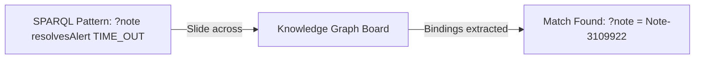

# Chapter 06: Querying Graphs with SPARQL

> Master the query language of the Semantic Web: pattern matching, graph traversal, filters, and property paths.

If SQL is the universal language for querying tables, **SPARQL** (SPARQL Protocol and RDF Query Language) is the universal language for querying Knowledge Graphs. In this chapter, we learn how SPARQL works and how this repository compiles plain English questions into deterministic graph queries.

---

## Track A: The Layperson Intuition Track

### The Transparent Overlay Analogy
Imagine you have our detective's corkboard covered in photos and red yarn.

How do you find answers on it?
- You take a **transparent sheet of plastic** and draw empty circles with labels on it:
  `(?Note) ----[resolvesAlert]----> [TIME_OUT]`
- You hold this transparent sheet up against the corkboard and slide it around.
- Wherever the red yarn and pins on the board match the pattern drawn on your plastic sheet, the pin that shows through the `(?Note)` circle is your answer!



In SPARQL, anything starting with a question mark (like `?note` or `?title`) is a **variable** (a blank circle waiting to be filled in).

---

## Track B: The Apprentice Engineer Track

### 1. SQL vs. SPARQL: A Direct Comparison

Notice how familiar SPARQL looks if you already know basic SQL:

| Feature | Relational SQL | Graph SPARQL 1.1 |
| :--- | :--- | :--- |
| **Selecting Data** | `SELECT column1, column2` | `SELECT ?note ?title` |
| **Data Source** | `FROM table_name` | `WHERE { ...graph patterns... }` |
| **Condition / Joins** | `JOIN t2 ON t1.id = t2.id` | Matching variables in multiple triples: `?note :hasComp ?c . ?c :name "FI" .` |
| **Filtering** | `WHERE amount > 100` | `FILTER(?sp >= 5)` |
| **Optional Data** | `LEFT OUTER JOIN` | `OPTIONAL { ?note :hasPatch ?patch }` |

---

### 2. A Real SPARQL Query From This Repository

Here is an actual SPARQL query generated by [`src/semantic_layer/reasoning/text_to_sparql.py`](../../src/semantic_layer/reasoning/text_to_sparql.py):

```sparql
PREFIX cifsup: <https://example.org/cifre-kg/support#>
PREFIX cifdata: <https://example.org/cifre-kg/data/>

SELECT DISTINCT ?note ?note_number
WHERE {
    # 1. The note must resolve the alert TIME_OUT
    ?note cifsup:resolvesAlert cifdata:Alert-TIME_OUT .
    
    # 2. The note must belong to the component BC-DB-HDB
    ?note cifsup:hasComponent cifdata:Comp-BC-DB-HDB .
    
    # 3. Retrieve the human-readable note number string
    ?note cifsup:noteNumber ?note_number .
}
ORDER BY ?note_number
```

### 3. Advanced Feature: SPARQL Property Paths
What if a note has a prerequisite note, which in turn has another prerequisite note, up to 10 levels deep?

In SQL, querying recursive parent-child hierarchies requires complex Common Table Expressions (`WITH RECURSIVE`).

In SPARQL, we can traverse paths with a single character:
- Sequence `/`: `?note cifsup:hasComponent / cifsup:componentName ?name`
- One-or-more `+`: `?note cifsup:hasPrerequisiteNote+ ?prereq` (finds all direct and indirect prerequisites!)
- Zero-or-more `*`: Reflexive transitive closure.

In [`src/semantic_layer/reasoning/query_planner.py`](../../src/semantic_layer/reasoning/query_planner.py), we construct bounded property paths up to a maximum safe depth (`MAX_PREREQUISITE_DEPTH = 16`) to prevent infinite recursion bugs!

---

## Student Lab: Run a Live SPARQL Query in Python

Let's load the synthetic knowledge graph and execute a real SPARQL query using RDFLib!

### Step 1: Open the Python REPL
```bash
.venv/bin/python
```

### Step 2: Query the Support Graph
```python
from semantic_layer.kg.loader import SAPKnowledgeGraph

# 1. Load the knowledge graph
kg = SAPKnowledgeGraph()
kg.load_ontologies([
    "semantic/ontology/sap_ppms.ttl",
    "semantic/ontology/sap_support.ttl",
    "semantic/data/sap_support_graph.ttl",
])
print(f"Loaded {len(kg)} triples.")

# 2. Define a SPARQL query
query = """
PREFIX cifsup: <https://example.org/cifre-kg/support#>
PREFIX cifdata: <https://example.org/cifre-kg/data/>

SELECT ?note_number ?alert
WHERE {
    ?note cifsup:noteNumber ?note_number ;
          cifsup:resolvesAlert ?alert_uri .
    BIND(STRAFTER(STR(?alert_uri), "Alert-") AS ?alert)
}
ORDER BY ?note_number
LIMIT 5
"""

# 3. Execute the query
results = kg.query(query)

print("\n--- SPARQL QUERY RESULTS ---")
for row in results:
    print(f"Note {row.note_number} resolves alert: {row.alert}")
```
Output:
```text
Loaded 730 RDF triples in triplestore.

--- SPARQL QUERY RESULTS ---
Note 2901100 resolves alert: DBSQL_NO_MORE_CONNECTION
Note 3012944 resolves alert: CX_SY_OPEN_SQL_ERROR
Note 3099911 resolves alert: TIME_OUT
Note 3109919 resolves alert: TIME_OUT
Note 3109922 resolves alert: TSV_TNEW_PAGE_ALLOC_FAILED
```

---

## Self-Check Quiz

1. **How do you denote a variable in a SPARQL query?**
   - *Answer*: By prefixing the name with a question mark (e.g. `?note` or `?title`).
2. **What does the `+` symbol mean in a SPARQL property path like `cifsup:hasPrerequisiteNote+`?**
   - *Answer*: One-or-more occurrences of the relationship, allowing recursive traversal through chains of prerequisites.
3. **What happens if a triple pattern in the `WHERE` clause does not match anything in the graph?**
   - *Answer*: The entire pattern match fails for that candidate, returning an empty result set (unless marked as `OPTIONAL`).

---

## Next Steps

Now that we know how to query graphs, what algorithms make this graph exploration fast, safe, and cycle-free? Proceed to [Chapter 07: Core Algorithms & Data Structures](07-core-algorithms-and-data-structures.md).
