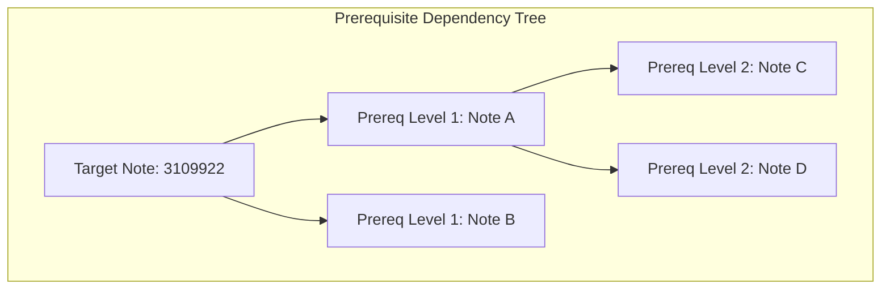

# Chapter 07: Core Algorithms & Data Structures

> How computer science theory comes alive: Breadth-First Search, Depth-First Search, cycle detection, queues, and hash maps in production.

If you are currently taking a college course in Data Structures and Algorithms, you have probably wondered: *"Will I ever actually use Depth-First Search or Breadth-First Search in a real job?"*

The answer is an emphatic **yes**! In this chapter, we explore how fundamental data structures and graph algorithms power the reasoning engine of this repository.

---

## Track A: The Layperson Intuition Track

### The College Prerequisite Nightmare
Imagine you are planning your class schedule for college:
- To take **CS 301 (Operating Systems)**, you must first pass **CS 201 (Data Structures)**.
- To take **CS 201**, you must first pass **CS 101 (Intro to Programming)**.
- This chain of prerequisites is a **Directed Graph**: arrows point from one requirement to the next.

Now, imagine a careless academic advisor enters an error into the university database:
- They set **CS 101** to require **CS 301**!
- What happens now?
  $$\text{CS 101} \rightarrow \text{CS 201} \rightarrow \text{CS 301} \rightarrow \text{CS 101}$$
- You have entered an **infinite cycle**! You can never graduate because you can never take the first course!

In enterprise IT, software patches and support notes have the exact same problem: Note A might require Note B. If there is a cycle, a customer's computer system will freeze in an infinite loop trying to install updates.

### BFS vs. DFS: Two Ways of Exploring
How does the computer explore these relationships?

1. **BFS (Breadth-First Search) — The Expanding Water Ripple**:
   - Like dropping a stone into water: it explores all immediate prerequisites (Level 1) first, then all prerequisites-of-prerequisites (Level 2), and so on.
   - Best for finding the **shortest path** or listing everything required at each step.
2. **DFS (Depth-First Search) — The Maze Runner**:
   - Like running through a maze: you pick one path and run down it as deep as you can go until you hit a dead end, then backtrack and try the next path.
   - Best for **detecting loops (cycles)**: if you run deep enough and see your own footprints, you know you are running in circles!



---

## Track B: The Apprentice Engineer Track

### 1. Cycle Detection via DFS in `query_planner.py`

In [`src/semantic_layer/reasoning/query_planner.py`](../../src/semantic_layer/reasoning/query_planner.py#L76-L120), we implement cycle detection using an explicit stack rather than recursion (avoiding Python's recursion limit):

```python
# Lines 76-120 of query_planner.py
def _detect_prerequisite_cycles(graph: Graph, target: URIRef) -> list[tuple[object, object]]:
    visited: set[object] = {target}
    active_positions: dict[object, int] = {target: 0}
    stack: list[tuple[object, list[object], int]] = [
        (target, _prerequisite_neighbors(graph, target), 0)
    ]
    cycle_edges: list[tuple[object, object]] = []

    while stack:
        node, neighbors, index = stack[-1]
        if index == len(neighbors):
            stack.pop()
            active_positions.pop(node)
            continue

        neighbor = neighbors[index]
        stack[-1] = (node, neighbors, index + 1)

        # BACK-EDGE DETECTED!
        if neighbor in active_positions:
            cycle_edges.append((node, neighbor))
        elif neighbor not in visited:
            visited.add(neighbor)
            active_positions[neighbor] = len(stack)
            stack.append((neighbor, _prerequisite_neighbors(graph, neighbor), 0))

    return cycle_edges
```

#### Why Back-Edge Detection Works ($O(V + E)$):
- `active_positions` keeps track of nodes currently on the active exploration branch.
- If we encounter a neighbor that is *already in* `active_positions`, that edge points back to an ancestor! That proves a directed cycle exists.

---

### 2. Bounded BFS Transitive Closure in `query_planner.py`

To collect all prerequisite notes level-by-level, we use a queue (`collections.deque`) with an explicit bound (`MAX_PREREQUISITE_DEPTH = 16`):

```python
# Lines 140-182 of query_planner.py
queue = deque([(target, 0)])
reachable_unique = []
truncated = False

while queue:
    current_node, depth = queue.popleft()
    if depth >= depth_limit:
        truncated = True
        break
    for neighbor in _prerequisite_neighbors(graph, current_node):
        if neighbor not in visited:
            visited.add(neighbor)
            reachable_unique.append(neighbor)
            queue.append((neighbor, depth + 1))
```

#### Why Bounded Depth Matters:
If someone maliciously creates a graph with millions of nodes or a massive graph component, an unbounded BFS could consume gigabytes of memory. Capping depth at 16 ensures guaranteed termination and predictable latency ($O(1)$ memory bounds).

---

### 3. Hash Tables & $O(1)$ Lookups in `schema_linker.py`

In [`src/semantic_layer/reasoning/schema_linker.py`](../../src/semantic_layer/reasoning/schema_linker.py#L65-L77), we pre-compute immutable `frozenset` collections and dictionaries during initialization:
```python
self._fillers = frozenset(grammar["filler_tokens"])
self._lookup_verbs = frozenset(grammar["lookup_verb"])
self._component_lookup = {v.casefold(): v for v in self.KNOWN_COMPONENTS}
```
When user tokens arrive, testing `token in self._fillers` takes $O(1)$ constant time instead of $O(N)$ scanning a list!

---

## Student Lab: Catching a Real Cycle in Python

In [`semantic/data/support-prerequisite-cycle.ttl`](../../semantic/data/support-prerequisite-cycle.ttl), we deliberately created a cyclic graph fixture to test our cycle detector. Let's run it!

### Step 1: Open the Python REPL
```bash
.venv/bin/python
```

### Step 2: Run the Cycle Detector
```python
from rdflib import Graph, URIRef
from semantic_layer.reasoning.query_planner import evaluate_prerequisite_traversal

# Load the cyclic fixture
g = Graph()
g.parse("semantic/data/support-prerequisite-cycle.ttl", format="turtle")

# Test Note 3109922 (which has a circular prerequisite in this fixture)
target = URIRef("https://example.org/cifre-kg/data/Note-3109922")
evidence = evaluate_prerequisite_traversal(g, target)

print("Cycle Detected?", evidence.cycle_detected)
print("Cycle Edges:", evidence.cycle_edges)
print("Status:", evidence.status.value)
print("Reason Code:", evidence.reason.value if evidence.reason else "None")
```
Output:
```text
Cycle Detected? True
Cycle Edges: [('https://example.org/cifre-kg/data/Note-3099911', 'https://example.org/cifre-kg/data/Note-3109922')]
Status: EMPTY_RESULT
Reason Code: PREREQUISITE_CYCLE_DETECTED
```
The algorithm caught the circular dependency immediately and flagged the exact offending edge!

---

## Self-Check Quiz

1. **Why does cycle detection use DFS rather than BFS?**
   - *Answer*: DFS maintains the current ancestry path in its call stack, making back-edges easy to detect when a node points to an active ancestor.
2. **What data structure is used to implement Breadth-First Search?**
   - *Answer*: A Queue (in Python, `collections.deque`) operating under First-In, First-Out (FIFO) ordering.
3. **What is the time complexity of looking up a token in a `frozenset` versus a `list`?**
   - *Answer*: Looking up in a `frozenset` (hash set) is $O(1)$ constant time on average, whereas scanning a `list` is $O(N)$ linear time.

---

## Next Steps

Now that we understand the algorithms, how does the agent think, reflect, and correct itself? Proceed to [Chapter 08: The Agentic Brain (AQR)](08-the-agentic-brain-aqr.md).
