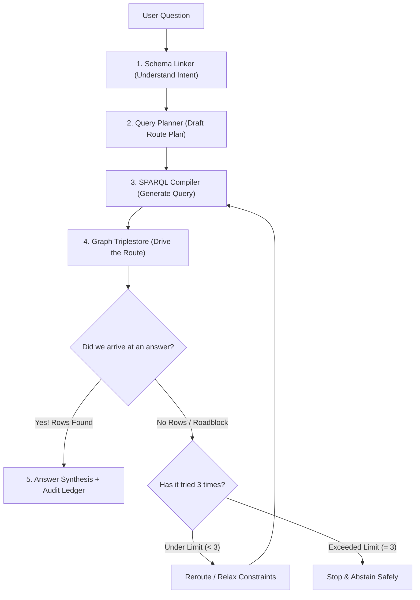

# Chapter 08: The Agentic Brain (AQR)

> Explore Autonomous Query Reasoning: how schema linking, typed logical planning, and bounded reflective state machines work together.

What separates an "AI Agent" from a simple script? A script runs a single command and crashes if anything goes wrong. An **AI Agent** can observe the outcome of its actions, diagnose errors, reflect on what went wrong, and make intelligent repairs.

In this chapter, we deconstruct the **Autonomous Query Reasoner (AQR)** that forms the brain of our knowledge graph hemisphere.

---

## Track A: The Layperson Intuition Track

### The Smart GPS Navigation Analogy
Think about the GPS navigation app in your car:
1. You speak a destination: *"Take me to the airport."*
2. The GPS plans a route using highways and local roads.
3. You start driving, but suddenly encounter an unexpected roadblock: a highway ramp is closed for construction!
4. What does the GPS do? Does it crash and turn off your car? Does it drive you off a cliff into the ocean?
5. No! It says: *"Recalculating..."* It finds the next available detour and routes you around the closure.
6. But what if you are stuck on a dead-end road on an island with no ferry? The GPS will eventually say: *"Cannot find a route to destination."* It knows when to **stop recalculating** rather than driving you in endless circles.



The **AQR Agent** in this repository is like that smart GPS:
- It plans a query.
- If the query returns empty or encounters an error, it reflects and relaxes constraints (e.g. dropping a support package filter or checking a parent software component).
- It is capped at **maximum 3 repair attempts**. It never enters an infinite loop!

---

## Track B: The Apprentice Engineer Track

### The 5-Stage AQR Architecture

The reasoning pipeline is divided into five modular, decoupled components:

1. **[`SchemaLinker`](../../src/semantic_layer/reasoning/schema_linker.py)**:
   - Takes raw user text, normalizes whitespace and punctuation, and matches against a closed grammar (`grounding_grammar.yaml`).
   - Produces a [`GroundedEntities`](../../src/semantic_layer/reasoning/schema_linker.py#L20-L35) object with recognized slots (`component_codes`, `alert_codes`, `note_numbers`, `intent`).
2. **[`QueryPlanner`](../../src/semantic_layer/reasoning/query_planner.py)**:
   - Converts `GroundedEntities` into a typed [`LogicalQueryPlan`](../../src/semantic_layer/reasoning/query_planner.py#L201-L250) (our Abstract Syntax Tree).
   - Verifies required slots (e.g. ensuring an alert resolution query actually specified an alert!).
3. **[`TextToSPARQLEngine`](../../src/semantic_layer/reasoning/text_to_sparql.py)**:
   - Deterministically compiles the `LogicalQueryPlan` into valid W3C SPARQL 1.1 syntax.
4. **[`SAPKnowledgeGraph`](../../src/semantic_layer/kg/loader.py)**:
   - Evaluates the SPARQL query against the in-memory RDFLib triplestore.
5. **[`AQRReflectiveAgent`](../../src/semantic_layer/reasoning/reflective_agent.py)**:
   - Inspects the returned rows. If execution fails or returns an empty result set, it enters a **Finite State Machine (FSM)** repair loop.

---

### The Finite State Machine & Bounded Repair Loop

In [`src/semantic_layer/reasoning/reflective_agent.py`](../../src/semantic_layer/reasoning/reflective_agent.py#L401-L763), the agent executes the query under an explicit repair budget:

```python
# Constants in reflective_agent.py
MAX_REPAIRS = 3

# Inside AQRReflectiveAgent.run()
for attempt in range(max_repairs):
    # 1. Compile plan to SPARQL
    sparql = self._compiler.plan_to_sparql(current_plan)
    
    # 2. Execute query
    try:
        bindings = self._kg.query(sparql)
        if bindings:
            return self._success(bindings, ledger)
        
        # 3. EMPTY RESULT -> Trigger Semantic Relaxation
        current_plan = self._relax_plan(current_plan, entities)
        ledger.record_relaxation(attempt, reason="EMPTY_RESULT")
        
    except Exception as error:
        # 4. ERROR -> Classify and Repair
        error_type = self._classify_error(error)
        sparql = self._repair_sparql(sparql, error)
        ledger.record_repair(attempt, error_type)
```

#### Why `MAX_REPAIRS = 3` is Critical in Production:
In LLM-based autonomous agents (like AutoGPT), agents without hard repair limits can enter runaway loops, burning hundreds of dollars in API tokens or consuming 100% CPU. AQR guarantees termination by strictly bounding repairs to $\le 3$ iterations.

---

## Student Lab: Watch the Agent Self-Correct

Let's test an **over-constrained query** in Python and watch the agent automatically relax constraints to find candidate answers!

### Step 1: Open the Python REPL
```bash
.venv/bin/python
```

### Step 2: Run an Over-Constrained Query
```python
from semantic_layer.kg.loader import SAPKnowledgeGraph
from semantic_layer.reasoning.reflective_agent import AQRReflectiveAgent

# 1. Load the knowledge graph
kg = SAPKnowledgeGraph()
kg.load_ontologies([
    "semantic/ontology/sap_ppms.ttl",
    "semantic/ontology/sap_support.ttl",
    "semantic/data/sap_support_graph.ttl",
])

# 2. Instantiate the agent
agent = AQRReflectiveAgent(kg)

# 3. Ask a query that is over-constrained (alert TIME_OUT at SP05 has no direct note)
result = agent.run("Find notes for alert TIME_OUT in component MM-PUR-PO at SP05")

print("Final Status:", result.status.value)
print("Answer Scope:", result.answer_scope)
print("Answer:", result.answer)
print("Number of Ledger Operations:", len(result.repair_ledger.operations))
for op in result.repair_ledger.operations:
    print(f"  - Attempt {op.attempt_index}: {op.operation_kind} (Reason: {op.reason_code.value})")
```
Output:
```text
Final Status: SUCCESS
Answer Scope: relaxed_candidates
Answer: Note 3109919 is a relaxed candidate (support package constraint dropped).
Number of Ledger Operations: 2
  - Attempt 0: initial (Reason: NONE)
  - Attempt 1: semantic_relaxation (Reason: SP_RELAXED)
```
The agent noticed the initial query yielded 0 results, relaxed the support package constraint, re-ran the query, found Note 3109919, and explicitly disclosed that the answer is a relaxed candidate!

---

## Self-Check Quiz

1. **What is the maximum number of repair attempts allowed in the AQR agent?**
   - *Answer*: 3 attempts (`MAX_REPAIRS = 3`).
2. **What does the agent do if a query returns 0 rows?**
   - *Answer*: It attempts semantic relaxation, first dropping secondary filters (like support packages) or widening components to their parent hierarchy.
3. **What is recorded in the `RepairLedger`?**
   - *Answer*: An immutable, append-only history of every attempt, including operation kind, reason code, query hashes, and status transitions for complete auditability.

---

## Next Steps

Now that we understand the reasoning architecture, let's trace a single user question through every single line of code! Proceed to [Chapter 09: A Day in the Life of a Query](09-a-day-in-the-life-of-a-query.md).
