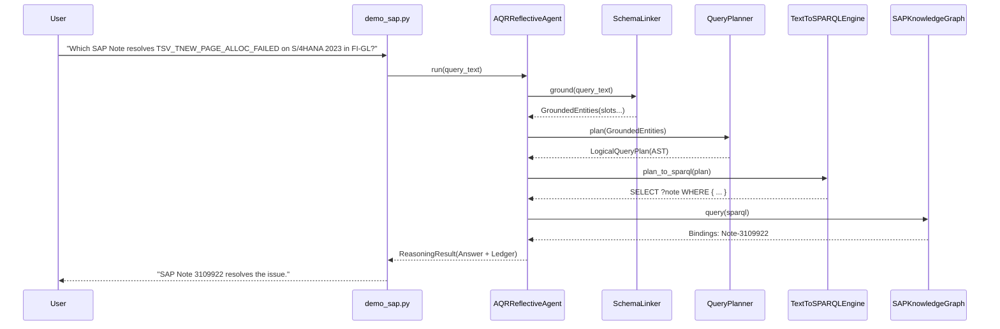

# Chapter 09: A Day in the Life of a Query

> Step-by-step execution trace: follow a single real-world business question through every function call from keystroke to verified answer.

As an engineer, the most effective way to understand a complex system is to trace a single request through the call stack from start to finish. In this chapter, we put on our detective hats and follow one real question line by line through the codebase.

---

## Track A: The Layperson Intuition Track

### The Crime Scene Investigation Analogy
Imagine a police detective receiving a tip:
1. **The Dispatcher (The API / CLI)**: Receives the telephone call from the witness.
2. **The Translator (Schema Linker)**: Listens to the call, cleans up background static, and extracts the key facts: *"Red Sedan, Seen at Bank of America, License plate starts with 7X"*.
3. **The Lead Detective (Query Planner)**: Draws up a search warrant specifying which archives the police are legally permitted to inspect.
4. **The Archivist (The Compiler & Graph)**: Takes the search warrant, goes into the police record vault, and searches the physical filing cabinets.
5. **The Quality Inspector (The Reflective Agent)**: Examines the files pulled from the vault to ensure they match the warrant, stamps the evidence with an official case number, and delivers the report to the Chief of Police.



---

## Track B: The Apprentice Engineer Track

### The Traced Question
We will trace **Scenario A** from [`src/semantic_layer/demo_sap.py`](../../src/semantic_layer/demo_sap.py#L34):
$$\text{"Which SAP Note resolves alert TSV\_TNEW\_PAGE\_ALLOC\_FAILED on S/4HANA 2023 in component FI-GL?"}$$

---

### Step 1: Entrypoint in `demo_sap.py`
In [`src/semantic_layer/demo_sap.py`](../../src/semantic_layer/demo_sap.py#L53):
```python
res = agent.run(query)
```
The execution jumps directly to `AQRReflectiveAgent.run()` in [`src/semantic_layer/reasoning/reflective_agent.py`](../../src/semantic_layer/reasoning/reflective_agent.py#L401).

---

### Step 2: Entity Grounding in `schema_linker.py`
The agent invokes the linker:
```python
# reflective_agent.py:421
entities = self._linker.ground(query_text)
```
Inside [`src/semantic_layer/reasoning/schema_linker.py`](../../src/semantic_layer/reasoning/schema_linker.py#L374-L417):
1. **Tokenization** (`_tokens`, L80): Converts the query into clean, punctuation-stripped lowercase tokens:
   ```python
   ["which", "sap", "note", "resolves", "alert", "tsv_tnew_page_alloc_failed", "on", "s/4hana", "2023", "in", "component", "fi-gl"]
   ```
2. **Entity Collection** (`_collect_entities`, L170): Matches tokens against lookup dictionaries:
   - Matches `"fi-gl"` $\rightarrow$ `entities.component_codes = ["FI-GL"]`
   - Matches `"tsv_tnew_page_alloc_failed"` $\rightarrow$ `entities.alert_codes = ["TSV_TNEW_PAGE_ALLOC_FAILED"]`
   - Matches `"s/4hana 2023"` $\rightarrow$ `entities.product_versions = ["S4HANA_2023"]`
3. **Template Matching** (`_match_declared_template`, L253): Determines the user's intent:
   - `entities.intent = "ALERT_RESOLUTION"`
   - `entities.failure_class = ReasonCode.NONE`

---

### Step 3: Logical Query Planning in `query_planner.py`
The agent passes the grounded entities to the planner:
```python
# reflective_agent.py:440
plan = self._planner.plan(entities)
```
Inside [`src/semantic_layer/reasoning/query_planner.py`](../../src/semantic_layer/reasoning/query_planner.py#L349-L451):
1. Verifies that required slots exist (`alert_codes` is not empty).
2. Instantiates a [`LogicalQueryPlan`](../../src/semantic_layer/reasoning/query_planner.py#L201-L250):
   ```python
   LogicalQueryPlan(
       intent="ALERT_RESOLUTION",
       root_entity="cifsup:SAPNote",
       required_variables=["?note", "?note_number"],
       component="FI-GL",
       alert="TSV_TNEW_PAGE_ALLOC_FAILED",
       product_version="S4HANA_2023"
   )
   ```

---

### Step 4: SPARQL Compilation in `text_to_sparql.py`
The agent compiles the plan:
```python
# reflective_agent.py:465
sparql = self._compiler.plan_to_sparql(plan)
```
The compiler emits a clean, deterministic query:
```sparql
PREFIX cifsup: <https://example.org/cifre-kg/support#>
PREFIX cifppms: <https://example.org/cifre-kg/ppms#>
PREFIX cifdata: <https://example.org/cifre-kg/data/>

SELECT DISTINCT ?note ?note_number
WHERE {
    ?note cifsup:resolvesAlert cifdata:Alert-TSV_TNEW_PAGE_ALLOC_FAILED ;
          cifsup:hasComponent cifdata:Comp-FI-GL ;
          cifsup:appliesToProductVersion cifdata:PV-S4HANA_2023 ;
          cifsup:noteNumber ?note_number .
}
ORDER BY ?note_number
```

---

### Step 5: Graph Evaluation in `loader.py`
The agent executes the SPARQL string against RDFLib:
```python
# reflective_agent.py:480
rows = self._kg.query(sparql)
```
RDFLib matches the triple patterns against the in-memory graph (`sap_support_graph.ttl`). It finds one exact match:
- `?note` = `<https://example.org/cifre-kg/data/Note-3109922>`
- `?note_number` = `"3109922"`

---

### Step 6: Answer Synthesis & Ledger Recording
In `reflective_agent.py:510`:
1. The agent sees `len(rows) == 1`. It does not need to relax or repair!
2. It records an initial successful operation in the `RepairLedger`:
   - `attempt_index = 0`
   - `operation_kind = "initial"`
   - `status = Status.SUCCESS`
3. It packages everything into a `ReasoningResult` dataclass and returns it to `demo_sap.py`, which prints:
   ```text
   ▶ Final Synthesized Answer:
     SAP Note 3109922 resolves alert TSV_TNEW_PAGE_ALLOC_FAILED on S/4HANA 2023 in component FI-GL.
   ```

---

## Student Lab: Step Through the Execution in Python

Let's reproduce every step of this exact trace in your own Python session!

### Step 1: Open the Python REPL
```bash
.venv/bin/python
```

### Step 2: Trace the Execution Step-by-Step
```python
from semantic_layer.kg.loader import SAPKnowledgeGraph
from semantic_layer.reasoning.schema_linker import SchemaLinker
from semantic_layer.reasoning.query_planner import QueryPlanner
from semantic_layer.reasoning.text_to_sparql import TextToSPARQLEngine

# Step 1: Input text
query = "Which SAP Note resolves alert TSV_TNEW_PAGE_ALLOC_FAILED on S/4HANA 2023 in component FI-GL?"

# Step 2: Grounding
linker = SchemaLinker()
entities = linker.ground(query)
print("Step 2 Grounded:", entities.intent, entities.alert_codes)

# Step 3: Logical Plan
planner = QueryPlanner()
plan = planner.plan(entities)
print("Step 3 Plan Root:", plan.root_entity)

# Step 4: SPARQL Compilation
compiler = TextToSPARQLEngine()
sparql = compiler.plan_to_sparql(plan)
print("\nStep 4 SPARQL:\n" + sparql)

# Step 5: Graph Query
kg = SAPKnowledgeGraph()
kg.load_ontologies([
    "semantic/ontology/sap_ppms.ttl",
    "semantic/ontology/sap_support.ttl",
    "semantic/data/sap_support_graph.ttl",
])
results = kg.query(sparql)
print("\nStep 5 Matching Notes:", [r.note_number for r in results])
```
Output:
```text
Step 2 Grounded: ALERT_RESOLUTION ['TSV_TNEW_PAGE_ALLOC_FAILED']
Step 3 Plan Root: cifsup:SAPNote

Step 4 SPARQL:
PREFIX ...
SELECT DISTINCT ?note ?note_number ...

Step 5 Matching Notes: [rdflib.term.Literal('3109922')]
```

---

## Self-Check Quiz

1. **Why does the agent call `SchemaLinker` before calling `QueryPlanner`?**
   - *Answer*: To normalize text and extract verified entity slots against a closed grammar, rejecting malformed or unsupported inputs before planning begins.
2. **What language does the `TextToSPARQLEngine` compile the plan into?**
   - *Answer*: W3C standard SPARQL 1.1 syntax.
3. **What is returned inside the final `ReasoningResult` object?**
   - *Answer*: The synthesized human answer, raw graph row bindings, the immutable repair audit ledger, input/query cryptographic hashes, and provenance metadata.

---

## Next Steps

Now that we have completely traced the Knowledge Graph hemisphere, let's explore the other half of the repository! Proceed to [Chapter 10: The Relational Track & DuckDB](10-the-relational-track-and-duckdb.md).
