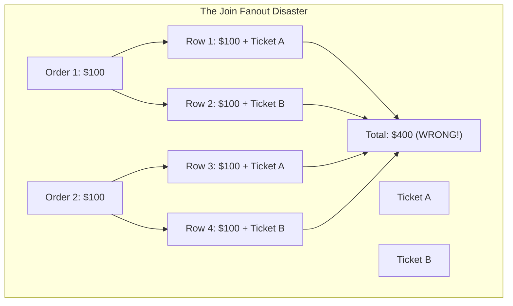

# Chapter 10: The Relational Track & DuckDB

> Explore the relational hemisphere: OLAP columnar analytics, table grains, preventing join fanout bugs, and compiling parameterized SQL with DuckDB.

While the Knowledge Graph hemisphere handles interconnected support notes and alerts, the **Relational Track** handles financial ledgers, sales orders, and business partner analytics. In this chapter, we explore how analytical SQL engines work, how to avoid catastrophic join errors, and how our compiler protects against SQL injection.

---

## Track A: The Layperson Intuition Track

### The Receipt Pile vs. The Spreadsheet Column
Imagine you run a retail store and want to know: *"What was our total revenue today?"*

1. **Row-by-Row (The Receipt Pile)**:
   - You take 1,000 paper receipts out of a drawer.
   - For every single receipt, you read the customer's name, their phone number, the date, their address, the list of items they bought, and finally the total price at the bottom.
   - Reading all that irrelevant text for 1,000 receipts takes 30 minutes!
2. **Column-by-Column (The High-Speed Calculator)**:
   - What if all receipt totals were printed on a single, clean tape with only numbers?
   - You can run your finger down that single strip of numbers in 10 seconds!

That is the difference between a traditional database (like SQLite/PostgreSQL, which store data in full rows) and an **OLAP database like DuckDB** (which stores data in clean columns). For business analytics, column storage is 100x faster!

### The Join Fanout Bug: The Double-Counting Disaster
Imagine an accountant is calculating customer revenue:
- Customer Alice has **2 Sales Orders** ($100 each).
- Customer Alice also has **2 Support Tickets** logged.
- If a naive computer program joins the Orders table to the Tickets table without grouping them first, every order is paired with every ticket:
  $$2 \times 2 = 4 \text{ rows!}$$
- If you sum the order amounts across those 4 rows, Alice's revenue appears to be **$400 instead of $200**!
- You have just invented $200 of fake revenue out of thin air! This is called the **Join Fanout Bug**, and it is one of the most common and dangerous errors in corporate reporting.



---

## Track B: The Apprentice Engineer Track

### 1. Data Grain and Join Keys in This Repo

To prevent accidental fanout, our data files have strictly defined **grains** (what a single row represents):

| Fixture File | Exact Grain (One row represents...) | Stable Join Keys |
| :--- | :--- | :--- |
| [`business_partners.csv`](../../data/curated/business_partners.csv) | One unique partner / customer | `partner_id` |
| [`sales_orders.csv`](../../data/curated/sales_orders.csv) | One unique sales order | `partner_id`, `sales_order_id` |
| [`acdoca_financials.csv`](../../data/curated/acdoca_financials.csv) | One financial ledger posting | `journal_entry_id`, `sales_order_id`, `partner_id` |
| [`billing_documents.csv`](../../data/curated/billing_documents.csv) | One billing invoice document | `billing_doc_id`, `sales_order_id`, `partner_id` |

In [`semantic/metrics/metrics.yaml`](../../semantic/metrics/metrics.yaml), metrics pre-aggregate financial postings and billing documents **independently** before joining them. This mathematically guarantees zero row multiplication!

---

### 2. How `DuckDBCompiler` Works

In [`src/semantic_layer/compiler/duckdb.py`](../../src/semantic_layer/compiler/duckdb.py#L50-L262), the compiler translates a [`SemanticQueryPlan`](../../src/semantic_layer/models.py) into SQL.

#### Parameterized SQL (Eliminating SQL Injection):
Never concatenate raw strings into SQL queries:
```python
# DANGEROUS! Vulnerable to SQL injection!
sql = f"SELECT * FROM users WHERE country = '{user_input}'"
```
If `user_input` is `' OR 1=1 --`, an attacker accesses the entire database!

Instead, `DuckDBCompiler` emits **parameterized queries** using `?` placeholders:
```python
# Lines 190-210 of duckdb.py
sql = """
SELECT
    bp.partner_id,
    COUNT(f.journal_entry_id) AS posting_count,
    SUM(f.amount_in_company_currency_eur) AS total_debit_loss_eur
FROM 'data/curated/business_partners.csv' bp
JOIN 'data/curated/acdoca_financials.csv' f ON bp.partner_id = f.partner_id
WHERE bp.country = ?
GROUP BY bp.partner_id
HAVING COUNT(f.journal_entry_id) >= ? AND SUM(f.amount_in_company_currency_eur) > ?
"""
params = [country, min_postings, min_loss]
```
The database treats `?` values strictly as literal data, making SQL injection impossible!

---

## Student Lab: Run DuckDB in Python

Let's use Python to query the curated CSV files directly using DuckDB!

### Step 1: Open the Python REPL
```bash
.venv/bin/python
```

### Step 2: Query the CSV File with DuckDB
```python
import duckdb

# Connect to in-memory DuckDB
conn = duckdb.connect()

# Query the sales_orders.csv directly as if it were a SQL table!
result = conn.execute("""
    SELECT
        country,
        product,
        COUNT(*) as order_count,
        SUM(net_amount_eur) as total_revenue_eur
    FROM 'data/curated/sales_orders.csv'
    GROUP BY country, product
    ORDER BY total_revenue_eur DESC
""").fetchall()

print("--- REVENUE BY COUNTRY & PRODUCT ---")
for row in result:
    print(f"Country: {row[0]}, Product: {row[1]}, Orders: {row[2]}, Revenue: EUR {row[3]:,.2f}")
```
Output:
```text
--- REVENUE BY COUNTRY & PRODUCT ---
Country: DE, Product: Industrial, Orders: 2, Revenue: EUR 55,500.00
Country: FR, Product: Automotive, Orders: 2, Revenue: EUR 20,700.00
Country: UK, Product: Technology, Orders: 2, Revenue: EUR 20,000.00
```
Notice how DuckDB queried raw CSV files on disk in milliseconds without needing to configure or boot up a database server!

---

## Self-Check Quiz

1. **What is the difference between OLTP and OLAP?**
   - *Answer*: OLTP is optimized for fast row-by-row transactional updates (e.g. processing a credit card payment), while OLAP is optimized for fast columnar aggregations across millions of rows (e.g. calculating quarterly financial metrics).
2. **What causes a Join Fanout Bug?**
   - *Answer*: Joining two one-to-many tables together without pre-aggregating them, causing rows to multiply and figures to be double-counted.
3. **How do parameterized queries prevent SQL injection?**
   - *Answer*: Parameters are passed separately to the database engine using `?` placeholders, ensuring user inputs are treated strictly as data values rather than executable SQL commands.

---

## Next Steps

Now that we understand how queries compile and execute against relational data, how do we enforce company security rules and track data lineage? Proceed to [Chapter 11: Enterprise Governance & Data Mesh](11-enterprise-governance-and-data-mesh.md).
