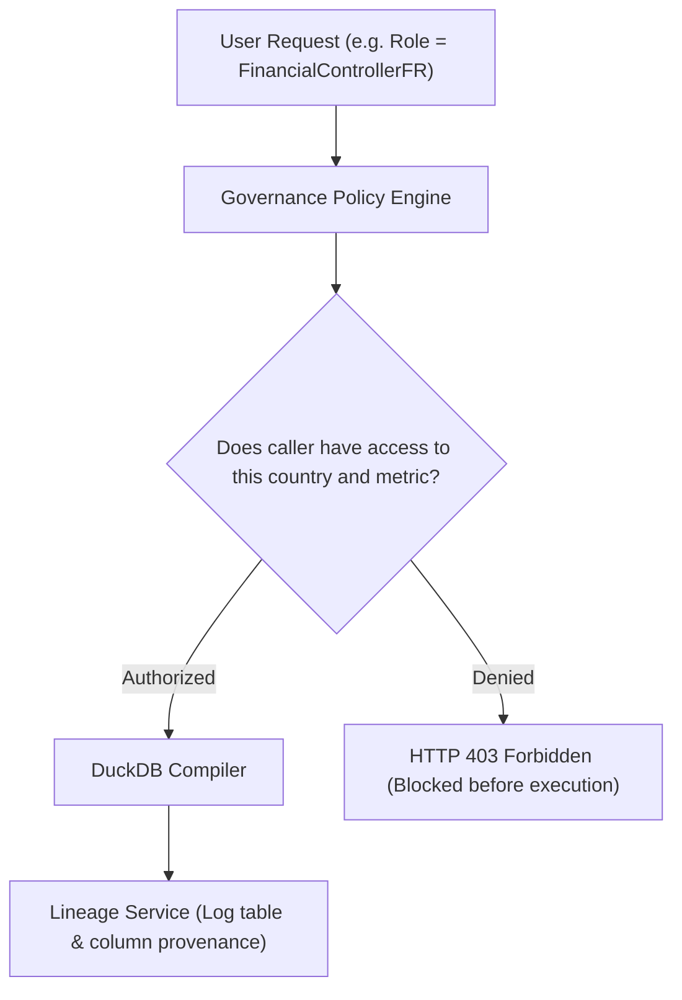

# Chapter 11: Enterprise Governance & Data Mesh

> Understand modern enterprise data governance: Data Products as code, Role-Based Access Control, data sovereignty, and column-level lineage.

In a small company, anyone can query any table. But in a global enterprise handling millions of dollars and confidential customer data, questions of **security, sovereignty, and data ownership** are paramount.

In this chapter, we explore how this repository implements a **Data Mesh** architecture, enforces access control before queries run, and traces data lineage from output back to source.

---

## Track A: The Layperson Intuition Track

### The Airport Customs & Security Analogy
Imagine traveling internationally through an airport:
1. **The Passport & Visa Check (RBAC / Authorization)**:
   - Before boarding a flight to France, border control checks your passport.
   - If your visa only permits entry into Germany, you are not allowed to board the flight to Paris!
   - In enterprise data, an auditor from the French division (`FinancialControllerFR`) is only permitted to see French records, not German or American records. This is called **Data Sovereignty**.
2. **The Food Nutrition Label (Data Product)**:
   - In the airport convenience store, every snack has an ingredients list, a nutrition facts box, and an expiration date.
   - You don't have to guess whether the food is safe; the label is a contract!
3. **The Luggage Tracking Barcode (Data Lineage)**:
   - When you check a bag, an adhesive barcode is attached.
   - At every transfer conveyor, scanner, and baggage cart, the bag's location is logged. If a bag goes missing, the airline traces the exact sequence of scanners it passed through.



---

## Track B: The Apprentice Engineer Track

### 1. Data Products in YAML

Instead of letting databases become a chaotic "data swamp", the **Data Mesh** philosophy treats datasets as curated products with strict contracts.

In [`data_products/acdoca_financials.yaml`](../../data_products/acdoca_financials.yaml), we define:
```yaml
product_id: ACDOCAFinancials
version: 1.0.0
owner: Enterprise Accounting Team
domain: Finance
certification_status: CERTIFIED
storage:
  path: data/curated/acdoca_financials.csv
  format: csv
grain: One row per accounting journal entry line
schema:
  - name: journal_entry_id
    type: string
    primary_key: true
  - name: amount_in_company_currency_eur
    type: decimal(18,2)
    sensitive: false
```
Every consumer knows the exact grain, types, and primary keys before writing a query!

---

### 2. Role-Based Access Control (RBAC) in `policy.py`

In [`src/semantic_layer/governance/policy.py`](../../src/semantic_layer/governance/policy.py), policies are evaluated *before* query compilation:

```python
class GovernancePolicy:
    ALLOWED_ROLES = {
        "FinancialControllerFR": {"country": "FR", "allowed_metrics": ["ciferp:TotalDebitLossEur"]},
        "FinancialControllerDE": {"country": "DE", "allowed_metrics": ["ciferp:TotalDebitLossEur"]},
        "GlobalAuditor": {"country": None, "allowed_metrics": ["*"]},
    }
    
    def authorize(self, plan: SemanticQueryPlan, caller: CallerContext) -> AuthorizationDecision:
        role_rules = self.ALLOWED_ROLES.get(caller.role)
        if not role_rules:
            return AuthorizationDecision(permitted=False, reason="Unknown role")
        
        # Check Country Sovereignty
        if role_rules["country"] and plan.country != role_rules["country"]:
            return AuthorizationDecision(permitted=False, reason="Country sovereignty violation")
            
        return AuthorizationDecision(permitted=True)
```
If a `FinancialControllerDE` attempts to query French records, authorization fails immediately with an HTTP 403, and the database is never touched!

---

### 3. Column-Level Data Lineage in `lineage/service.py`

When an executive sees a number like `Total Debit Loss: EUR 24,500.00`, they ask: *"Where did that come from?"*

In [`src/semantic_layer/lineage/service.py`](../../src/semantic_layer/lineage/service.py), the `LineageService` tracks dependencies from output columns back to source tables:
- Output `total_debit_loss_eur` $\leftarrow$ Aggregated from `acdoca_financials.csv:amount_in_company_currency_eur`
- Output `partner_id` $\leftarrow$ Joined across `business_partners.csv:partner_id` and `acdoca_financials.csv:partner_id`

This lineage graph is packaged directly into the query result for auditors!

---

## Student Lab: Test Policy Authorization in Python

Let's test our policy engine in Python to see how it permits authorized roles and blocks cross-country access!

### Step 1: Open the Python REPL
```bash
.venv/bin/python
```

### Step 2: Test Authorization Decisions
```python
from semantic_layer.governance.policy import PolicyService
from semantic_layer.models import CallerContext, SemanticQueryPlan, QueryFilter

policy = PolicyService()

# 1. Create a plan requesting French data
french_plan = SemanticQueryPlan(
    query_id="query-test-01",
    filters=[QueryFilter(dimension="ciferp:CompanyCode", value="FR")],
    target_platform="DuckDB",
)

# 2. Test with French Financial Controller (Should PASS)
french_caller = CallerContext(role="FinancialControllerFR", country="FR")
decision = policy.authorize(french_plan, french_caller)
print("French Controller Allowed?", decision.is_authorized)

# 3. Test with German Financial Controller (Should FAIL)
german_caller = CallerContext(role="FinancialControllerDE", country="DE")
decision_denied = policy.authorize(french_plan, german_caller)
print("German Controller Allowed on French Data?", decision_denied.is_authorized)
print("Denial Reason:", decision_denied.reasons)
```
Output:
```text
French Controller Allowed? True
German Controller Allowed on French Data? False
Denial Reason: ('country sovereignty mismatch',)
```

---

## Self-Check Quiz

1. **What is a "Data Product" in a Data Mesh architecture?**
   - *Answer*: A self-contained, documented, and certified dataset with clear ownership, automated quality tests, and usage contracts.
2. **What does Data Sovereignty mean?**
   - *Answer*: Legal and governance restrictions requiring that data belonging to a specific country or jurisdiction can only be accessed by authorized callers within that jurisdiction.
3. **At what stage in the execution pipeline does policy enforcement occur?**
   - *Answer*: Before compilation and database execution, preventing unauthorized queries from touching data stores.

---

## Next Steps

Now that we understand governance and authorization, how do we guarantee that analytical results and benchmark evidence are tamper-proof? Proceed to [Chapter 12: Cryptography & Audit Provenance](12-cryptography-and-audit-provenance.md).
