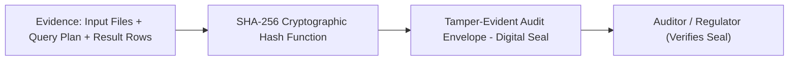

# Chapter 12: Cryptography & Audit Provenance

> Understand cryptographic hashing: SHA-256 digital fingerprints, the avalanche effect, tamper-evident audit envelopes, and automated secret redaction.

In consumer software, if an app shows a number, you trust it. In enterprise compliance, financial accounting, and scientific research, **trust is not enough: you must prove it mathematically**.

In this chapter, we explore how cryptographic hashing ensures that data, query plans, and evaluation benchmarks cannot be tampered with.

---

## Track A: The Layperson Intuition Track

### The Tamper-Evident Evidence Bag Analogy
Imagine a police forensics team gathering evidence at a crime scene:
1. When they collect a watch or document, they place it inside a heavy-duty plastic **evidence bag**.
2. They seal the bag with red **tamper-evident security tape**.
3. If anyone attempts to peel open the tape, the word **"VOID"** appears in bold red letters across the plastic, and the seal cannot be resealed.
4. The officer writes an exact case number, timestamp, and signature across the seam.



In software, **cryptographic hashing is that tamper-evident seal**.
If an enterprise produces an audit report, a cryptographic hash proves to external auditors that nobody went into the database and edited a number before the audit.

---

## Track B: The Apprentice Engineer Track

### 1. Properties of the SHA-256 Hash Function

A hash function takes an arbitrary block of data (whether one letter or an entire encyclopedia) and produces a fixed-size **256-bit (64 hexadecimal character) string**:

1. **Deterministic**: The exact same input always produces the exact same hash output.
2. **One-Way (Pre-image Resistance)**: You can easily compute the hash from the data, but it is mathematically impossible to reverse-engineer the original data from the hash.
3. **Collision Resistant**: It is virtually impossible to find two different inputs that produce the exact same hash.
4. **The Avalanche Effect**: Changing even **a single bit** (like capitalizing one letter or adding a comma) completely randomizes the entire hash string!

---

### 2. How SHA-256 is Used in This Repository

#### A. Input Byte Manifests (`benchmark_runner.py`)
In [`src/semantic_layer/research/benchmark_runner.py`](../../src/semantic_layer/research/benchmark_runner.py#L561-L576), the function `build_hash_manifest()` hashes every tracked input file:
```python
for relative in _manifest_candidates(repository_root):
    data = (repository_root / relative).read_bytes()
    digest = hashlib.sha256(data).hexdigest()
    entries.append({"path": relative, "sha256": digest, "byte_length": len(data)})
```
If a developer changes a single test fixture or ontology file without running the canonical benchmark, the manifest digest will not match, and `make research-verify` will immediately fail!

#### B. Provenance Envelopes (`provenance/store.py`)
In [`src/semantic_layer/provenance/store.py`](../../src/semantic_layer/provenance/store.py), every completed query stores an immutable record:
- Query ID and timestamp
- Caller role and country context
- Exact plan digest
- Exact generated SQL or SPARQL digest
- Row count and result signature

---

### 3. Automated Secret Redaction (`sanitize_diagnostic`)

When errors occur during database or API queries, database drivers often dump connection strings that contain passwords or authentication tokens!

If those error messages were written directly to audit logs, sensitive corporate passwords would be leaked.

In [`src/semantic_layer/reasoning/reflective_agent.py`](../../src/semantic_layer/reasoning/reflective_agent.py#L39-L66), the `sanitize_diagnostic()` function automatically redacts sensitive strings before logging:
```python
def sanitize_diagnostic(text: str, limit: int = 512) -> str:
    value = str(text)
    # Redact Bearer / Basic authorization tokens
    value = re.sub(r"(?i)(authorization\s*[:=]\s*(?:bearer|basic)\s+)[^\s,;]+", r"\1[REDACTED]", value)
    # Redact passwords, secrets, api keys
    value = re.sub(r"(?i)(\b(?:password|passwd|secret|token|api[_-]?key)\s*[:=]\s*)[^\s,;]+", r"\1[REDACTED]", value)
    # Redact user:password in URLs
    value = re.sub(r"(?i)\b([a-z][a-z0-9+.-]*://)([^\s/@:]*):([^\s/@]+)@", r"\1[REDACTED]@", value)
    return value[:limit]
```

---

## Student Lab: Observe the Avalanche Effect in Python

Let's test SHA-256 right now and see the dramatic avalanche effect with your own eyes!

### Step 1: Open the Python REPL
```bash
.venv/bin/python
```

### Step 2: Hash Two Strings Differing by One Character
```python
import hashlib

string1 = "Total financial revenue: EUR 100,000"
string2 = "Total financial revenue: EUR 100,001"  # Just 1 digit changed!

hash1 = hashlib.sha256(string1.encode()).hexdigest()
hash2 = hashlib.sha256(string2.encode()).hexdigest()

print("String 1:", string1)
print("Hash 1:  ", hash1)
print("\nString 2:", string2)
print("Hash 2:  ", hash2)
```
Output:
```text
String 1: Total financial revenue: EUR 100,000
Hash 1:   f425b085e33d4ff2e9cf9d750cfa823055909249c12df718aa6a7da883ca0e9a

String 2: Total financial revenue: EUR 100,001
Hash 2:   27926b47c0bc789df95b3671ad203ce8fa46bc45591cf167683713f06dd5e01c
```
Notice: changing just the last digit (`0` $\rightarrow$ `1`) completely scrambles every single character of the hash! Any tampering is instantly detectable.

---

## Self-Check Quiz

1. **What is the length of a SHA-256 hexadecimal hash output?**
   - *Answer*: Exactly 64 hexadecimal characters (256 bits).
2. **What is the "Avalanche Effect" in cryptographic hashing?**
   - *Answer*: A small change in the input (even a single bit or letter) produces a drastically and unpredictably different hash output.
3. **Why do we sanitize error diagnostics before saving them to audit logs?**
   - *Answer*: To prevent leaking sensitive information such as database passwords, API keys, or bearer tokens that might be included in raw error messages.

---

## Next Steps

Now that we understand security, provenance, and data integrity, how do we prove that our code works and never breaks? Proceed to [Chapter 13: How We Know It Works (Testing & Quality)](13-how-we-know-it-works-testing.md).
