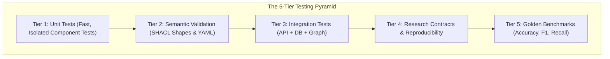

# Chapter 13: How We Know It Works (Testing & Quality)

> The engineering discipline of automated verification: the test pyramid, golden evaluation benchmarks, scientific metrics, and documentation contracts.

In amateur programming, someone writes code, runs it once, and says: *"It works on my machine!"*

In professional software engineering, **silence is not success**. You must prove that your code works across edge cases, negative inputs, and future code changes through **automated testing**. In this chapter, we explore how this repository enforces quality across more than 530 automated tests.

---

## Track A: The Layperson Intuition Track

### The Academic Standardized Exam Analogy
Imagine a university measuring how well students understand mathematics:
1. **The Pop Quiz (Unit Tests)**:
   - A 5-minute quiz at the end of class testing a single rule: *"What is $7 \times 8$?"*
   - It is fast, focused, and immediately catches small errors.
2. **The Final Exam (Integration Tests)**:
   - A comprehensive 2-hour exam where students must solve multi-step word problems combining algebra, geometry, and calculus.
   - It proves that all the individual concepts work together in a complete scenario.
3. **The National Standardized Test (Golden Benchmark)**:
   - A sealed, pre-verified national exam with hundreds of certified questions and answers.
   - It measures accuracy, precision, and recall without teacher bias.



---

## Track B: The Apprentice Engineer Track

### 1. The 5-Tier Test Pyramid in This Repository

When you run `make test`, Pytest executes over 530 tests across 5 specialized directories:

1. **[`tests/unit/`](../../tests/unit/) (Tier 1: Unit Tests)**:
   - Tests individual Python functions in milliseconds (e.g. testing that `SchemaLinker` tokenizes text properly, or that `query_planner.py` detects cycles).
2. **[`tests/semantic/`](../../tests/semantic/) (Tier 2: Semantic Contract Tests)**:
   - Uses PySHACL to validate that all Turtle `.ttl` files obey ontology rules, and verifies YAML vocabulary integrity.
3. **[`tests/integration/`](../../tests/integration/) (Tier 3: Integration Tests)**:
   - Tests complete subsystems working together: booting the FastAPI app and sending HTTP requests, querying DuckDB views, and testing the end-to-end AQR agent.
4. **[`tests/research/`](../../tests/research/) (Tier 4: Research Reproducibility)**:
   - Tests the deterministic state machine, migration manifests, and hash verification across benchmark corpora.
5. **[`tests/golden/`](../../tests/golden/) (Tier 5: Golden Benchmark Evaluation)**:
   - Evaluates the system against human-curated golden questions in [`tests/golden/questions.yaml`](../../tests/golden/questions.yaml) to ensure zero regression on core business queries.

---

### 2. Scientific Evaluation Metrics

In machine learning and agent research, accuracy alone can be misleading. We evaluate performance across three standard metrics:

$$\text{Precision} = \frac{\text{True Positives}}{\text{True Positives} + \text{False Positives}}$$
*(Of all the answers the agent returned, how many were actually correct?)*

$$\text{Recall} = \frac{\text{True Positives}}{\text{True Positives} + \text{False Negatives}}$$
*(Of all the true answers that exist in the database, how many did the agent find?)*

$$\text{F1-Score} = 2 \times \frac{\text{Precision} \times \text{Recall}}{\text{Precision} + \text{Recall}}$$
*(The harmonic mean balancing precision and recall.)*

In this repository's benchmark runner ([`src/semantic_layer/research/benchmark_runner.py`](../../src/semantic_layer/research/benchmark_runner.py)), these metrics are calculated with exact 6-decimal precision using `decimal.Decimal`.

---

### 3. Documentation Contracts (`test_documentation_contract.py`)

Did you know that in this repository, **even the documentation is tested by automated software**?

In [`tests/unit/test_documentation_contract.py`](../../tests/unit/test_documentation_contract.py), automated tests verify:
- That every relative Markdown link resolves to an existing file and heading anchor.
- That all Mermaid diagrams use valid syntax without illegal line break tags.
- That no unfinished placeholder tokens (such as to-do or fix-me tags) or secret keys exist in the docs.

If someone writes a broken link or a malformed diagram in documentation, **the build fails**!

---

## Student Lab: Run the Tests in Your Terminal

Let's run a targeted test file right now using Pytest and watch the automated assertions pass!

### Run the Query Planner Unit Tests
Execute this command in your shell:
```bash
PYTHONPATH=src .venv/bin/python -m pytest tests/unit/test_query_planner.py -v
```

#### What You Will See:
```text
============================= test session starts ==============================
platform linux -- Python 3.12.3, pytest-9.1.1, pluggy-1.6.0
collected 22 items

tests/unit/test_query_planner.py::test_build_plan_rejects_missing_concept PASSED
tests/unit/test_query_planner.py::test_build_plan_builds_expected_plan PASSED
tests/unit/test_query_planner.py::test_plan_has_expected_structure PASSED
...
============================== 22 passed in 0.18s ==============================
```
In 0.18 seconds, the computer verified 22 mathematical assertions about the query planner!

---

## Self-Check Quiz

1. **What is the difference between a Unit Test and an Integration Test?**
   - *Answer*: A unit test tests a single function or class in isolation (fast, focused), while an integration test tests multiple components working together (e.g. API + Database + Business Logic).
2. **What is Precision versus Recall?**
   - *Answer*: Precision measures how many returned answers were correct (avoiding false positives), while Recall measures how many of the actual true answers were successfully found (avoiding false negatives).
3. **Why do we test documentation with automated code?**
   - *Answer*: To prevent documentation rot: ensuring links never break, diagrams remain valid, and claims match real code.

---

## Conclusion & Congratulations!

You have completed the entire `docs/learn/` curriculum! You now possess a solid understanding of:
- Enterprise computing and the semantic layer
- Knowledge graphs, RDF triples, and ontologies
- SPARQL and SQL analytical query engines
- Autonomous query reasoning and bounded reflection
- Data governance, security, and cryptographic auditability
- Professional software testing and reproducibility

Return to the [Learning Hub Index](README.md) or explore the source code in [`src/semantic_layer/`](../../src/semantic_layer/) with your newfound knowledge!
