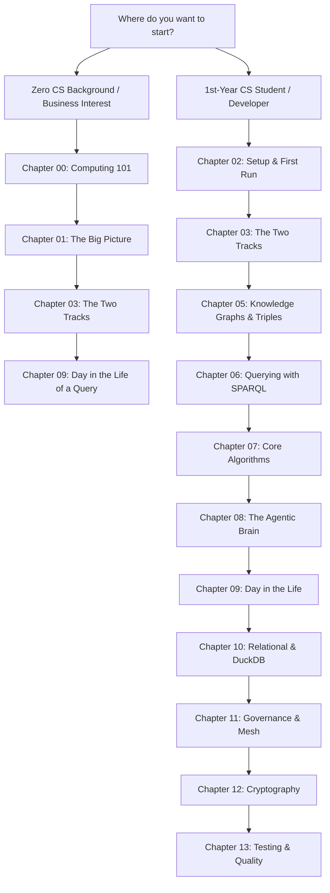

# The Learning Hub: Enterprise Semantic Layer & Agentic Knowledge Graph

> A beginner-friendly, dual-track curriculum for understanding enterprise data architecture, knowledge graphs, and autonomous query reasoning.

Welcome! Whether you are a **first-year Computer Science student** or someone with **zero programming background**, this folder was built to guide you through this repository from first principles to advanced autonomous systems.

---

## How to Use This Curriculum: The Dual-Track Approach

Every guide in this folder is divided into two distinct reading tracks:

1. **Track A: The Layperson Intuition Track (Zero-CS Background)**
   - No code, no command line, and no math required.
   - Uses real-world metaphors (detective evidence boards, hotel concierges, airport security checkpoints).
   - Explains the human problem, why traditional software and chatbots fail, and what this system accomplishes.
2. **Track B: The Apprentice Engineer Track (1st-Year CS & Coding)**
   - Gentle, step-by-step technical explanations connecting classroom theory to real production code.
   - Exact line references to Python, Turtle, and YAML files in this repository.
   - Interactive terminal labs and self-check quizzes to verify your understanding.

---

## The Computer Science Curriculum Crosswalk

If you are a student, here is how topics from your CS courses map directly to this repository:

| Computer Science Concept | Where You Learn It in College | Where It Lives in This Repository | Chapter to Read |
| :--- | :--- | :--- | :--- |
| **Variables, Data Types & Immutability** | CS101: Intro to Programming | [`models.py`](../../src/semantic_layer/models.py) (Frozen Dataclasses) | [Chapter 04: The Developer Toolbox](04-the-developer-toolbox.md) |
| **Hash Tables & O(1) Dictionary Lookups** | CS102: Data Structures | [`schema_linker.py`](../../src/semantic_layer/reasoning/schema_linker.py) (Token Sets) | [Chapter 07: Core Algorithms](07-core-algorithms-and-data-structures.md) |
| **Directed Graphs & Graph Traversal** | CS102: Data Structures | [`loader.py`](../../src/semantic_layer/kg/loader.py) (RDF Triples) | [Chapter 05: Knowledge Graphs](05-knowledge-graphs-and-triples.md) |
| **Breadth-First Search (BFS) & Queues** | CS102: Data Structures & Algorithms | [`query_planner.py`](../../src/semantic_layer/reasoning/query_planner.py) (Prerequisite Traversal) | [Chapter 07: Core Algorithms](07-core-algorithms-and-data-structures.md) |
| **Depth-First Search (DFS) & Cycle Detection** | CS102: Data Structures & Algorithms | [`query_planner.py`](../../src/semantic_layer/reasoning/query_planner.py) (Detecting Loops) | [Chapter 07: Core Algorithms](07-core-algorithms-and-data-structures.md) |
| **Finite State Machines (FSM)** | CS201: Discrete Math & Systems | [`reflective_agent.py`](../../src/semantic_layer/reasoning/reflective_agent.py) (Repair Loop) | [Chapter 08: The Agentic Brain](08-the-agentic-brain-aqr.md) |
| **Compiler Design & ASTs** | CS301: Compilers & Languages | [`duckdb.py`](../../src/semantic_layer/compiler/duckdb.py) (AST Compilation) | [Chapter 10: The Relational Track](10-the-relational-track-and-duckdb.md) |
| **Cryptographic Hashing (SHA-256)** | CS202: Security & Cryptography | [`provenance/store.py`](../../src/semantic_layer/provenance/store.py) (Audit Envelopes) | [Chapter 12: Cryptography & Provenance](12-cryptography-and-audit-provenance.md) |
| **Relational Databases & SQL** | CS203: Database Systems | [`compiler/duckdb.py`](../../src/semantic_layer/compiler/duckdb.py) (OLAP Queries) | [Chapter 10: The Relational Track](10-the-relational-track-and-duckdb.md) |
| **Testing, Precision, Recall & F1** | CS204: Software Engineering & Data Science | [`tests/golden/`](../../tests/golden/) and [`tests/research/`](../../tests/research/) | [Chapter 13: Quality & Testing](13-how-we-know-it-works-testing.md) |

---

## Suggested Learning Pathways

Choose the pathway that matches your goals:

- **Pathway 1: The Executive Summary (15 Minutes)**: Read [00-computing-101-for-absolute-beginners.md](00-computing-101-for-absolute-beginners.md) and [01-the-big-picture.md](01-the-big-picture.md).
- **Pathway 2: The Fast Developer Track (30 Minutes)**: Read [02-setup-and-your-first-run.md](02-setup-and-your-first-run.md), run the demos, then read [03-the-two-tracks-and-repo-anatomy.md](03-the-two-tracks-and-repo-anatomy.md) and [09-a-day-in-the-life-of-a-query.md](09-a-day-in-the-life-of-a-query.md).
- **Pathway 3: The Complete Deep Dive**: Follow the numbered chapters 00 through 13 in order.

---

## Chapter Index

1. **[Glossary: The Jargon Buster](glossary.md)**: Every acronym and domain term defined in plain English with 1-line analogies.
2. **[00: Computing 101 for Absolute Beginners](00-computing-101-for-absolute-beginners.md)**: What is code, a database, an API, a server, and a terminal?
3. **[01: The Big Picture](01-the-big-picture.md)**: The enterprise data challenge, the semantic gap, and why naive LLM prompting fails in business.
4. **[02: Setup & Your First Run](02-setup-and-your-first-run.md)**: Virtual environments, pinned dependencies, Makefiles, and running both live demos.
5. **[03: The Two Tracks & Repo Anatomy](03-the-two-tracks-and-repo-anatomy.md)**: The Two Hemispheres (Graph Track vs. Relational Track) and directory walkthrough.
6. **[04: The Developer Toolbox](04-the-developer-toolbox.md)**: Why Python 3.12, DuckDB, RDFLib, PySHACL, FastAPI, Pydantic, and Ruff?
7. **[05: Knowledge Graphs & Triples](05-knowledge-graphs-and-triples.md)**: Graph thinking, RDF triples, Turtle syntax, OWL/RDFS ontologies, and SHACL validation.
8. **[06: Querying Graphs with SPARQL](06-querying-graphs-with-sparql.md)**: The SQL of graphs: pattern matching, filters, optionals, and property paths.
9. **[07: Core Algorithms & Data Structures](07-core-algorithms-and-data-structures.md)**: BFS, DFS cycle detection, transitive closure, queues, and hash maps in action.
10. **[08: The Agentic Brain (AQR)](08-the-agentic-brain-aqr.md)**: Autonomous Query Reasoning, schema linking, planning, and bounded repair loops.
11. **[09: A Day in the Life of a Query](09-a-day-in-the-life-of-a-query.md)**: Step-by-step code trace of one real user question through the entire system.
12. **[10: The Relational Track & DuckDB](10-the-relational-track-and-duckdb.md)**: OLAP databases, data grain, the join fanout trap, and SQL injection safety.
13. **[11: Enterprise Governance & Data Mesh](11-enterprise-governance-and-data-mesh.md)**: Data products, access control policies (RBAC), and column-level data lineage.
14. **[12: Cryptography & Audit Provenance](12-cryptography-and-audit-provenance.md)**: SHA-256 digital fingerprints, tamper-evident ledgers, and secret redaction.
15. **[13: How We Know It Works (Testing & Quality)](13-how-we-know-it-works-testing.md)**: The test pyramid, golden benchmarks, evaluation metrics, and documentation tests.
