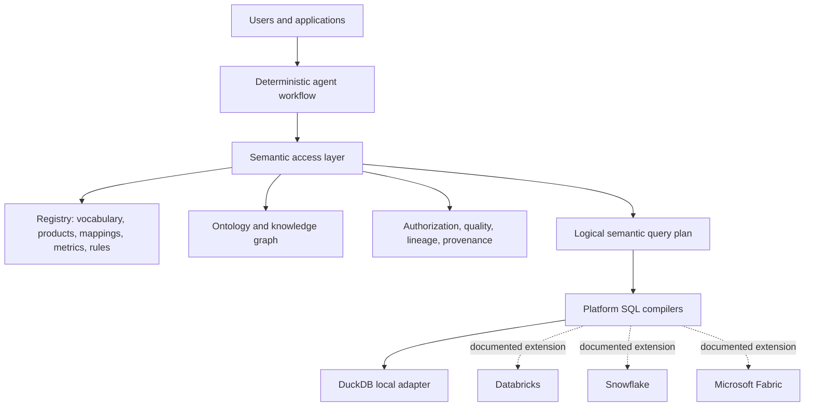
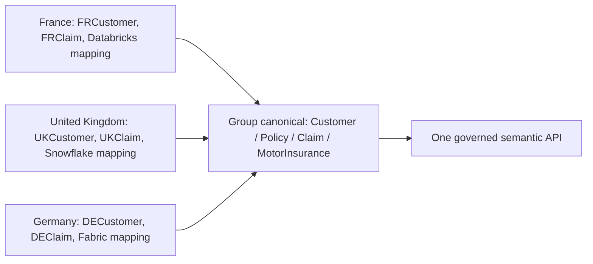
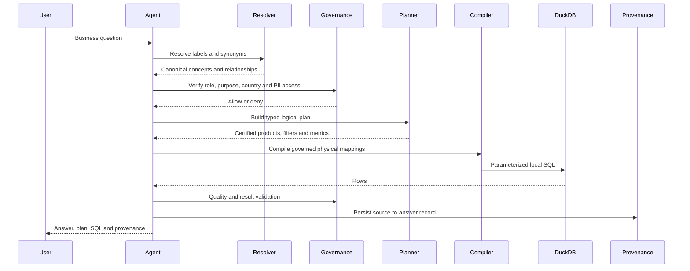

# Federated Semantic Layer for Agentic AI — Design Specification

## Purpose

Build an interview-ready, locally runnable reference implementation for **GlobalSure Insurance Group**, a fictional federated insurer operating in France, the United Kingdom, and Germany. The repository demonstrates a central principle: the semantic layer is the governed, machine-readable contract between business concepts, certified data products, and AI agents. It does not use AXA data or require paid cloud accounts.

## Scope and Success Definition

The runnable path answers the primary Claims Investigation question end to end:

> Find French motor-insurance customers with at least three qualifying claims in the last 12 months and total incurred loss above EUR 20,000.

The agent must resolve business language; select certified data products; authorize access; create a typed logical query plan; compile it from governed mappings; execute DuckDB SQL; validate quality and results; and return provenance. The repository also contains a FastAPI surface, ontology/SHACL assets, an RDF sample graph, multi-platform mappings, governance, 30+ golden questions, CI, ADRs, and documentation needed to explain the design credibly.

Cloud-specific SQL and adapters are artifacts/interfaces only. They are explicitly labeled unexecuted unless credentials are provided. DuckDB is the only fully implemented execution platform.

## Architectural Alternatives Considered

1. **LLM-to-SQL demo.** Fast to build but unacceptable for an enterprise demonstration: joins, metric logic, table selection, and authorization depend on model guesses; outputs lack durable provenance.
2. **Knowledge-graph-first runtime.** Strong for relationship navigation but needlessly turns every aggregation into graph traversal and does not replace certified analytical products or platform execution engines.
3. **Recommended: semantic-contract control plane with platform adapters.** Git-versioned business assets define intent and rules; a deterministic service resolves and validates intent; compilers map typed plans to certified physical products. RDF/OWL is used for relationships and validation, DuckDB for local analytical execution, and cloud adapters preserve the extension seam.

## System Boundaries

The semantic access layer is the control plane. Platform adapters are execution-plane integrations and must not be used to bypass platform-native security.

## Semantic Asset Model

All assets are versioned in Git and loaded into a local SQLite-backed registry.

| Asset | Canonical format | Runtime role |
| --- | --- | --- |
| Business vocabulary | YAML | Definitions, owners, sensitivity, synonyms, related concepts |
| Product taxonomy | SKOS Turtle | Preferred/alternative labels and broader/narrower insurance categories |
| Ontology | OWL/RDFS Turtle | Typed relationship vocabulary and domain/range constraints |
| Shapes | SHACL Turtle | Validates insurance instance graphs |
| Knowledge graph | Turtle | Compact FR/UK/DE customer-policy-claim example instances |
| Data-product contracts | YAML | Certification, grain, SLA, security, lineage and semantic exposure |
| Mappings | YAML | Platform fields and local-value normalization to Group semantics |
| Metrics and rules | YAML | Governed calculations; QualifyingClaim excludes CANCELLED and DUPLICATE |

The initial canonical concepts are Customer, Policy, Claim, InsuranceProduct, MotorInsurance, Risk, Coverage, Premium, ClaimStatus, Country, ActivePolicy, QualifyingClaim, and IncurredLoss. The ontology defines `ownsPolicy`, `submitsClaim`, `relatesToPolicy`, `hasProduct`, `coversRisk`, `hasCoverage`, and `generatesPremium`. `MotorInsurance` is a subclass of `InsuranceProduct`.

Glossary records human definitions; taxonomy organizes labels; ontology constrains conceptual entities/relationships; the knowledge graph contains instance facts; the semantic layer combines those with products, mappings, metrics, policy, and execution controls.

## Federation Model

Group owns the core vocabulary, canonical ontology, interoperability rules, and semantic CI. Local entities own their products, local extensions, mappings, and regulatory policies. France demonstrates Databricks values such as `MOTOR`/`MTR`; the UK demonstrates Snowflake `AUTO`/`CAR`; Germany demonstrates Fabric `MotorInsurance`. All normalize to `insurance:MotorInsurance`.

## Runtime Contract

The agent never has a tool that accepts arbitrary SQL. Its runtime sequence is:

The `SemanticQueryPlan` Pydantic model contains root entity, projected dimensions, filters, relationships, metric predicates, time context, selected certified products, caller context, and target platform. The resolver performs deterministic lexical/synonym matching. An optional LLM interface may enhance parsing or explanation but can never create SQL or override semantic validation.

## Local Data and Execution

`generate_demo_data.py` produces deterministic CSV files for FR, UK, and DE with a fixed seed and an explicit as-of date. Curated data is used for the normal demo; raw data includes deliberately invalid/future/duplicate samples to exercise quality checks. At least several French customers satisfy the primary use case.

DuckDB registers curated CSV data as views. Compiler output uses a fixed, trusted query template controlled by mappings and plan validation rather than interpolating free-form model input. Incomplete Databricks, Snowflake, and Fabric SQL fragments may be shown for documentation, but they are not equivalent to the governed plan and are not executed.

## Governance, Quality, Lineage, and Provenance

Roles are ClaimsAnalystFR, ClaimsManagerGroup, and FinanceAnalyst. The local API supplies these as simulated caller fields; production identity-aware transports must authenticate callers before invoking authorization. Authorization combines role permissions with country and classification attributes. A ClaimsAnalystFR can retrieve French claim records only; FinanceAnalyst can access premium metrics but not customer PII.

Quality checks enforce non-null IDs, non-negative incurred amount, non-future claim date, valid statuses/countries, and valid product mappings. Product quality status is surfaced to the agent; unsafe/degraded product status blocks detail queries. Static product lineage and dynamic query lineage form a provenance envelope containing query id, user question, concepts, metrics, products, mappings, physical sources, semantic versions, timestamps, authorization outcome, and quality outcome.

## Public Interfaces

FastAPI exposes `/health`, concepts, metrics, data products, mappings, `/resolve`, `/query-plan`, `/execute`, `/validate`, and `/provenance/{query_id}`. The Python agent tool layer exposes `search_concept`, `resolve_business_term`, `get_business_definition`, `get_relationships`, `find_certified_data_product`, `get_metric_definition`, `build_query_plan`, `execute_semantic_query`, and `get_provenance`. An MCP transport is documented as an optional extension rather than a runtime dependency.

## Repository and Module Boundaries

`semantic/`, `data_products/`, and `mappings/` hold reviewable declarative assets. `data/` owns deterministic raw/curated demo records. `src/semantic_layer/registry` loads validated assets; `resolver`, `query_planner`, and `compiler` form the semantic control path; `adapters` performs execution; `governance`, `quality`, `lineage`, and `provenance` provide cross-cutting controls; `agents` orchestrates the workflow; `api` is transport only. Tests are split by unit, semantic, integration, and golden behavior.

## Testing and Delivery

Implementation follows red-green-refactor for production behavior. Tests cover loaders, resolver, mappings, metrics, compiler, authorization, quality, provenance, SHACL, API, DuckDB E2E, agent workflow, and a 30+ question golden dataset. CI runs lint, type checks where practical, YAML parsing, ontology/SHACL validation, mapping/quality checks, golden tests, compiler tests, and the full test suite. `make setup`, `make test`, `make validate-semantic`, `make demo`, `make evaluate`, and `make run-api` are the supported developer interface.

Semantic versioning is explicit. Patch changes correct metadata; minor changes add compatible concepts/synonyms; major changes alter definitions, joins, or metric semantics and must update golden tests. An ActivePolicy definition regression test demonstrates the rule.

## Non-Goals and Honesty Boundaries

- No real Databricks, Snowflake, Fabric, or AXA connection is claimed or required.
- No benchmark figures are fabricated; only locally measured evaluation output is reported.
- No secrets, credentials, or production data are included.
- A Streamlit UI is optional and only considered after the API, tests, and demo are verified.

## Acceptance Checklist

The completed repository must satisfy the 30 success criteria in the request, with special evidence for the main local end-to-end run, SHACL validation, FastAPI endpoints, golden evaluation suite, documented federation, CI workflow, and an interview-ready README/demo guide. The final verification also includes a secret scan and checked documentation links/diagram fences.
